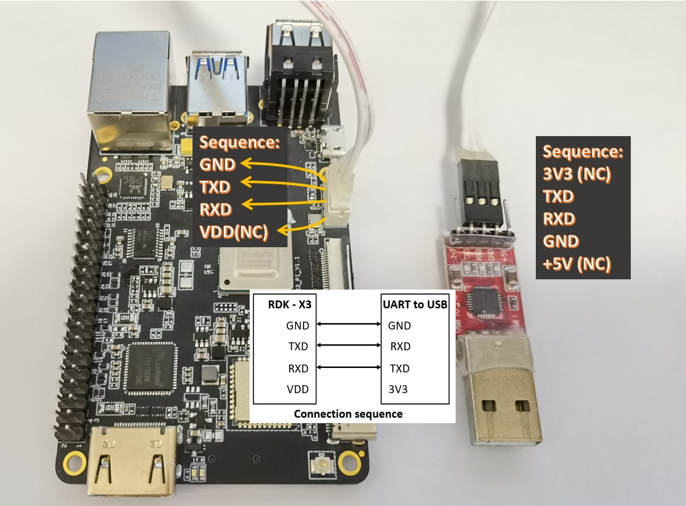

# 6.1 硬件和系统

认证配件及购买链接请参考[认证配件清单](https://developer.horizon.cc/documents_rdk/hardware_development/rdk_x3/accessory)

详细请参考[地平线RDK套件用户手册的常见问题](https://developer.horizon.cc/documents_rdk/category/common_questions)

## 什么是地平线RDK套件？

Horizon Robotics Developer Kits，简称[地平线RDK套件](https://developer.horizon.cc/documents_rdk/)，是基于地平线智能芯片打造的机器人开发者套件，包括**RDK X3（旭日X3派）**、**RDK X3 Module（旭日X3模组）**、**RDK Ultra**。

## 如何查看系统版本号

系统安装完成后，登录系统并使用命令`apt list --installed | grep hobot`查看系统核心功能包版本，使用`cat /etc/version`命令查看系统大版本号。

2.x版本（以2.0.0版本为例说明）系统信息如下：

```shell
root@ubuntu:~# apt list --installed | grep hobot

WARNING: apt does not have a stable CLI interface. Use with caution in scripts.

hobot-boot/unknown,now 2.0.0-20230530181103 arm64 [installed]
hobot-bpu-drivers/unknown,now 2.0.0-20230530181103 arm64 [installed]
hobot-camera/unknown,now 2.0.0-20230530181103 arm64 [installed]
hobot-configs/unknown,now 2.0.0-20230530181103 arm64 [installed]
hobot-display/unknown,now 2.0.0-20230530181103 arm64 [installed]
hobot-dnn/unknown,now 2.0.0-20230530181103 arm64 [installed]
hobot-dtb/unknown,now 2.0.0-20230530181103 arm64 [installed]
hobot-io-samples/unknown,now 2.0.0-20230530181103 arm64 [installed]
hobot-io/unknown,now 2.0.0-20230530181103 arm64 [installed]
hobot-kernel-headers/unknown,now 2.0.0-20230530181103 arm64 [installed]
hobot-models-basic/unknown,now 1.0.1 arm64 [installed]
hobot-multimedia-dev/unknown,now 2.0.0-20230530181103 arm64 [installed]
hobot-multimedia-samples/unknown,now 2.0.0-20230530181103 arm64 [installed]
hobot-multimedia/unknown,now 2.0.0-20230530181103 arm64 [installed]
hobot-sp-samples/unknown,now 2.0.0-20230530181103 arm64 [installed]
hobot-spdev/unknown,now 2.0.0-20230530181103 arm64 [installed]
hobot-utils/unknown,now 2.0.0-20230530181103 arm64 [installed]
hobot-wifi/unknown,now 2.0.0-20230530181103 arm64 [installed]
root@ubuntu:~#
root@ubuntu:~# cat /etc/version
2.0.0
root@ubuntu:~#

```

1.x版本（以1.1.6版本为例说明）系统信息如下：

```shell
root@ubuntu:~# apt list --installed | grep hobot

WARNING: apt does not have a stable CLI interface. Use with caution in scripts.

hobot-arm64-bins/unknown,now 1.1.5 arm64 [installed]
hobot-arm64-boot/unknown,now 1.1.6 arm64 [installed]
hobot-arm64-configs/unknown,now 1.1.6 arm64 [installed]
hobot-arm64-desktop/unknown,now 1.1.5 arm64 [installed]
hobot-arm64-dnn-python/unknown,now 1.1.6 arm64 [installed]
hobot-arm64-gpiopy/unknown,now 1.1.5 arm64 [installed]
hobot-arm64-hdmi-sdb/unknown,now 1.1.5 arm64 [installed]
hobot-arm64-includes/unknown,now 1.1.5 arm64 [installed]
hobot-arm64-libs/unknown,now 1.1.6 arm64 [installed]
hobot-arm64-modules/unknown,now 1.1.6 arm64 [installed]
hobot-arm64-sdb-ap6212/unknown,now 1.1.6 arm64 [installed]
hobot-arm64-srcampy/unknown,now 1.1.5 arm64 [installed]
hobot-linux-headers/unknown,now 1.1.5 arm64 [installed]
hobot-models-basic/unknown,now 1.0.1 arm64 [installed]
hobot-sp-cdev/unknown,now 1.1.6 arm64 [installed]
root@ubuntu:~#
root@ubuntu:~# cat /etc/version
x3_ubuntu_v1.1.6
root@ubuntu:~#

```

## 系统版本和RDK平台硬件对应关系

系统版本说明：

- 2.x版本系统：基于RDK Linux开源代码包制作，支持RDK X3、RDK X3 Module等全系列硬件。

- 1.x版本系统：基于闭源Linux系统制作，历史版本，仅支持RDK X3硬件。

**注意**

- **1.x版本系统无法通过apt命令直接升级到2.x版本系统，需要以烧录镜像的方式重新[安装系统](https://developer.horizon.cc/documents_rdk/installation/install_os)。**

- **2.x版本tros.b仅支持2.x版本系统，1.x版本tros.b仅支持1.x版本系统。**

## 摄像头插拔注意事项

**严禁在开发板未断电的情况下插拔摄像头，否则非常容易烧坏摄像头模组**。

## 串口线如何连接?

串口线一端（白色）接到RDK X3，由于接口有凹槽正反面通常不会接反，另外一端接到串口转接板，此处需要重点关注，连接图如下：



## RDK X3供电有什么要求？

RDK X3通过USB Type C接口供电，并兼容QC、PD快充协议。推荐使用支持QC、PD快充协议的电源适配器，或者至少搭配**5V 直流 2A**的电源适配器为开发板供电。

**注意，请不要使用PC机USB接口为开发板供电，否则会因供电不足造成开发板工作异常（例如RDK X3上电后， HDMI 无输出（完全黑屏），绿灯没有熄灭，连接串口后，发现系统在反复重启，无法进入操作系统）。**

## RDK X3是否有推荐SD卡？

建议使用高速C10 SD卡，老卡可能会存在烧录镜像无法启动问题，SD卡16G以上；

金士顿：<https://item.jd.com/25263496192.html>

闪迪：<https://item.jd.com/1875992.html#crumb-wrap>

## F37和GC4663 MIPI摄像头如何连接?

F37和GC4663摄像头模组通过24pin异面FPC排线跟开发板连接，**注意排线两端蓝面向上插入连接器**。F37摄像头连接示意图如下：


正常连接后接通电源，执行命令：

```bash
cd /app/ai_inference/03_mipi_camera_sample
sudo python3 mipi_camera.py
```

算法渲染结果的HDMI输出如下图，示例图像中检测到了`teddy bear`、`cup`和`vase`。


```text
输入命令：i2cdetect -y -r 1   
F37：
     0  1  2  3  4  5  6  7  8  9  a  b  c  d  e  f
00:          -- -- -- -- -- -- -- -- -- -- -- -- -- 
10: -- -- -- -- -- -- -- -- -- -- -- -- -- -- -- -- 
20: -- -- -- -- -- -- -- -- -- -- -- -- -- -- -- -- 
30: -- -- -- -- -- -- -- -- -- -- -- UU -- -- -- -- 
40: 40 -- -- -- -- -- -- -- -- -- -- -- -- -- -- -- 
50: -- -- -- -- -- -- -- -- -- -- -- -- -- -- -- -- 
60: -- -- -- -- -- -- -- -- -- -- -- -- -- -- -- -- 
70: -- -- -- -- -- -- -- --   

GC4663：
     0  1  2  3  4  5  6  7  8  9  a  b  c  d  e  f
00:          -- -- -- -- -- -- -- -- -- -- -- -- -- 
10: -- -- -- -- -- -- -- -- -- -- -- -- -- -- -- -- 
20: -- -- -- -- -- -- -- -- -- 29 -- -- -- -- -- -- 
30: -- -- -- -- -- -- -- -- -- -- -- UU -- -- -- -- 
40: -- -- -- -- -- -- -- -- -- -- -- -- -- -- -- -- 
50: -- -- -- -- -- -- -- -- -- -- -- -- -- -- -- -- 
60: -- -- -- -- -- -- -- -- -- -- -- -- -- -- -- -- 
70: -- -- -- -- -- -- -- --                         
```

## 如何查看RDK X3的CPU、BPU等运行状态?

```bash
sudo hrut_somstatus
```

## 如何设置自启动?

通过在sudo vim /etc/rc.local文件末尾添加命令，可实现开机自启动功能，例如：

```bash
#!/bin/bash -e
# 
# rc.local
#re
# This script is executed at the end of each multiuser runlevel.
# Make sure that the script will "exit 0" on success or any other
# value on error.
#
# In order to enable or disable this script just change the execution
# bits.
#
# By default this script does nothing.

#!/bin/sh

chmod a=rx,u+ws /usr/bin/sudo
chown sunrise:sunrise /home/sunrise

which "hrut_count" >/dev/null 2>&1
if [ $? -eq 0 ]; then
        hrut_count 0
fi

# Insert what you need
```
