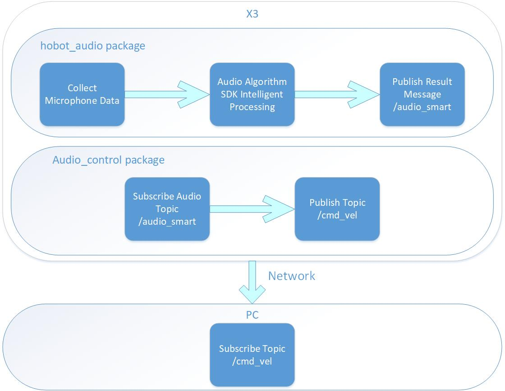

# 4.6 语音控制小车运动

```mdx-code-block
import Tabs from '@theme/Tabs';
import TabItem from '@theme/TabItem';
```

## 功能介绍

语音控制小车运动功能通过语音控制机器人向前、向后、向左、向右运动，需要搭配地平线机器人操作系统的智能语音模块一起使用。流程如下图：



APP以PC端Gazebo仿真环境下的虚拟小车举例，发布的控制指令也可以直接用于控制实物小车。

代码仓库：<https://github.com/HorizonRDK/audio_control.git>

## 支持平台

| 平台     | 运行方式      | 示例功能                       |
| -------- | ------------ | ------------------------------ |
| RDK X3 | Ubuntu 20.04 (Foxy), Ubuntu 22.04 (Humble) | 启动智能语音模块解析语音信息并进行语音控制，通过Gazebo展示控制效果 |

**注意：仅支持RDK X3，RDK X3 Module暂不支持。**

## 准备工作

### 地平线RDK平台

1. 地平线RDK已烧录好地平线提供的Ubuntu 20.04/Ubuntu 22.04镜像。

2. 地平线RDK已成功安装TogetheROS.Bot。

3. 地平线RDK已成功安装智能语音算法包，安装命令：

   <Tabs groupId="tros-distro">
   <TabItem value="foxy" label="Foxy">

   ```bash
   sudo apt update
   sudo apt install tros-hobot-audio
   ```

   </TabItem>
   <TabItem value="humble" label="Humble">

   ```bash
   sudo apt update
   sudo apt install tros-humble-hobot-audio
   ```

   </TabItem>
   </Tabs>

4. 地平线RDK已成功接好适配的音频板（可参考[智能语音章节](../boxs/function/hobot_audio.md)）。

5. 和地平线RDK在同一网段（有线或者连接同一无线网，IP地址前三段需保持一致）的PC，PC端需要安装的环境包括：

 <Tabs groupId="tros-distro">
 <TabItem value="foxy" label="Foxy">

   - Ubuntu 20.04系统和[ROS2 Foxy桌面版](https://docs.ros.org/en/foxy/Installation/Ubuntu-Install-Debians.html)
   - Gazebo和Turtlebot3相关的功能包，安装方法：

    ```shell
    sudo apt-get install ros-foxy-gazebo-*
    sudo apt install ros-foxy-turtlebot3
    sudo apt install ros-foxy-turtlebot3-simulations
    ```

 </TabItem>
 <TabItem value="humble" label="Humble">

   - Ubuntu 22.04系统和[ROS2 Humble桌面版](https://docs.ros.org/en/humble/Installation/Ubuntu-Install-Debians.html)
   - Gazebo和Turtlebot3相关的功能包，安装方法：

    ```shell
    sudo apt-get install ros-humble-gazebo-*
    sudo apt install ros-humble-turtlebot3
    sudo apt install ros-humble-turtlebot3-simulations
    ```

 </TabItem>
 </Tabs>

## 使用介绍

PC端启动仿真环境：

<Tabs groupId="tros-distro">
<TabItem value="foxy" label="Foxy">

```shell
source /opt/ros/foxy/setup.bash
```

</TabItem>
<TabItem value="humble" label="Humble">

```shell
source /opt/ros/humble/setup.bash
```

</TabItem>
</Tabs>

```shell
export TURTLEBOT3_MODEL=burger
ros2 launch turtlebot3_gazebo empty_world.launch.py
```

启动成功后，仿真环境中小车效果如下：


地平线RDK平台启动程序：

1. 拷贝音频配置文件

 <Tabs groupId="tros-distro">
 <TabItem value="foxy" label="Foxy">

    ```bash
    # 配置tros.b环境
    source /opt/tros/setup.bash
    ```

 </TabItem>
 <TabItem value="humble" label="Humble">

    ```bash
    # 配置tros.b环境
    source /opt/tros/humble/setup.bash
    ```

 </TabItem>
 </Tabs>

    ```shell
    # 从tros.b的安装路径中拷贝出运行示例需要的配置文件。
    cp -r /opt/tros/${TROS_DISTRO}/lib/hobot_audio/config/ .
    ```

2. 确认麦克风设备

    麦克风设备号通过配置文件 *config/audio_config.json* 中 `micphone_name` 字段设置，默认为"hw:0,0"，表示音频设备Card0 Device0，设备号可通过命令 `ls /dev/snd` 查看如："pcmC0D1c"；最后字母c表示capture设备，C0表示Card0，D1表示Device1，修改参数为"hw:0,1"。

3. 启动程序

    <Tabs groupId="tros-distro">
    <TabItem value="foxy" label="Foxy">

    ```bash
    # 配置tros.b环境
    source /opt/tros/setup.bash
    ```

    </TabItem>

    <TabItem value="humble" label="Humble">

    ```bash
    # 配置tros.b环境
    source /opt/tros/humble/setup.bash
    ```

    </TabItem>

    </Tabs>

    ```shell
    #启动launch文件
    ros2 launch audio_control audio_control.launch.py
    ```

    程序启动成功后，可通过命令词“向前走”、“向后退”、“向左转”，“向右转”，“停止运动”控制小车运动。

## 结果分析

在地平线RDK运行终端输出如下信息：

```shell
        This is audio control package.

============================================
        audio control usage

Wake up device is "地平线你好".
Audio control commnad word definitions are:
        "向前走": move front.
        "向后退": move back.
        "向右转": rotate robot to right.
        "向左转": rotate robot to left. 
============================================

```

以上log截取了一段音频控制pkg启动后的输出。log内容显示，此语音控制模块配置的设备唤醒词是“地平线你好”，控制小车运动的命令词有：“向前走”、“向后退”、“向左转”，“向右转”。

PC端在终端使用`ros2 topic list`命令可以查询到地平线RDK的topic信息：

```shell
$ ros2 topic list
/audio_smart
/cmd_vel
```

其中`/audio_smart`是X3发布的包含智能语音结果的算法msg，`/cmd_vel`是地平线RDK发布的运动控制指令。

PC端在终端使用`ros2 topic echo /cmd_vel`命令可以查看到地平线RDK发布的运动控制指令：

```shell
linear:
  x: 0.30000001192092896
  y: 0.0
  z: 0.0
angular:
  x: 0.0
  y: 0.0
  z: 0.0
---
linear:
  x: 0.0
  y: -0.30000001192092896
  z: 0.0
angular:
  x: 0.0
  y: 0.0
  z: -0.5
---
linear:
  x: 0.0
  y: 0.30000001192092896
  z: 0.0
angular:
  x: 0.0
  y: 0.0
  z: 0.5
---
```

PC端仿真环境中小车跟随语音控制命令词的指示进行运动，仿真小车运动效果如下：


