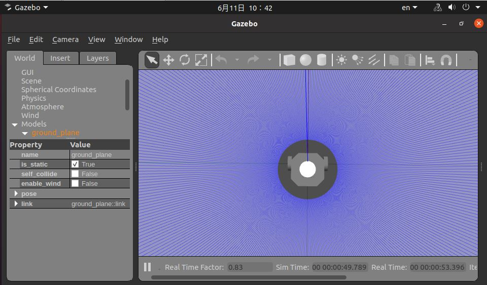

# 4.7 语音追踪控制小车运动

```mdx-code-block
import Tabs from '@theme/Tabs';
import TabItem from '@theme/TabItem';
```

## 功能介绍

语音追踪控制小车运动功能根据声源定位的DOA角度信息控制机器人转向声源方向，并且控制机器人向前移动。此功能需要搭配地平线机器人操作系统的智能语音模块一起使用。当用户说出智能语音识别模块配置的唤醒词唤醒设备之后，语音追踪控制小车功能会激活，后续用户说出唤醒词或者配置的命令词，智能语音识别模块会输出声源的DOA角度信息，此模块收到DOA角度信息之后会控制消息转向声源方向，并且前进一定距离。

流程如下图：


App以PC端Gazebo仿真环境下的虚拟小车举例，发布的控制指令也可以直接用于控制实物小车。

智能语音功能输出的声源定位DOA角度信息，单位为角度，支持线形和环形两种类型麦克风阵列，其中线形麦克风阵列角度范围为0度~180度，环形麦克风阵列角度范围为0度~360度。麦克风角度的相对位置关系与麦克风的安装位置强相关，实际角度示意图如下：

线形麦克风：


环形麦克风：


代码仓库：<https://github.com/HorizonRDK/audio_tracking.git>

## 支持平台

| 平台    | 运行方式      | 示例功能                       |
| ------- | ------------ | ------------------------------ |
| RDK X3 | Ubuntu 20.04 (Foxy), Ubuntu 22.04 (Humble) | 启动智能语音模块解析语音信息并进行语音追踪通过Gazebo展示追踪效果 |

**注意：仅支持RDK X3，RDK X3 Module暂不支持。**

## 准备工作

### 地平线RDK平台

1. 地平线RDK已烧录好地平线提供的Ubuntu 20.04/Ubuntu 22.04系统镜像。

2. 地平线RDK已成功安装TogetheROS.Bot。

3. 地平线RDK已成功安装智能语音算法包，安装命令：

   <Tabs groupId="tros-distro">
   <TabItem value="foxy" label="Foxy">

   ```bash
   sudo apt update
   sudo apt install tros-hobot-audio
   ```

   </TabItem>
   <TabItem value="humble" label="Humble">

   ```bash
   sudo apt update
   sudo apt install tros-humble-hobot-audio
   ```

   </TabItem>
   </Tabs>

5. 地平线RDK已成功接好适配的音频板（可参考[智能语音章节](../boxs/function/hobot_audio.md)）。

6. 和地平线RDK在同一网段（有线或者连接同一无线网，IP地址前三段需保持一致）的PC，PC端需要安装的环境包括：

 <Tabs groupId="tros-distro">
 <TabItem value="foxy" label="Foxy">

   - Ubuntu 20.04系统和[ROS2 Foxy桌面版](https://docs.ros.org/en/foxy/Installation/Ubuntu-Install-Debians.html)
   - Gazebo和Turtlebot3相关的功能包，安装方法：

    ```shell
    sudo apt-get install ros-foxy-gazebo-*
    sudo apt install ros-foxy-turtlebot3
    sudo apt install ros-foxy-turtlebot3-simulations
    ```

 </TabItem>
 <TabItem value="humble" label="Humble">

   - Ubuntu 22.04系统和[ROS2 Humble桌面版](https://docs.ros.org/en/humble/Installation/Ubuntu-Install-Debians.html)
   - Gazebo和Turtlebot3相关的功能包，安装方法：

    ```shell
    sudo apt-get install ros-humble-gazebo-*
    sudo apt install ros-humble-turtlebot3
    sudo apt install ros-humble-turtlebot3-simulations
    ```

 </TabItem>
 </Tabs>

## 使用介绍

### 地平线RDK平台

运行语音追踪功能后，语音追踪控制模块会接收从智能语音功能模块发布的智能语音消息结果，并且解析消息，根据消息中的唤醒事件以及DOA角度信息发布控制小车转向某个方向特定角度的指令，当小车转向特定角度之后，继续控制小车前进一定距离（此模块默认控制小车前进0.2米的距离）。

PC端启动仿真环境：

<Tabs groupId="tros-distro">
<TabItem value="foxy" label="Foxy">

```shell
source /opt/ros/foxy/setup.bash
```

</TabItem>
<TabItem value="humble" label="Humble">

```shell
source /opt/ros/humble/setup.bash
```

</TabItem>
</Tabs>

```shell
export TURTLEBOT3_MODEL=burger
ros2 launch turtlebot3_gazebo empty_world.launch.py
```

启动成功后，仿真环境中小车效果如下：



地平线RDK平台启动程序：

1. 拷贝音频配置文件和加载音频驱动

 <Tabs groupId="tros-distro">
 <TabItem value="foxy" label="Foxy">

    ```bash
    # 配置tros.b环境
    source /opt/tros/setup.bash
    ```

 </TabItem>
 <TabItem value="humble" label="Humble">

    ```bash
    # 配置tros.b环境
    source /opt/tros/humble/setup.bash
    ```

 </TabItem>
 </Tabs>

    ```shell
    # 从tros.b的安装路径中拷贝出运行示例需要的配置文件。
    cp -r /opt/tros/${TROS_DISTRO}/lib/hobot_audio/config/ .
    ```

2. 确认麦克风设备

    麦克风设备号通过配置文件 *config/audio_config.json* 中 `micphone_name` 字段设置，默认为"hw:0,0"，表示音频设备Card0 Device0，设备号可通过命令 `ls /dev/snd`  查看如："pcmC0D1c"；最后字母c表示capture设备，C0表示Card0，D1表示Device1，修改参数为"hw:0,1"。

3. 启动程序

    <Tabs groupId="tros-distro">
    <TabItem value="foxy" label="Foxy">

    ```bash
    # 配置tros.b环境
    source /opt/tros/setup.bash
    ```

    </TabItem>

    <TabItem value="humble" label="Humble">

    ```bash
    # 配置tros.b环境
    source /opt/tros/humble/setup.bash
    ```

    </TabItem>

    </Tabs>

    ```shell
    # 启动launch文件，并指定小车正前方对应的语音DOA角度，以90为例
    ros2 launch audio_tracking audio_tracking.launch.py car_front_audio_angle:=90
    ```

## 结果分析

在地平线RDK运行终端输出如下信息：

```text

        This is audio tracking package.

============================================
        audio tracking usage

Wake up device is "地平线你好".
Audio control commnad word definitions are:
        "向前走"
        "向后退"
        "向右转"
        "向左转" 
When you say the wake word, the car turns toward you 
Let's start the experience
============================================

[INFO] [1663149803.248119421] [audio_tracking]: AudioTrackingEngine construct
[INFO] [1663149803.313949108] [rclcpp]: ParametersClass node construct
[WARN] [1663149803.337782049] [AudioTrackingNode]: Parameter:
 ai_msg_sub_topic_name: /audio_smart
 twist_pub_topic_name: /cmd_vel
[WARN] [1663149804.316577383] [audio_control_parameter_node]: Robot Move param are
move_step: 0.3
rotate_step: 0.348

[INFO] [1663149814.967019845] [audio_tracking]: process audio frame type:2
[INFO] [1663149814.967377380] [audio_tracking]: process audio event type:1
[INFO] [1663149815.012831677] [audio_tracking]: process audio frame type:5
[WARN] [1663149815.013112088] [audio_tracking]: process audio doa theta:80.000000
[INFO] [1663149815.168426039] [audio_tracking]: process audio doa move to front distance:0.200000, speed:0.300000, duration:0.666667, ticks:6
[WARN] [1663149815.769833806] [audio_tracking]: cancel move
[INFO] [1663149822.128098383] [audio_tracking]: process audio frame type:2
[INFO] [1663149822.128389794] [audio_tracking]: process audio event type:1
[INFO] [1663149822.145186562] [audio_tracking]: process audio frame type:5
[WARN] [1663149822.145491473] [audio_tracking]: process audio doa theta:55.000000
[INFO] [1663149822.174037772] [audio_tracking]: process audio doa move theta:35.000000, angle:0.610865, direction:1, ticks:6
[WARN] [1663149822.775398926] [audio_tracking]: cancel move
[INFO] [1663149822.775698796] [audio_tracking]: process audio doa move to front distance:0.200000, speed:0.300000, duration:0.666667, ticks:6
[WARN] [1663149823.377099758] [audio_tracking]: cancel move
```

以上log截取了一段音频控制pkg启动后的输出。log内容显示，智能语音识别模块配置的设备唤醒词是“地平线你好”，语音追踪控制模块接收到唤醒事件之后接收到DOA角度信息，如log上面显示DOA是80度，此时语音追踪控制模块发布控制小车左转20度，转动之后控制小车前进，后面控制小车停止运动。

PC端在终端使用`ros2 topic list`命令可以查询到地平线RDK的topic信息：

```shell
$ ros2 topic list
/audio_smart
/cmd_vel
```

其中`/audio_smart`是X3发布的包含智能语音结果的算法感知msg，`/cmd_vel`是地平线RDK发布的运动控制指令。

PC端在终端使用`ros2 topic echo /cmd_vel`命令可以查看到是地平线RDK发布的运动控制指令：

```text
linear:
  x: 0.0
  y: 0.30000001192092896
  z: 0.0
angular:
  x: 0.0
  y: 0.0
  z: 1.1136000156402588
---
linear:
  x: 0.0
  y: 0.30000001192092896
  z: 0.0
angular:
  x: 0.0
  y: 0.0
  z: 1.1136000156402588
---
linear:
  x: 0.0
  y: 0.30000001192092896
  z: 0.0
angular:
  x: 0.0
  y: 0.0
  z: 1.1136000156402588
---
linear:
  x: 0.0
  y: 0.30000001192092896
  z: 0.0
angular:
  x: 0.0
  y: 0.0
  z: 1.1136000156402588
---
linear:
  x: 0.0
  y: 0.30000001192092896
  z: 0.0
angular:
  x: 0.0
  y: 0.0
  z: 1.1136000156402588
---
```

PC端仿真环境中语音追踪控制小车运动，效果如下：


上图中左边为仿真小车根据声源定位角度转动，右边为程序输出的log，log中包含有DOA角度信息。
