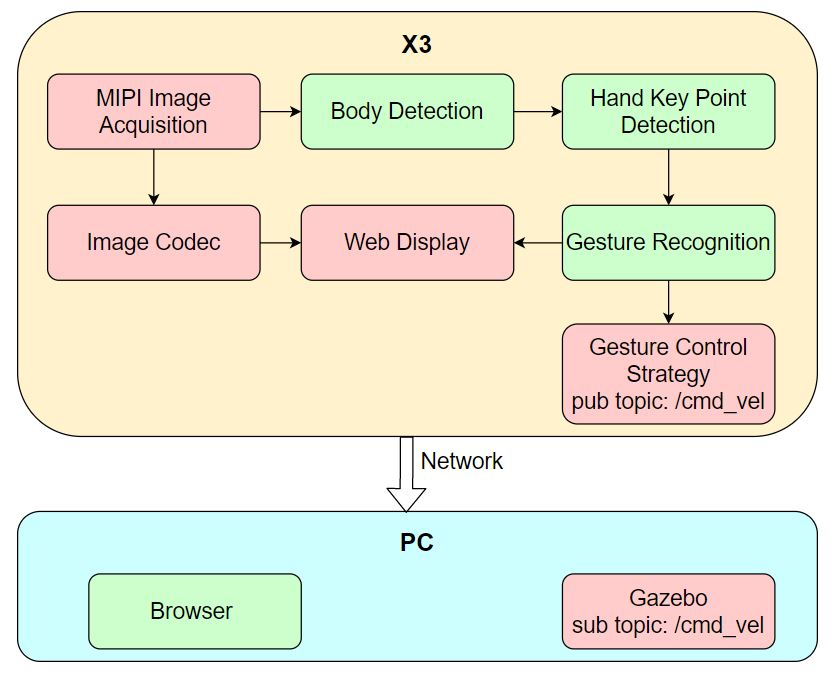
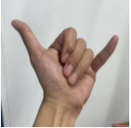
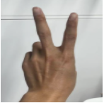
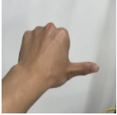
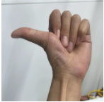

# 4.5 小车手势控制

```mdx-code-block
import Tabs from '@theme/Tabs';
import TabItem from '@theme/TabItem';
```

## 功能介绍

小车手势控制App功能为通过手势控制机器人小车运动，包括左右旋转和前后平移运动。App由MIPI图像采集、人体检测和跟踪、人手关键点检测、手势识别、手势控制策略、图像编解码、Web展示端组成，流程如下图：



支持的控制手势，对应的手势功能定义和手势动作举例如下：

| 控制手势              | 手势功能 | 手势动作举例                                                           |
| --------------------- | -------- | ---------------------------------------------------------------------- |
| 666手势/Awesome       | 前进     |        |
| yeah/Victory          | 后退     |        |
| 大拇指向右/ThumbRight | 右转     |  |
| 大拇指向左/ThumbLeft  | 左转     |    |

App以PC端Gazebo仿真环境下的虚拟小车举例，发布的控制指令也可以直接用于控制实物小车。

代码仓库：<https://github.com/HorizonRDK/gesture_control>

## 支持平台

| 平台                             | 运行方式     | 示例功能                                                                           |
| -------------------------------- | ------------ | ---------------------------------------------------------------------------------- |
| RDK X3, RDK X3 Module | Ubuntu 20.04 (Foxy), Ubuntu 22.04 (Humble) | 启动MIPI/USB摄像头获取图像，并进行手势识别以及手势控制，最后通过Gazebo展示控制效果 |
| RDK Ultra | Ubuntu 20.04 (Foxy) | 启动MIPI/USB摄像头获取图像，并进行手势识别以及手势控制，最后通过Gazebo展示控制效果 |

## 准备工作

### 地平线RDK平台

1. 地平线RDK已烧录好地平线提供的Ubuntu 20.04/Ubuntu 22.04系统镜像。

2. 地平线RDK已成功安装TogetheROS.Bot。

3. 地平线RDK已安装MIPI或者USB摄像头。

4. 和地平线RDK在同一网段（有线或者连接同一无线网，IP地址前三段需保持一致）的PC，PC端需要安装的环境包括：

 <Tabs groupId="tros-distro">
 <TabItem value="foxy" label="Foxy">

   - Ubuntu 20.04系统和[ROS2 Foxy桌面版](https://docs.ros.org/en/foxy/Installation/Ubuntu-Install-Debians.html)
   - Gazebo和Turtlebot3相关的功能包，安装方法：

    ```shell
    sudo apt-get install ros-foxy-gazebo-*
    sudo apt install ros-foxy-turtlebot3
    sudo apt install ros-foxy-turtlebot3-simulations
    ```

 </TabItem>
 <TabItem value="humble" label="Humble">

   - Ubuntu 22.04系统和[ROS2 Humble桌面版](https://docs.ros.org/en/humble/Installation/Ubuntu-Install-Debians.html)
   - Gazebo和Turtlebot3相关的功能包，安装方法：

    ```shell
    sudo apt-get install ros-humble-gazebo-*
    sudo apt install ros-humble-turtlebot3
    sudo apt install ros-humble-turtlebot3-simulations
    ```

 </TabItem>
 </Tabs>

## 使用介绍

### 地平线RDK平台

运行小车手势控制App后，通过“666手势/Awesome”手势控制小车前进，“yeah/Victory”手势控制小车后退，“大拇指向右/ThumbRight”手势控制小车右转，“大拇指向左/ThumbLeft”手势控制小车左转。其中左转/右转分别是向人的左/右方向（大拇指的指向）转动。

App启动后可以在PC端浏览器上渲染显示sensor发布的图片和对应的算法结果（浏览器输入<http://IP:8000>，IP为地平线RDK的IP地址）。

PC端启动仿真环境：

<Tabs groupId="tros-distro">
<TabItem value="foxy" label="Foxy">

```shell
source /opt/ros/foxy/setup.bash
```

</TabItem>
<TabItem value="humble" label="Humble">

```shell
source /opt/ros/humble/setup.bash
```

</TabItem>
</Tabs>

```shell
export TURTLEBOT3_MODEL=burger
ros2 launch turtlebot3_gazebo empty_world.launch.py
```

启动成功后，仿真环境中小车效果如下：


**使用mipi摄像头发布图片**

<Tabs groupId="tros-distro">
<TabItem value="foxy" label="Foxy">

```shell
# 配置tros.b环境
source /opt/tros/setup.bash

# 从tros.b的安装路径中拷贝出运行示例需要的配置文件。
cp -r /opt/tros/${TROS_DISTRO}/lib/mono2d_body_detection/config/ .
cp -r /opt/tros/${TROS_DISTRO}/lib/hand_lmk_detection/config/ .
cp -r /opt/tros/${TROS_DISTRO}/lib/hand_gesture_detection/config/ .

# 配置MIPI摄像头
export CAM_TYPE=mipi

# 启动launch文件
ros2 launch gesture_control gesture_control.launch.py
```

</TabItem>

<TabItem value="humble" label="Humble">

```shell
# 配置tros.b环境
source /opt/tros/humble/setup.bash

# 从tros.b的安装路径中拷贝出运行示例需要的配置文件。
cp -r /opt/tros/${TROS_DISTRO}/lib/mono2d_body_detection/config/ .
cp -r /opt/tros/${TROS_DISTRO}/lib/hand_lmk_detection/config/ .
cp -r /opt/tros/${TROS_DISTRO}/lib/hand_gesture_detection/config/ .

# 配置MIPI摄像头
export CAM_TYPE=mipi

# 启动launch文件
ros2 launch gesture_control gesture_control.launch.py
```

</TabItem>

</Tabs>

**使用USB摄像头发布图片**

<Tabs groupId="tros-distro">
<TabItem value="foxy" label="Foxy">

```shell
# 配置tros.b环境
source /opt/tros/setup.bash

# 从tros.b的安装路径中拷贝出运行示例需要的配置文件。
cp -r /opt/tros/${TROS_DISTRO}/lib/mono2d_body_detection/config/ .
cp -r /opt/tros/${TROS_DISTRO}/lib/hand_lmk_detection/config/ .
cp -r /opt/tros/${TROS_DISTRO}/lib/hand_gesture_detection/config/ .

# 配置USB摄像头
export CAM_TYPE=usb

# 启动launch文件
ros2 launch gesture_control gesture_control.launch.py
```

</TabItem>

<TabItem value="humble" label="Humble">

```shell
# 配置tros.b环境
source /opt/tros/humble/setup.bash

# 从tros.b的安装路径中拷贝出运行示例需要的配置文件。
cp -r /opt/tros/${TROS_DISTRO}/lib/mono2d_body_detection/config/ .
cp -r /opt/tros/${TROS_DISTRO}/lib/hand_lmk_detection/config/ .
cp -r /opt/tros/${TROS_DISTRO}/lib/hand_gesture_detection/config/ .

# 配置USB摄像头
export CAM_TYPE=usb

# 启动launch文件
ros2 launch gesture_control gesture_control.launch.py
```

</TabItem>

</Tabs>

## 结果分析

在地平线RDK运行终端输出如下信息：

```shell
[gesture_control-7] [WARN] [1652965757.159500951] [GestureControlEngine]: frame_ts_ms: 3698315358, track_id: 2, tracking_sta: 1, gesture: 14
[gesture_control-7] [WARN] [1652965757.159660358] [GestureControlEngine]: do move, direction: 0, step: 0.500000
[gesture_control-7] [WARN] [1652965757.211420964] [GestureControlEngine]: frame_ts_ms: 3698315425, track_id: 2, tracking_sta: 1, gesture: 14
[gesture_control-7] [WARN] [1652965757.211624899] [GestureControlEngine]: do move, direction: 0, step: 0.500000
[gesture_control-7] [WARN] [1652965757.232051230] [GestureControlEngine]: frame_ts_ms: 3698315457, track_id: 2, tracking_sta: 1, gesture: 14
[gesture_control-7] [WARN] [1652965757.232207513] [GestureControlEngine]: do move, direction: 0, step: 0.500000
```

以上log截取了一段通过手势控制小车运动的处理结果。其中tracking_sta值为1，表示处于手势控制状态，tracking_sta值为0表示识别到手势。

从时间戳frame_ts_ms: 3698315358开始通过666手势（gesture: 14）控制小车以0.5m/s的速度前进运动（do move, direction: 0, step: 0.500000）。

PC端在终端使用`ros2 topic list`命令可以查询到地平线RDK的topic信息：

```shell
$ ros2 topic list
/camera_info
/cmd_vel
/hbmem_img04054242060426080500012020112713
/hobot_hand_gesture_detection
/hobot_hand_lmk_detection
/hobot_mono2d_body_detection
/image
/parameter_events
/rosout
```

其中`/image`是地平线RDK发布的从MIPI sensor采集图像后经过JPEG格式编码的图片，`/hobot_hand_gesture_detection`是地平线RDK发布的包含手势识别信息的算法msg，`/cmd_vel`是地平线RDK发布的运动控制指令。

PC端在终端使用`ros2 topic echo /cmd_vel`命令可以查看到地平线RDK发布的运动控制指令：

```shell
linear:
  x: -0.5
  y: 0.0
  z: 0.0
angular:
  x: 0.0
  y: 0.0
  z: 0.0
---
linear:
  x: 0.0
  y: 0.0
  z: 0.0
angular:
  x: 0.0
  y: 0.0
  z: -0.5
---
```

PC端仿真环境中小车按照手势动作运动，仿真小车运动效果如下：


