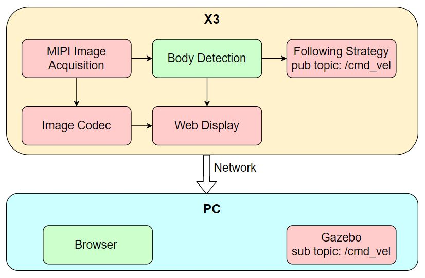

# 4.4 小车人体跟随

## 功能介绍

小车人体跟随App功能为控制机器人跟随人体移动，App由MIPI图像采集、人体检测和跟踪、人体跟随策略、图像编解码、Web展示端组成，流程如下图：



App以PC端Gazebo仿真环境下的虚拟小车举例，发布的控制指令也可以直接用于控制实物小车。

代码仓库：<https://github.com/HorizonRDK/body_tracking>

## 支持平台

| 平台    | 运行方式      | 示例功能                       |
| ------- | ------------ | ------------------------------ |
| RDK X3, RDK X3 Module, RDK J5| Ubuntu 20.04 | 启动MIPI/USB摄像头获取图像，并进行人体关键点检测以及人体跟踪，最后通过Gazebo展示跟随效果 |

## 准备工作

### 地平线RDK平台

1. 地平线RDK已烧录好地平线提供的Ubuntu 20.04系统镜像。

2. 地平线RDK已成功安装TogetheROS.Bot。

3. 地平线RDK已安装MIPI或者USB摄像头。

4. 和地平线RDK在同一网段（有线或者连接同一无线网，IP地址前三段需保持一致）的PC，PC端需要安装的环境包括：

  - Ubuntu 20.04系统

  - [ROS2 Foxy桌面版](https://docs.ros.org/en/foxy/Installation/Ubuntu-Install-Debians.html)

  - Gazebo和Turtlebot3相关的功能包，安装方法：

  ```
  sudo apt-get install ros-foxy-gazebo-*
  sudo apt install ros-foxy-turtlebot3
  sudo apt install ros-foxy-turtlebot3-simulations
  ```


## 使用介绍

### 地平线RDK平台

运行小车人体跟随App后，小车运动控制package选择距离小车前方最近的人体（人体检测框宽度最大）作为跟随对象。当人体距离小车较远时，小车开始前进运动靠近人体，并保持人体在小车正前方。

APP启动后可以在PC端浏览器上渲染显示sensor发布的图片和对应的算法结果（浏览器输入http://IP:8000，IP为地平线RDK的IP地址）。

PC端启动仿真环境：

```
source /opt/ros/foxy/setup.bash
export TURTLEBOT3_MODEL=burger
ros2 launch turtlebot3_gazebo empty_world.launch.py
```

启动成功后，仿真环境中小车效果如下：


**使用mipi摄像头发布图片**

```shell
# 配置tros.b环境
source /opt/tros/setup.bash

# 从TogetheROS的安装路径中拷贝出运行示例需要的配置文件。
cp -r /opt/tros/lib/mono2d_body_detection/config/ .

# 配置MIPI摄像头
export CAM_TYPE=mipi

# 启动launch文件
ros2 launch body_tracking body_tracking_without_gesture.launch.py
```

**使用USB摄像头发布图片**

```shell
# 配置tros.b环境
source /opt/tros/setup.bash

# 从tros.b的安装路径中拷贝出运行示例需要的配置文件。
cp -r /opt/tros/lib/mono2d_body_detection/config/ .

# 配置USB摄像头
export CAM_TYPE=usb

# 启动launch文件
ros2 launch body_tracking body_tracking_without_gesture.launch.py
```

## 结果分析

在地平线RDK板端运行终端输出如下信息：

```shell
[body_tracking-7] [WARN] [1653430533.523069034] [ParametersClass]: TrackCfg param are
[body_tracking-7] activate_wakeup_gesture: 0
[body_tracking-7] track_serial_lost_num_thr: 100
[body_tracking-7] activate_robot_rotate_thr: 45
[body_tracking-7] activate_robot_move_thr: 5
[body_tracking-7] move_step: 0.3
[body_tracking-7] rotate_step: 0.5
[body_tracking-7] img_width: 960
[body_tracking-7] img_height: 544
[body_tracking-7] 
[body_tracking-7] [WARN] [1653430533.712812076] [TrackingManager]: update frame_ts 395787, 873
[body_tracking-7] [WARN] [1653430533.713105576] [TrackingManager]: Tracking body start!, track_id: 1, frame_ts: 395787, tracking_sta(0:INITING, 1:TRACKING, 2:LOST): 1, gesture: 0
[body_tracking-7] [WARN] [1653430535.018442618] [TrackingManager]: Do move! body_rect_width: 353, thr: 864, move_step_ratio: 1, body_rect_to_top: 20, img_height: 544, move_step: 0.3
[body_tracking-7] [WARN] [1653430535.220268535] [TrackingManager]: Do rotate move, ts sec: 3397, nanosec: 387800000
[body_tracking-7] [WARN] [1653430535.220408576] [RobotCmdVelNode]: RobotCtl, angular: 0 0 0, linear: 0.3 0 0, pub twist ts: 1653430535220394

```

以上log截取了一段App启动后的输出。启动后先打印相关配置（TrackCfg param）。检测到人体后小车就开始进入跟随状态（tracking_sta值为1），并以0.3m/s的速度前进运动（RobotCtl, angular: 0 0 0, linear: 0.3 0 0）靠近人体。

PC端在终端使用`ros2 topic list`命令可以查询到地平线RDK的topic信息：

```shell
$ ros2 topic list
/clock
/cmd_vel
/hbmem_img04054242060426080500012020112713
/hobot_mono2d_body_detection
/image_jpeg
/image_raw
```

其中`/image_jpeg`是地平线RDK发布的从MIPI sensor采集图像后经过JPEG格式编码的图片，`/hobot_mono2d_body_detection`是地平线RDK发布的包含人体检测结果的算法msg，`/cmd_vel`是地平线RDK发布的运动控制指令。

PC端在终端使用`ros2 topic echo /cmd_vel`命令可以查看到地平线RDK发布的运动控制指令：

```shell
linear:
  x: 0.5
  y: 0.0
  z: 0.0
angular:
  x: 0.0
  y: 0.0
  z: -0.5
---
linear:
  x: 0.5
  y: 0.0
  z: 0.0
angular:
  x: 0.0
  y: 0.0
  z: -0.5
---
```

PC端仿真环境中小车跟随人体运动，仿真小车运动效果如下：


