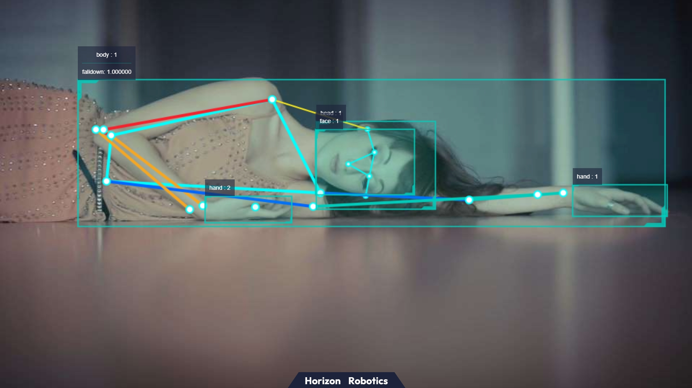

# 4.3 姿态检测

```mdx-code-block
import Tabs from '@theme/Tabs';
import TabItem from '@theme/TabItem';
```

## 功能介绍

姿态检测App通过订阅摄像头发布的图片消息，检测出人体关键点后分析人体姿态，并发布姿态事件。

姿态事件使用自定义算法msg发布出去, 用户可以订阅此topic的msg用于应用开发。

目前只支持跌倒检测功能，检测人体是否跌倒。

代码仓库：<https://github.com/HorizonRDK/hobot_falldown_detection>

## 支持平台

| 平台     | 运行方式     | 示例功能                       |
| -------- | ------------ | ------------------------------ |
| RDK X3, RDK X3 Module | Ubuntu 20.04 (Foxy), Ubuntu 22.04 (Humble) | 启动MIPI/USB摄像头获取图像，并进行人体关键点检测以及姿态检测，最后通过Web展示图像和算法效果，发布姿态事件 |
| RDK Ultra | Ubuntu 20.04 (Foxy) | 启动MIPI/USB摄像头获取图像，并进行人体关键点检测以及姿态检测，最后通过Web展示图像和算法效果，发布姿态事件 |

## 准备工作

### 地平线RDK平台

1. 地平线RDK已烧录好地平线提供的Ubuntu 20.04/Ubuntu 22.04系统镜像。

2. 地平线RDK已成功安装TogetheROS.Bot。

3. 确认PC机跟地平线RDK处于同一网段，IP地址前三段需保持一致

4. 地平线RDK已安装MIPI或者USB摄像头。

## 使用介绍

### 地平线RDK平台

姿态检测pkg订阅人体关键点检测pkg发布的数据，经过算法推理后发布算法msg，通过websocket package实现在PC端浏览器上渲染显示发布的图片和对应的算法结果。

友情提示：体验App时，将摄像头旋转90度，模拟人跌倒的效果。

**使用mipi摄像头发布图片**

<Tabs groupId="tros-distro">
<TabItem value="foxy" label="Foxy">

```shell
# 配置tros.b环境
source /opt/tros/setup.bash

# 从tros.b的安装路径中拷贝出运行示例需要的配置文件。
cp -r /opt/tros/${TROS_DISTRO}/lib/mono2d_body_detection/config/ .

# 配置MIPI摄像头
export CAM_TYPE=mipi

# 启动launch文件
ros2 launch hobot_falldown_detection hobot_falldown_detection.launch.py
```

</TabItem>

<TabItem value="humble" label="Humble">

```shell
# 配置tros.b环境
source /opt/tros/humble/setup.bash

# 从tros.b的安装路径中拷贝出运行示例需要的配置文件。
cp -r /opt/tros/${TROS_DISTRO}/lib/mono2d_body_detection/config/ .

# 配置MIPI摄像头
export CAM_TYPE=mipi

# 启动launch文件
ros2 launch hobot_falldown_detection hobot_falldown_detection.launch.py
```

</TabItem>

</Tabs>

**使用USB摄像头发布图片**

<Tabs groupId="tros-distro">
<TabItem value="foxy" label="Foxy">

```shell
# 配置tros.b环境
source /opt/tros/setup.bash

# 从tros.b的安装路径中拷贝出运行示例需要的配置文件。
cp -r /opt/tros/${TROS_DISTRO}/lib/mono2d_body_detection/config/ .

# 配置USB摄像头
export CAM_TYPE=usb

# 启动launch文件
ros2 launch hobot_falldown_detection hobot_falldown_detection.launch.py
```

</TabItem>

<TabItem value="humble" label="Humble">

```shell
# 配置tros.b环境
source /opt/tros/humble/setup.bash

# 从tros.b的安装路径中拷贝出运行示例需要的配置文件。
cp -r /opt/tros/${TROS_DISTRO}/lib/mono2d_body_detection/config/ .

# 配置USB摄像头
export CAM_TYPE=usb

# 启动launch文件
ros2 launch hobot_falldown_detection hobot_falldown_detection.launch.py
```

</TabItem>

</Tabs>

运行命令中的参数说明，参考hobot_falldown_detection package源码中的README.md。

## 结果分析

启动姿态检测pkg后，在运行终端输出如下信息：

```shell
[hobot_falldown_detection-4] [INFO] [1660271558.250055538] [body_kps_Subscriber]: receive targetType: personpointType: body_kps
[hobot_falldown_detection-4] [INFO] [1660271558.250598996] [fall_down_publisher]: track_id: 1 is fall down
```

输出log显示，订阅到了body_kps数据，并发布了姿态事件。

在PC端的浏览器输入<http://IP:8000>，人体检测框，关键点和姿态检测结果在web端展示渲染效果（IP为地平线RDK的IP地址）：


