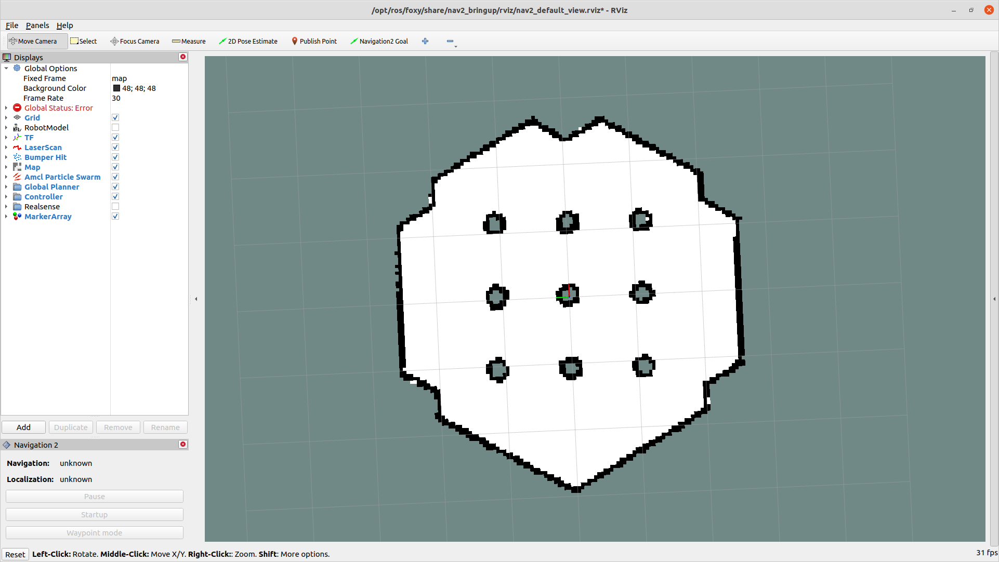
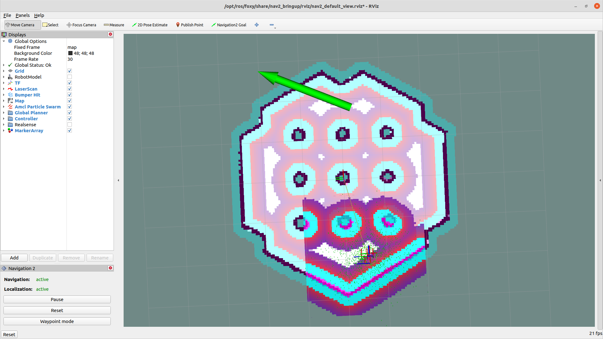

# 4.2 Navigation2

```mdx-code-block
import Tabs from '@theme/Tabs';
import TabItem from '@theme/TabItem';
```

## 功能介绍

Nav2（Navigation2）是ROS2中自带的导航框架，旨在寻找一种安全的方式让移动机器人从A点移动到B点。Nav2也可以应用于其他机器人导航应用，例如动态点跟踪，在这个过程中需要完成动态路径规划、计算电机速度、避免障碍等。

[SLAM建图](./slam)介绍了如何运行SLAM算法进行建图，本章节介绍如何基于建立的地图使用Nav2进行导航。同样使用Gazebo在PC端创建虚拟环境和小车，使用Rviz2设置导航目的地，地平线RDK运行Nav2程序导航。


## 支持平台

| 平台    | 运行方式     | 示例功能                       |
| ------- | ------------ | ------------------------------ |
| RDK X3, RDK X3 Module | Ubuntu 20.04 (Foxy), Ubuntu 22.04 (Humble) | PC端启动仿真环境，并在地平线RDK启动导航功能，最后通过Rviz2展示导航效果 |

## 准备工作

### 地平线RDK平台

1. 地平线RDK已烧录好地平线提供的Ubuntu 20.04/Ubuntu 22.04系统镜像。

2. 地平线RDK已成功安装tros.b。

3. tros.b成功安装后，安装Nav2。

 <Tabs groupId="tros-distro">
 <TabItem value="foxy" label="Foxy">

   ```shell
   sudo apt update 
   sudo apt install ros-foxy-navigation2
   sudo apt install ros-foxy-nav2-bringup
   ```

 </TabItem>
 <TabItem value="humble" label="Humble">

   ```shell
   sudo apt update 
   sudo apt install ros-humble-navigation2
   sudo apt install ros-humble-nav2-bringup
   ```

 </TabItem>
 </Tabs>

4. 和地平线RDK在同一网段的PC，PC已安装Ubuntu 20.04/Ubuntu 22.04系统、ROS2桌面版和仿真环境Gazebo，数据可视化工具Rviz2。

 <Tabs groupId="tros-distro">
 <TabItem value="foxy" label="Foxy">

   - Ubuntu 20.04系统和[ROS2 Foxy桌面版](https://docs.ros.org/en/foxy/Installation/Ubuntu-Install-Debians.html)
   - PC的ROS2安装成功后安装Gazebo和Turtlebot3相关的功能包，安装方法为：

    ```bash
    sudo apt-get install ros-foxy-gazebo-*
    sudo apt install ros-foxy-turtlebot3*
    sudo apt install ros-foxy-navigation2
    sudo apt install ros-foxy-nav2-bringup
    ```

 </TabItem>
 <TabItem value="humble" label="Humble">

   - Ubuntu 22.04系统和[ROS2 Humble桌面版](https://docs.ros.org/en/humble/Installation/Ubuntu-Install-Debians.html)
   - PC的ROS2安装成功后安装Gazebo和Turtlebot3相关的功能包，安装方法为：

    ```bash
    sudo apt-get install ros-humble-gazebo-*
    sudo apt install ros-humble-turtlebot3*
    sudo apt install ros-humble-navigation2
    sudo apt install ros-humble-nav2-bringup
    ```

 </TabItem>
 </Tabs>

## 使用介绍

### 地平线RDK平台

本章节介绍如何在PC端搭建仿真环境，以及进行导航目的地设置，地平线RDK运行导航功能，并查看导航效果。

1. **PC端**启动gazebo仿真环境

<Tabs groupId="tros-distro">
<TabItem value="foxy" label="Foxy">

   ```shell
   source /opt/ros/foxy/setup.bash
   ```

</TabItem>
<TabItem value="humble" label="Humble">

   ```shell
   source /opt/ros/humble/setup.bash
   ```

</TabItem>
</Tabs>

   ```shell
   export TURTLEBOT3_MODEL=waffle
   ros2 launch turtlebot3_gazebo turtlebot3_world.launch.py
   ```

   仿真环境如下图所示：

   

1. **地平线RDK**启动导航功能

   <Tabs groupId="tros-distro">
   <TabItem value="foxy" label="Foxy">

   ```bash
   # 配置tros.b环境
   source /opt/tros/setup.bash
   ros2 launch nav2_bringup bringup_launch.py use_sim_time:=True map:=/opt/ros/foxy/share/nav2_bringup/maps/turtlebot3_world.yaml
   ```

   </TabItem>

   <TabItem value="humble" label="Humble">

   ```bash
   # 配置tros.b环境
   source /opt/tros/humble/setup.bash
   ros2 launch nav2_bringup bringup_launch.py use_sim_time:=True map:=/opt/ros/humble/share/nav2_bringup/maps/turtlebot3_world.yaml
   ```

   </TabItem>

   </Tabs>

2. **PC端**启动Rviz2工具

<Tabs groupId="tros-distro">
<TabItem value="foxy" label="Foxy">

   ```shell
   source /opt/ros/foxy/setup.bash
   ```

</TabItem>
<TabItem value="humble" label="Humble">

   ```shell
   source /opt/ros/humble/setup.bash
   ```

</TabItem>
</Tabs>

   ```shell
   ros2 launch nav2_bringup rviz_launch.py
   ```

   Rviz2效果如下图：

   

1. 在Rviz2上设置机器人起始位置和方向

   Rviz2启动后，机器人最初不知道它在哪里。默认情况下，Nav2会等待用户给机器人一个大致的起始位置。查看机器人在Gazebo中的位置，并在地图上找到该位置。通过点击Rviz2中的"2D Pose Estimate" 按钮，然后通过在地图上机器人预估的位置处点击来设置机器人初始位置 。可以通过向前拖动刚才单击的位置来设置机器人起始的移动方向。如下图所示：

   

   一旦设置好了机器人的初始位置，就会完成坐标变换树，同时Nav2将会完全激活并准备就绪。这时就可以看到机器人和点云了。

   

2. Rviz2设置目的地

   点击 "Navigaton2 Goal" 按钮并选择一个目的地。

   

   现在就可以看到机器人在移动了。

## 结果分析

导航效果如下图所示：


