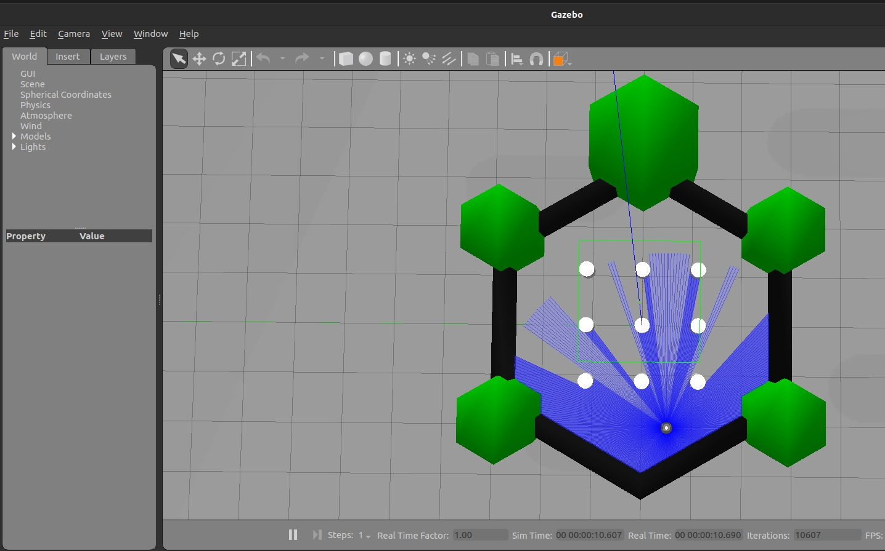
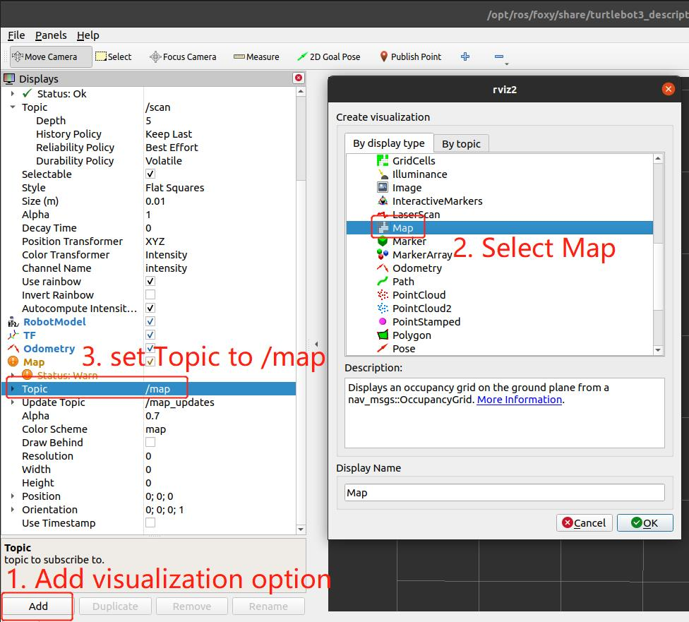
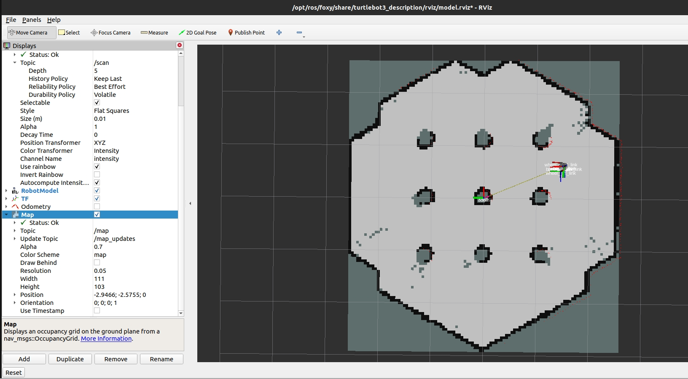

# 4.1 SLAM建图

```mdx-code-block
import Tabs from '@theme/Tabs';
import TabItem from '@theme/TabItem';
```

## 功能介绍

SLAM指即时定位与地图构建（Simultaneous Localization and Mapping，简称SLAM）。
本章节使用ROS2的SLAM-Toolbox作为建图算法，在Gazebo中控制小车行驶建立地图，并通过Rviz2观察建图效果。
其中SLAM-Toolbox运行在地平线RDK上，Gazebo和Rviz2运行在与地平线RDK同一网段的PC上。

## 支持平台

| 平台    | 运行方式     |
| ------- | ------------ |
| RDK X3, RDK X3 Module | Ubuntu 20.04 (Foxy), Ubuntu 22.04 (Humble) |
| RDK Ultra | Ubuntu 22.04 |

## 准备工作

### 地平线RDK平台

1. 地平线RDK已烧录好地平线提供的Ubuntu 20.04/Ubuntu 22.04系统镜像。

2. 地平线RDK已成功安装TogetheROS.Bot。

3. tros.b成功安装后，安装SLAM-Toolbox

 <Tabs groupId="tros-distro">
 <TabItem value="foxy" label="Foxy">

    ```bash
    sudo apt-get install ros-foxy-slam-toolbox
    ```

 </TabItem>
 <TabItem value="humble" label="Humble">

    ```bash
    sudo apt-get install ros-humble-slam-toolbox
    ```

 </TabItem>
 </Tabs>

:::caution
 如果安装失败，并且报错如下：

 ```bash
   The following packages have unmet dependencies:
    ros-foxy-slam-toolbox : Depends: ros-foxy-nav2-map-server but it is not going to be installed
   E: Unable to correct problems, you have held broken packages.
 ```

 请执行以下命令后再安装：
 
   apt update

   sudo apt install libwebp6=0.6.1-2ubuntu0.20.04.3
:::

4. 和地平线RDK在同一网段的PC，PC已安装Ubuntu 20.04/Ubuntu 22.04系统、ROS2桌面版和仿真环境Gazebo，数据可视化工具Rviz2。

 <Tabs groupId="tros-distro">
 <TabItem value="foxy" label="Foxy">

   - Ubuntu 20.04系统和[ROS2 Foxy桌面版](https://docs.ros.org/en/foxy/Installation/Ubuntu-Install-Debians.html)
   - PC的ROS2安装成功后安装Gazebo和Turtlebot3相关的功能包，安装方法为：

    ```bash
    sudo apt-get install ros-foxy-gazebo-*
    sudo apt install ros-foxy-turtlebot3
    sudo apt install ros-foxy-turtlebot3-bringup
    sudo apt install ros-foxy-turtlebot3-simulations
    sudo apt install ros-foxy-teleop-twist-keyboard
    ```

 </TabItem>
 <TabItem value="humble" label="Humble">

   - Ubuntu 22.04系统和[ROS2 Humble桌面版](https://docs.ros.org/en/humble/Installation/Ubuntu-Install-Debians.html)
   - PC的ROS2安装成功后安装Gazebo和Turtlebot3相关的功能包，安装方法为：

    ```bash
    sudo apt-get install ros-humble-gazebo-*
    sudo apt install ros-humble-turtlebot3
    sudo apt install ros-humble-turtlebot3-bringup
    sudo apt install ros-humble-turtlebot3-simulations
    sudo apt install ros-humble-teleop-twist-keyboard
    ```

 </TabItem>
 </Tabs>

## 使用介绍

### 地平线RDK平台

本小节介绍如何使用地平线RDK运行SLAM算法，并使用PC观察建图效果。

PC端启动仿真环境：

<Tabs groupId="tros-distro">
<TabItem value="foxy" label="Foxy">

```shell
source /opt/ros/foxy/setup.bash
```

</TabItem>
<TabItem value="humble" label="Humble">

```shell
source /opt/ros/humble/setup.bash
```

</TabItem>
</Tabs>

```bash
export TURTLEBOT3_MODEL=burger
ros2 launch turtlebot3_gazebo turtlebot3_world.launch.py
```

仿真环境如下图所示：


PC端开启另外一个控制台，启动Rviz2 用于观察建图效果：

<Tabs groupId="tros-distro">
<TabItem value="foxy" label="Foxy">

```shell
source /opt/ros/foxy/setup.bash
```

</TabItem>
<TabItem value="humble" label="Humble">

```shell
source /opt/ros/humble/setup.bash
```

</TabItem>
</Tabs>

```bash
ros2 launch turtlebot3_bringup rviz2.launch.py
```

打开Rviz2后，需要添加“map”可视化选项，用于展示建立的地图，步骤如下所示：


地平线RDK板端运行SLAM-Toolbox：

<Tabs groupId="tros-distro">
<TabItem value="foxy" label="Foxy">

```bash
# 配置tros.b环境
source /opt/tros/setup.bash
```

</TabItem>

<TabItem value="humble" label="Humble">

```bash
# 配置tros.b环境
source /opt/tros/humble/setup.bash
```

</TabItem>

</Tabs>

```bash
#启动SLAM launch文件
ros2 launch slam_toolbox online_sync_launch.py
```

PC端开启另外一个控制台，PC端启动控制工具，通过键盘控制小车运动，控制方法见控制台打印的log，在此不再赘述：

<Tabs groupId="tros-distro">
<TabItem value="foxy" label="Foxy">

```shell
source /opt/ros/foxy/setup.bash
```

</TabItem>
<TabItem value="humble" label="Humble">

```shell
source /opt/ros/humble/setup.bash
```

</TabItem>
</Tabs>

```bash
ros2 run teleop_twist_keyboard teleop_twist_keyboard
```

控制小车行驶，随着小车雷达探测到更多的环境信息，SLAM算法也建立起环境地图，可以在Rviz2上观察到建图效果。


## 结果分析

在地平线RDK板端运行终端输出如下信息：

```text
[INFO] [launch]: All log files can be found below /root/.ros/log/2022-06-10-06-40-34-204213-ubuntu-5390
[INFO] [launch]: Default logging verbosity is set to INFO
[INFO] [sync_slam_toolbox_node-1]: process started with pid [5392]
[sync_slam_toolbox_node-1] [INFO] [1654843239.403931058] [slam_toolbox]: Node using stack size 40000000
[sync_slam_toolbox_node-1] [INFO] [1654843240.092340814] [slam_toolbox]: Using solver plugin solver_plugins::CeresSolver
[sync_slam_toolbox_node-1] [INFO] [1654843240.096554433] [slam_toolbox]: CeresSolver: Using SCHUR_JACOBI preconditioner.
[sync_slam_toolbox_node-1] Info: clipped range threshold to be within minimum and maximum range!
[sync_slam_toolbox_node-1] [WARN] [1654843589.431524393] [slam_toolbox]: maximum laser range setting (20.0 m) exceeds the capabilities of the used Lidar (3.5 m)
[sync_slam_toolbox_node-1] Registering sensor: [Custom Described Lidar]
```
