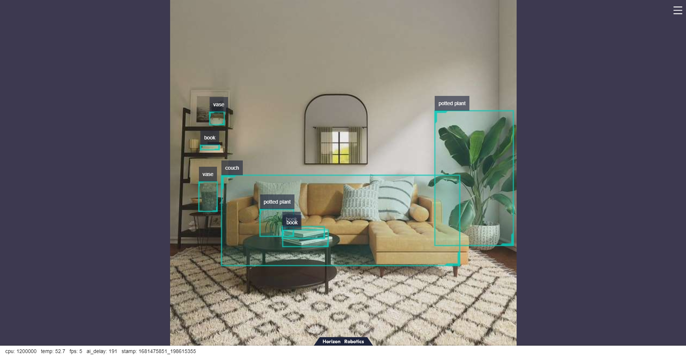
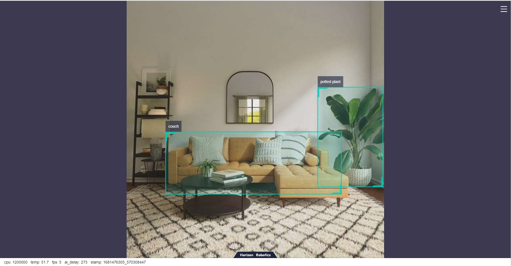

# 3.1 工具链参考算法

## 目标检测

### FCOS{#fcos}

#### 功能介绍

FCOS目标检测算法示例使用图片作为输入，利用BPU进行算法推理，发布包含目标类别和检测框的智能msg。

FCOS是地平线开源的Onnx模型，使用[COCO数据集](http://cocodataset.org/)进行训练，支持的目标检测类型包括人、动物、水果、交通工具等共80种类型。

代码仓库：<https://github.com/HorizonRDK/hobot_dnn>

应用场景：FCOS发布于2019年，是一款单阶段的目标检测算法，可实现行人检测、车辆检测等功能，主要应用于自动驾驶、智能家居等领域。

多光谱的目标检测案例：<https://github.com/hdjsjyl/Multispectral-FCOS>

#### 支持平台

| 平台    | 运行方式     | 示例功能                       |
| ------- | ------------ | ------------------------------ |
| RDK X3, RDK X3 Module| Ubuntu 20.04 | · 启动MIPI/USB摄像头，并通过web展示推理渲染结果<br/>· 使用本地回灌，渲染结果保存在本地 |
| X86     | Ubuntu 20.04 | · 使用本地回灌，渲染结果保存在本地 |

#### 准备工作

##### 地平线RDK平台

1. 地平线RDK已烧录好地平线提供的Ubuntu 20.04系统镜像。

2. 地平线RDK已成功安装TogetheROS.Bot。

3. 地平线RDK已安装MIPI或者USB摄像头，无摄像头的情况下通过回灌本地JPEG/PNG格式图片或者MP4、H.264和H.265的视频方式体验算法效果。

4. 确认PC机能够通过网络访问地平线RDK。

##### X86平台

1. X86环境已配置好Ubuntu 20.04系统镜像。

2. X86环境系统已成功安装tros.b。

#### 使用介绍

##### 地平线RDK平台

###### 使用MIPI摄像头发布图片

FCOS目标检测算法示例订阅sensor package发布的图片，经过推理后发布算法msg，通过websocket package实现在PC端浏览器上渲染显示发布的图片和对应的算法结果。

```shell
# 配置tros.b环境
source /opt/tros/setup.bash

# 配置MIPI摄像头
export CAM_TYPE=mipi

# 启动launch文件
ros2 launch dnn_node_example dnn_node_example.launch.py dnn_example_config_file:=config/fcosworkconfig.json dnn_example_image_width:=480 dnn_example_image_height:=272
```

###### 使用USB摄像头发布图片

```shell
# 配置tros.b环境
source /opt/tros/setup.bash

# 配置USB摄像头
export CAM_TYPE=usb

# 启动launch文件
ros2 launch dnn_node_example dnn_node_example.launch.py dnn_example_config_file:=config/fcosworkconfig.json dnn_example_image_width:=480 dnn_example_image_height:=272
```

###### 使用本地图片回灌

FCOS目标检测算法示例使用本地JPEG/PNG格式图片回灌，经过推理后将算法结果渲染后的图片存储在运行路径下。

```shell
# 配置tros.b环境
source /opt/tros/setup.bash

# 启动launch文件
ros2 launch dnn_node_example dnn_node_example_feedback.launch.py dnn_example_config_file:=config/fcosworkconfig.json dnn_example_image:=config/target.jpg
```

##### X86平台

###### 使用本地图片回灌

FCOS目标检测算法示例使用本地JPEG/PNG格式图片回灌，经过推理后将算法结果渲染后的图片存储在本地的运行路径下。

```shell
# 配置tros.b环境
source /opt/tros/setup.bash

# 启动launch文件
ros2 launch dnn_node_example dnn_node_example_feedback.launch.py dnn_example_config_file:=config/fcosworkconfig.json dnn_example_image:=config/target.jpg
```

#### 结果分析

##### 使用摄像头发布图片

在运行终端输出如下信息：

```text
[example-3] [WARN] [1655092908.847609539] [example]: Create ai msg publisher with topic_name: hobot_dnn_detection
[example-3] [WARN] [1655092908.849393011] [example]: Create img hbmem_subscription with topic_name: /hbmem_img
[example-3] [WARN] [1655092543.834432739] [img_sub]: Sub img fps 31.16
[example-3] [WARN] [1655092543.864126080] [example]: Smart fps 31.56
[example-3] [WARN] [1655092544.867603759] [img_sub]: Sub img fps 30.01
[example-3] [WARN] [1655092544.899715339] [example]: Smart fps 29.95
[example-3] [WARN] [1655092545.900991853] [img_sub]: Sub img fps 30.01
[example-3] [WARN] [1655092545.931518037] [example]: Smart fps 30.07
[example-3] [WARN] [1655092546.901658559] [img_sub]: Sub img fps 30.00
[example-3] [WARN] [1655092546.938970895] [example]: Smart fps 29.79
[example-3] [WARN] [1655092547.934894494] [img_sub]: Sub img fps 30.01
[example-3] [WARN] [1655092547.973566486] [example]: Smart fps 29.98
[example-3] [WARN] [1655092548.967549745] [img_sub]: Sub img fps 30.10
[example-3] [WARN] [1655092548.997125216] [example]: Smart fps 30.30

```

输出log显示，发布算法推理结果的topic为`hobot_dnn_detection`，订阅图片的topic为`/hbmem_img`，订阅到的图片和算法推理输出帧率约为30fps。

在PC端的浏览器输入http://IP:8000 即可查看图像和算法渲染效果（IP为地平线RDK的IP地址）：


##### 使用本地图片回灌

在运行终端输出如下信息：

```text
[example-1] [INFO] [1654766336.839353395] [PostProcessBase]: out box size: 6
[example-1] [INFO] [1654766336.839427767] [PostProcessBase]: det rect: 87.2364 259.123 409.917 371.59, det type: couch, score:0.782941
[example-1] [INFO] [1654766336.839523764] [PostProcessBase]: det rect: 374.212 175.732 510.993 375.211, det type: potted plant, score:0.719925
[example-1] [INFO] [1654766336.839597637] [PostProcessBase]: det rect: 167.183 335.857 234.13 355.308, det type: book, score:0.548071
[example-1] [INFO] [1654766336.839671426] [PostProcessBase]: det rect: 139.87 313.279 183.4 352.292, det type: potted plant, score:0.542984
[example-1] [INFO] [1654766336.839738966] [PostProcessBase]: det rect: 57.9695 148.59 83.5923 186.552, det type: potted plant, score:0.502935
[example-1] [INFO] [1654766336.839823755] [PostProcessBase]: det rect: 165.691 339.25 237.475 366.896, det type: book, score:0.500648
```

输出log显示，算法使用输入的图片推理出6个目标，并输出了目标检测框坐标（输出的坐标顺序分别是人体框的左上的x和y坐标，和右下的x和y坐标）和类别。存储的渲染图片文件名为render_feedback_0_0.jpeg，渲染图片效果：


### YOLO{#yolo}

#### 功能介绍

YOLO目标检测算法示例使用图片作为输入，利用BPU进行算法推理，发布包含目标类别和检测框的算法msg。目前支持yolov2、yolov3、yolov5、yolov5x四个版本。

模型使用[COCO数据集](http://cocodataset.org/)进行训练，支持的目标检测类型包括人、动物、水果、交通工具等共80种类型。

代码仓库：<https://github.com/HorizonRDK/hobot_dnn>

应用场景：YOLO系列作为单阶段目标检测中的代表算法，具有速度快，泛化性好的优点，可实现垃圾识别、车辆检测等功能，主要应用于自动驾驶、智能家居等领域。

车辆检测案例：<https://github.com/JunshengFu/vehicle-detection>   
摔倒检测案例：<https://github.com/xiaobin1231/Fall-Detection-By-YOLOV3-and-LiteFlowNet>

#### 支持平台

| 平台    | 运行方式      | 支持算法 |示例功能                       |
| ------- | ------------ | ---------| ------------------------------ |
| RDK X3, RDK X3 Module| Ubuntu 20.04 | yolov2/yolov3/yolov5 | · 启动MIPI/USB摄像头，并通过web展示推理渲染结果<br/>· 使用本地回灌，渲染结果保存在本地 |
| RDK J5| Ubuntu 20.04 | yolov5x | · 启动MIPI/USB摄像头，并通过web展示推理渲染结果<br/>· 使用本地回灌，渲染结果保存在本地 |
| X86     | Ubuntu 20.04 | yolov2/yolov3 | · 使用本地回灌，渲染结果保存在本地 |

#### 准备工作

##### 地平线RDK平台

1. 地平线RDK已烧录好地平线提供的Ubuntu 20.04系统镜像。

2. 地平线RDK已成功安装TogetheROS.Bot。

3. 地平线RDK已安装MIPI或者USB摄像头，无摄像头的情况下通过回灌本地JPEG/PNG格式图片或者MP4、H.264和H.265的视频方式体验算法效果。

4. 确认PC机能够通过网络访问地平线RDK。

##### X86平台

1. X86环境已配置好Ubuntu 20.04系统镜像。

2. X86环境系统已成功安装tros.b。

#### 使用介绍

##### 地平线RDK X3和RDK X3 Module平台

###### 使用MIPI摄像头发布图片

YOLOv2目标检测算法示例订阅MIPI摄像头发布的图片，经过算法推理后发布算法msg，通过websocket package实现在PC端浏览器上渲染显示发布的图片和对应的算法结果。

```shell
# 配置tros.b环境
source /opt/tros/setup.bash

# 配置MIPI摄像头
export CAM_TYPE=mipi

# 启动launch文件
ros2 launch dnn_node_example dnn_node_example.launch.py dnn_example_config_file:=config/yolov2workconfig.json dnn_example_image_width:=480 dnn_example_image_height:=272
```

###### 使用USB摄像头发布图片

YOLOv2目标检测算法示例订阅USB摄像头发布的图片，经过算法推理后发布算法msg，通过websocket package实现在PC端浏览器上渲染显示发布的图片和对应的算法结果。

```shell
# 配置tros.b环境
source /opt/tros/setup.bash

# 配置USB摄像头
export CAM_TYPE=usb

# 启动launch文件
ros2 launch dnn_node_example dnn_node_example.launch.py dnn_example_config_file:=config/yolov2workconfig.json dnn_example_image_width:=480 dnn_example_image_height:=272
```

###### 使用本地图片回灌

YOLOv2目标检测算法示例使用本地JPEG/PNG格式图片回灌，经过推理后将算法结果渲染后的图片存储在本地的运行路径下。

```shell
# 配置tros.b环境
source /opt/tros/setup.bash

# 启动launch文件
ros2 launch dnn_node_example dnn_node_example_feedback.launch.py dnn_example_config_file:=config/yolov2workconfig.json dnn_example_image:=config/target.jpg
```

除了YOLOv2算法，还支持YOLOv3和YOLOv5算法。启动命令中使用参数config_file切换算法，如使用YOLOv3算法的启动配置为`dnn_example_config_file:="config/yolov3workconfig.json"`，使用YOLOv5算法的启动配置为`dnn_example_config_file:="config/yolov5workconfig.json"`。

除了YOLOv2算法，还支持YOLOv3和YOLOv5算法。启动命令中使用参数config_file切换算法，如使用YOLOv3算法的启动配置为`dnn_example_config_file:="config/yolov3workconfig.json"`，使用YOLOv5算法的启动配置为`dnn_example_config_file:="config/yolov5workconfig.json"`。

##### 地平线RDK J5平台

###### 使用MIPI摄像头发布图片

YOLOv5x目标检测算法示例订阅MIPI摄像头发布的图片，经过算法推理后发布算法msg，通过websocket package实现在PC端浏览器上渲染显示发布的图片和对应的算法结果。

```shell
# 配置tros.b环境
source /opt/tros/setup.bash

# 配置MIPI摄像头
export CAM_TYPE=mipi

# 启动launch文件
ros2 launch dnn_node_example dnn_node_example.launch.py dnn_example_config_file:=config/yolov5xworkconfig.json dnn_example_image_width:=672 dnn_example_image_height:=672
```

###### 使用USB摄像头发布图片

YOLOv5x目标检测算法示例订阅USB摄像头发布的图片，经过算法推理后发布算法msg，通过websocket package实现在PC端浏览器上渲染显示发布的图片和对应的算法结果。

```shell
# 配置tros.b环境
source /opt/tros/setup.bash

# 配置USB摄像头
export CAM_TYPE=usb

# 启动launch文件
ros2 launch dnn_node_example dnn_node_example.launch.py dnn_example_config_file:=config/yolov5xworkconfig.json dnn_example_image_width:=672 dnn_example_image_height:=672
```

###### 使用本地图片回灌

YOLOv5x目标检测算法示例使用本地JPEG/PNG格式图片回灌，经过推理后将算法结果渲染后的图片存储在本地的运行路径下。

```shell
# 配置tros.b环境
source /opt/tros/setup.bash

# 启动launch文件
ros2 launch dnn_node_example dnn_node_example_feedback.launch.py dnn_example_config_file:=config/yolov5xworkconfig.json dnn_example_image:=config/target.jpg
```

##### X86平台

###### 使用本地图片回灌

YOLOv2目标检测算法示例使用本地JPEG/PNG格式图片回灌，经过推理后将算法结果渲染后的图片存储在本地的运行路径下。

```shell
# 配置tros.b环境
source /opt/tros/setup.bash

# 启动launch文件
ros2 launch dnn_node_example dnn_node_example_feedback.launch.py dnn_example_config_file:=config/yolov2workconfig.json dnn_example_image:=config/target.jpg
```

除了YOLOv2算法，还支持YOLOv3算法，YOLOv5算法暂不支持。启动命令中使用参数config_file切换算法，如使用YOLOv3算法的启动配置为`dnn_example_config_file:="config/yolov3workconfig.json"`。

#### 结果分析

##### 使用摄像头发布图片

在运行终端输出如下信息：

```text
[example-3] [WARN] [1655095347.608475236] [example]: Create ai msg publisher with topic_name: hobot_dnn_detection
[example-3] [WARN] [1655095347.608640353] [example]: Create img hbmem_subscription with topic_name: /hbmem_img
[example-3] [WARN] [1655095348.709411619] [img_sub]: Sub img fps 12.95
[example-3] [WARN] [1655095348.887570945] [example]: Smart fps 12.10
[example-3] [WARN] [1655095349.772225728] [img_sub]: Sub img fps 11.30
[example-3] [WARN] [1655095349.948913662] [example]: Smart fps 11.31
[example-3] [WARN] [1655095350.834951431] [img_sub]: Sub img fps 11.30
[example-3] [WARN] [1655095351.011915729] [example]: Smart fps 11.30
```

输出log显示，发布算法推理结果的topic为`hobot_dnn_detection`，订阅图片的topic为`/hbmem_img`。

在PC端的浏览器输入http://IP:8000 即可查看图像和算法渲染效果（IP为地平线RDK的IP地址）：



##### 使用本地图片回灌

在运行终端输出如下信息：

```text
[example-1] [INFO] [1654925067.952159234] [PostProcessBase]: out box size: 8
[example-1] [INFO] [1654925067.952227232] [PostProcessBase]: det rect: 464.03 196.145 605.525 434.865, det type: potted plant, score:0.813219
[example-1] [INFO] [1654925067.952319229] [PostProcessBase]: det rect: 86.5421 310.158 512.542 468.201, det type: couch, score:0.669208
[example-1] [INFO] [1654925067.952392268] [PostProcessBase]: det rect: 198.968 399.91 273.841 421.767, det type: book, score:0.539755
[example-1] [INFO] [1654925067.952465182] [PostProcessBase]: det rect: 159.861 370.656 217.685 417.746, det type: potted plant, score:0.480698
[example-1] [INFO] [1654925067.952533221] [PostProcessBase]: det rect: 51.2147 321.047 84.0969 375.842, det type: vase, score:0.433644
[example-1] [INFO] [1654925067.952607802] [PostProcessBase]: det rect: 70.0548 197.381 96.1826 221.062, det type: vase, score:0.399885
[example-1] [INFO] [1654925067.952675924] [PostProcessBase]: det rect: 197.706 405.271 278.929 435.743, det type: book, score:0.384268
[example-1] [INFO] [1654925067.952743463] [PostProcessBase]: det rect: 54.0955 256.68 88.6269 266.159, det type: book, score:0.307426
```

输出log显示，算法使用输入的图片推理出8个目标，并输出了目标检测框坐标（输出的坐标顺序分别是人体框的左上的x和y坐标，和右下的x和y坐标）和类别。存储的渲染图片文件名为render_feedback_0_0.jpeg，渲染图片效果：


### MobileNet_SSD{#mobilenet_ssd}

#### 功能介绍

MobileNet_SSD目标检测算法示例使用图片作为输入，利用BPU进行算法推理，发布包含目标类别和检测框的算法msg。

Mobilenet_SSD是从 <https://github.com/chuanqi305/MobileNet-SSD> 获得的 caffe 模型，使用[VOC数据集](http://host.robots.ox.ac.uk/pascal/VOC/voc2012/)进行训练，支持的目标检测类型包括人、动物、水果、交通工具等共20种类型。

代码仓库：<https://github.com/HorizonRDK/hobot_dnn>

应用场景：MobileNet_SSD是以MobileNet为基础的目标检测算法，具有速度快，易于部署的优点，可实现物体检测、垃圾识别等功能，主要应用于自动驾驶、智能家居等领域。

人脸检测案例：<https://github.com/bruceyang2012/Face-detection-with-mobilenet-ssd>    
车牌检测案例：<https://github.com/soonhahwang/Mobilenet-SSD-to-detect-Licence-Plate>

#### 支持平台

| 平台    | 运行方式      | 示例功能                       |
| ------- | ------------ | ------------------------------ |
| RDK X3, RDK X3 Module| Ubuntu 20.04 | · 启动MIPI/USB摄像头，并通过web展示推理渲染结果<br/>· 使用本地回灌，渲染结果保存在本地 |
| X86     | Ubuntu 20.04 | · 使用本地回灌，渲染结果保存在本地 |

#### 准备工作

##### 地平线RDK平台

1. 地平线RDK已烧录好地平线提供的Ubuntu 20.04系统镜像。

2. 地平线RDK已成功安装TogetheROS.Bot。

3. 地平线RDK已安装MIPI或者USB摄像头，无摄像头的情况下通过回灌本地JPEG/PNG格式图片或者MP4、H.264和H.265的视频方式体验算法效果。

4. 确认PC机能够通过网络访问地平线RDK。

##### X86平台

1. X86环境已配置好Ubuntu 20.04系统镜像。

2. X86环境系统已成功安装tros.b。

#### 使用介绍

##### 地平线RDK平台

###### 使用MIPI摄像头发布图片

MobileNet_SSD目标检测算法示例订阅sensor package发布的图片，经过推理后发布算法msg，通过websocket package实现在PC端浏览器上渲染显示发布的图片和对应的算法结果。

```shell
# 配置tros.b环境
source /opt/tros/setup.bash

# 配置MIPI摄像头
export CAM_TYPE=mipi

# 启动launch文件
ros2 launch dnn_node_example dnn_node_example.launch.py dnn_example_config_file:=config/mobilenet_ssd_workconfig.json dnn_example_image_width:=480 dnn_example_image_height:=272
```

###### 使用USB摄像头发布图片

```shell
# 配置tros.b环境
source /opt/tros/setup.bash

# 配置USB摄像头
export CAM_TYPE=usb

# 启动launch文件
ros2 launch dnn_node_example dnn_node_example.launch.py dnn_example_config_file:=config/mobilenet_ssd_workconfig.json dnn_example_image_width:=480 dnn_example_image_height:=272
```

##### 使用本地图片回灌

MobileNet_SSD目标检测算法示例使用本地JPEG/PNG格式图片回灌，经过推理后将算法结果渲染后的图片存储在本地的运行路径下。

```shell
# 配置tros.b环境
source /opt/tros/setup.bash

# 启动launch文件
ros2 launch dnn_node_example dnn_node_example_feedback.launch.py dnn_example_config_file:=config/mobilenet_ssd_workconfig.json dnn_example_image:=config/target.jpg
```

##### X86平台

##### 使用本地图片回灌

MobileNet_SSD目标检测算法示例使用本地JPEG/PNG格式图片回灌，经过算法推理后将算法结果渲染后的图片存储在本地的运行路径下。

```shell
# 配置tros.b环境
source /opt/tros/setup.bash

# 启动launch文件
ros2 launch dnn_node_example dnn_node_example_feedback.launch.py dnn_example_config_file:=config/mobilenet_ssd_workconfig.json dnn_example_image:=config/target.jpg
```

#### 结果分析

##### 使用摄像头发布图片

在运行终端输出如下信息：

```shell
[example-3] [WARN] [1655095279.473675326] [example]: Create ai msg publisher with topic_name: hobot_dnn_detection
[example-3] [WARN] [1655095279.473789113] [example]: Create img hbmem_subscription with topic_name: /hbmem_img
[example-3] [WARN] [1655095280.697388819] [img_sub]: Sub img fps 31.16
[example-3] [WARN] [1655095280.710505278] [example]: Smart fps 31.50
[example-3] [WARN] [1655095281.697831409] [img_sub]: Sub img fps 30.00
[example-3] [WARN] [1655095281.743811574] [example]: Smart fps 30.01
[example-3] [WARN] [1655095282.730768103] [img_sub]: Sub img fps 30.04
[example-3] [WARN] [1655095282.744084511] [example]: Smart fps 30.00
```

输出log显示，发布算法推理结果的topic为`hobot_dnn_detection`，订阅图片的topic为`/hbmem_img`，订阅到的图片和算法推理输出帧率约为30fps。

在PC端的浏览器输入http://IP:8000 即可查看图像和算法渲染效果（IP为地平线RDK的IP地址）：


##### 使用本地图片回灌

在运行终端输出如下信息：

```shell
[example-1] [INFO] [1654930510.201326806] [example]: Output from image_name: config/target.jpg, frame_id: feedback, stamp: 0.0
[example-1] [INFO] [1654930510.201485092] [PostProcessBase]: outputs size: 12
[example-1] [INFO] [1654930510.201581047] [PostProcessBase]: out box size: 2
[example-1] [INFO] [1654930510.201672794] [PostProcessBase]: det rect: 227.27 101.873 299.219 223.667, det type: pottedplant, score:0.995207
[example-1] [INFO] [1654930510.201778415] [PostProcessBase]: det rect: 62.3792 155.731 221.676 223.179, det type: sofa, score:0.982129
```

输出log显示，算法使用输入的图片推理出2个目标，并输出了目标检测框坐标（输出的坐标顺序分别是人体框的左上的x和y坐标，和右下的x和y坐标）和类别。存储的渲染图片文件名为render_feedback_0_0.jpeg，渲染图片效果：


### EfficientNet_Det{#efficientnet_det}

#### 功能介绍

EfficientNet_Det目标检测算法示例使用图片作为输入，利用BPU进行算法推理，发布包含目标类别和检测框的算法msg。

EfficientNet_Det是从 <https://github.com/HorizonRobotics-Platform/ModelZoo/tree/master/EfficientDet> 获得的 Onnx 模型，使用[COCO数据集](http://cocodataset.org/)进行训练，支持的目标检测类型包括人、动物、水果、交通工具等共80种类型。

代码仓库：<https://github.com/HorizonRDK/hobot_dnn>

应用场景：EfficientNet_Det可实现车辆检测等功能，主要应用于自动驾驶、智能家居等领域。

烟雾检测案例：<https://github.com/abg3/Smoke-Detection-using-Tensorflow-2.2>

#### 支持平台

| 平台    | 运行方式      | 示例功能                       |
| ------- | ------------- | ------------------------------ |
| RDK X3, RDK X3 Module| Ubuntu 20.04  | · 启动MIPI/USB摄像头，并通过web展示推理渲染结果<br/>· 使用本地回灌，渲染结果保存在本地 |

#### 准备工作

##### 地平线RDK平台

1. 地平线RDK已烧录好地平线提供的Ubuntu 20.04系统镜像。

2. 地平线RDK已成功安装TogetheROS.Bot。

3. 地平线RDK已安装MIPI或者USB摄像头，无摄像头的情况下通过回灌本地JPEG/PNG格式图片或者MP4、H.264和H.265的视频方式体验算法效果。

4. 确认PC机能够通过网络访问地平线RDK。

#### 使用介绍

##### 地平线RDK平台

###### 使用MIPI摄像头发布图片

EfficientNet_Det目标检测算法示例订阅sensor package发布的图片，经过推理后发布算法msg，通过websocket package实现在PC端浏览器上渲染显示发布的图片和对应的算法结果。

```shell
# 配置tros.b环境
source /opt/tros/setup.bash

# 配置MIPI摄像头
export CAM_TYPE=mipi

# 启动launch文件
ros2 launch dnn_node_example dnn_node_example.launch.py dnn_example_config_file:=config/efficient_det_workconfig.json dnn_example_image_width:=480 dnn_example_image_height:=272
```

###### 使用USB摄像头发布图片

```shell
# 配置tros.b环境
source /opt/tros/setup.bash

# 配置USB摄像头
export CAM_TYPE=usb

# 启动launch文件
ros2 launch dnn_node_example dnn_node_example.launch.py dnn_example_config_file:=config/efficient_det_workconfig.json dnn_example_image_width:=480 dnn_example_image_height:=272
```

###### 使用本地图片回灌

EfficientNet_Det目标检测算法示例使用本地JPEG/PNG格式图片回灌，经过推理后将算法结果渲染后的图片存储在本地的运行路径下。

```shell
# 配置tros.b环境
source /opt/tros/setup.bash

# 启动launch文件
ros2 launch dnn_node_example dnn_node_example_feedback.launch.py dnn_example_config_file:=config/efficient_det_workconfig.json dnn_example_image:=config/target.jpg
```

#### 结果分析

##### 使用摄像头发布图片

在运行终端输出如下信息：

```shell
[example-3] [WARN] [1655093196.041759782] [example]: Create ai msg publisher with topic_name: hobot_dnn_detection
[example-3] [WARN] [1655093196.041878985] [example]: Create img hbmem_subscription with topic_name: /hbmem_img
[example-3] [WARN] [1655093197.405840936] [img_sub]: Sub img fps 8.57
[example-3] [WARN] [1655093197.687361687] [example]: Smart fps 8.04
[example-3] [WARN] [1655093198.559784569] [img_sub]: Sub img fps 6.94
[example-3] [WARN] [1655093198.891958094] [example]: Smart fps 6.64
[example-3] [WARN] [1655093199.735312707] [img_sub]: Sub img fps 6.81
[example-3] [WARN] [1655093200.013067298] [example]: Smart fps 7.14
[example-3] [WARN] [1655093200.890569474] [img_sub]: Sub img fps 6.93
[example-3] [WARN] [1655093201.175239677] [example]: Smart fps 6.88
[example-3] [WARN] [1655093202.011887441] [img_sub]: Sub img fps 7.14
[example-3] [WARN] [1655093202.302124315] [example]: Smart fps 7.10
```

输出log显示，发布算法推理结果的topic为`hobot_dnn_detection`，订阅图片的topic为`/hbmem_img`。

在PC端的浏览器输入http://IP:8000 即可查看图像和算法渲染效果（IP为地平线RDK的IP地址）：



##### 使用本地图片回灌

在运行终端输出如下信息：

```shell
[example-1] [INFO] [1654931461.278066695] [example]: Output from image_name: config/target.jpg, frame_id: feedback, stamp: 0.0
[example-1] [INFO] [1654931461.278186816] [PostProcessBase]: outputs size: 10
[example-1] [INFO] [1654931461.278231981] [PostProcessBase]: out box size: 2
[example-1] [INFO] [1654931461.278303520] [PostProcessBase]: det rect: 380.107 170.888 511.048 372.511, det type: potted plant, score:1.16971
[example-1] [INFO] [1654931461.278396934] [PostProcessBase]: det rect: 79.3884 263.497 373.645 372.554, det type: couch, score:1.0287
```

输出log显示，算法使用输入的图片推理出2个目标，并输出了目标检测框坐标（输出的坐标顺序分别是人体框的左上的x和y坐标，和右下的x和y坐标）和类别。存储的渲染图片文件名为render_feedback_0_0.jpeg，渲染图片效果：


## 图像分类

### mobilenetv2{#mobilenetv2}

#### 功能介绍

mobilenetv2图片分类算法示例使用图片作为输入，利用BPU进行算法推理，发布包含物体类别的算法msg。

mobilenetv2是使用[ImageNet data](http://www.image-net.org/)数据集训练出来的caffe模型，模型来源：<https://github.com/shicai/MobileNet-Caffe>。
支持的目标类型包括人、动物、水果、交通工具等共1000种类型。具体支持的类别详见地平线RDK板端文件/opt/tros/lib/dnn_node_example/config/imagenet.list（已安装TogatherROS.Bot）。

代码仓库：<https://github.com/HorizonRDK/hobot_dnn>

应用场景：mobilenetv2能够预测给定图片的类别，可实现数字识别、物体识别等功能，主要应用于文字识别、图像检索等领域。

食品类型识别案例：<https://github.com/frotms/Chinese-and-Western-Food-Classification>

#### 支持平台

| 平台    | 运行方式      | 示例功能                       |
| ------- | ------------ | ------------------------------ |
| RDK X3, RDK X3 Module, RDK J5| Ubuntu 20.04 | · 启动MIPI/USB摄像头，并通过web展示推理渲染结果<br/>· 使用本地回灌，渲染结果保存在本地 |
| X86     | Ubuntu 20.04 | · 使用本地回灌，渲染结果保存在本地 |

#### 准备工作

##### 地平线RDK平台

1. 地平线RDK已烧录好地平线提供的Ubuntu 20.04系统镜像。

2. 地平线RDK已成功安装tros.b。

3. 地平线RDK已安装MIPI或者USB摄像头，无摄像头的情况下通过回灌本地JPEG/PNG格式图片或者MP4、H.264和H.265的视频方式体验算法效果。

4. 确认PC机能够通过网络访问地平线RDK。

##### X86平台

1. X86环境已配置好Ubuntu 20.04系统镜像。

2. X86环境系统已成功安装tros.b。

#### 使用介绍

##### 地平线RDK X3和RDK X3 Module平台

mobilenetv2图片分类订阅sensor package发布的图片，经过推理后发布算法msg，通过websocket package实现在PC端浏览器上渲染显示发布的图片和对应的算法结果。

###### 使用MIPI摄像头发布图片

```shell
# 配置TogetheROS环境
source /opt/tros/setup.bash

# 配置MIPI摄像头
export CAM_TYPE=mipi

# 启动launch文件
ros2 launch dnn_node_example dnn_node_example.launch.py dnn_example_config_file:=config/mobilenetv2workconfig.json dnn_example_image_width:=480 dnn_example_image_height:=272
```

###### 使用USB摄像头发布图片

```shell
# 配置TogetheROS环境
source /opt/tros/setup.bash

# 配置USB摄像头
export CAM_TYPE=usb

# 启动launch文件
ros2 launch dnn_node_example dnn_node_example.launch.py dnn_example_config_file:=config/mobilenetv2workconfig.json dnn_example_image_width:=480 dnn_example_image_height:=272
```

###### 使用本地图片回灌

mobilenetv2图片分类算法示例使用本地JPEG/PNG格式图片回灌，经过推理后将算法结果渲染后的图片存储在本地的运行路径下。

```shell
# 配置TogetheROS环境
source /opt/tros/setup.bash

# 启动launch文件
ros2 launch dnn_node_example dnn_node_example_feedback.launch.py dnn_example_config_file:=config/mobilenetv2workconfig.json dnn_example_image:=config/target_class.jpg
```

##### 地平线RDK J5平台

###### 使用MIPI摄像头发布图片

mobilenetv2图片分类算法node订阅MIPI摄像头发布的图片，经过推理后发布算法msg，通过websocket package实现在PC端浏览器上渲染显示发布的图片和对应的算法结果。

```shell
# 配置TogetheROS环境
source /opt/tros/setup.bash

# 配置MIPI摄像头
export CAM_TYPE=mipi

# 启动launch文件
ros2 launch dnn_node_example dnn_node_example.launch.py dnn_example_config_file:=config/mobilenetv2workconfig.json dnn_example_image_width:=224 dnn_example_image_height:=224
```

###### 使用USB摄像头发布图片

mobilenetv2图片分类算法node订阅USB摄像头发布的图片，经过推理后发布算法msg，通过websocket package实现在PC端浏览器上渲染显示发布的图片和对应的算法结果。

```shell
# 配置TogetheROS环境
source /opt/tros/setup.bash

# 配置USB摄像头
export CAM_TYPE=usb

# 启动launch文件
ros2 launch dnn_node_example dnn_node_example.launch.py dnn_example_config_file:=config/mobilenetv2workconfig.json dnn_example_image_width:=224 dnn_example_image_height:=224

```

###### 使用本地图片回灌

mobilenetv2图片分类算法示例使用本地JPEG/PNG格式图片回灌，经过推理后将算法结果渲染后的图片存储在本地的运行路径下。

```shell
# 配置TogetheROS环境
source /opt/tros/setup.bash

# 启动launch文件
ros2 launch dnn_node_example dnn_node_example_feedback.launch.py dnn_example_config_file:=config/mobilenetv2workconfig.json dnn_example_image:=config/target_class.jpg 
```

##### X86平台

###### 使用本地图片回灌

mobilenetv2图片分类算法示例使用本地JPEG/PNG格式图片回灌，经过推理后将算法结果渲染后的图片存储在本地的运行路径下。

```shell
# 配置TogetheROS环境
source /opt/tros/setup.bash

# 启动launch文件
ros2 launch dnn_node_example dnn_node_example_feedback.launch.py dnn_example_config_file:=config/mobilenetv2workconfig.json dnn_example_image:=config/target_class.jpg
```

#### 结果分析

##### 使用摄像头发布图片

在运行终端输出如下信息：

```shell
[example-3] [WARN] [1655095481.707875587] [example]: Create ai msg publisher with topic_name: hobot_dnn_detection
[example-3] [WARN] [1655095481.707983957] [example]: Create img hbmem_subscription with topic_name: /hbmem_img
[example-3] [WARN] [1655095482.985732162] [img_sub]: Sub img fps 31.07
[example-3] [WARN] [1655095482.992031931] [example]: Smart fps 31.31
[example-3] [WARN] [1655095484.018818843] [img_sub]: Sub img fps 30.04
[example-3] [WARN] [1655095484.025123362] [example]: Smart fps 30.04
[example-3] [WARN] [1655095485.051988567] [img_sub]: Sub img fps 30.01
[example-3] [WARN] [1655095486.057854228] [example]: Smart fps 30.07
```

输出log显示，发布算法推理结果的topic为`hobot_dnn_detection`，订阅图片的topic为`/hbmem_img`，订阅到的图片和算法推理输出帧率约为30fps。

在PC端的浏览器输入http://IP:8000 即可查看图像和算法渲染效果（IP为地平线RDK的IP地址）：


##### 使用本地图片回灌

在运行终端输出如下信息：

```shell
[example-1] [INFO] [1654767648.897132079] [example]: The model input width is 224 and height is 224
[example-1] [INFO] [1654767648.897180241] [example]: Dnn node feed with local image: config/target_class.jpg
[example-1] [INFO] [1654767648.935638968] [example]: task_num: 2
[example-1] [INFO] [1654767648.946566665] [example]: Output from image_name: config/target_class.jpg, frame_id: feedback, stamp: 0.0
[example-1] [INFO] [1654767648.946671029] [ClassificationPostProcess]: outputs size: 1
[example-1] [INFO] [1654767648.946718774] [ClassificationPostProcess]: out cls size: 1
[example-1] [INFO] [1654767648.946773602] [ClassificationPostProcess]: class type:window-shade, score:0.776356
[example-1] [INFO] [1654767648.947251721] [ImageUtils]: target size: 1
[example-1] [INFO] [1654767648.947342212] [ImageUtils]: target type: window-shade, rois.size: 1
[example-1] [INFO] [1654767648.947381666] [ImageUtils]: roi.type: , x_offset: 112 y_offset: 112 width: 0 height: 0
[example-1] [WARN] [1654767648.947563731] [ImageUtils]: Draw result to file: render_feedback_0_0.jpeg
```

输出log显示，算法使用输入的图片config/target_class.jpg推理出的图片分类结果是window-shade，置信度为0.776356（算法只输出置信度最高的分类结果）。存储的渲染图片文件名为render_feedback_0_0.jpeg，渲染图片效果：


## 语义分割

### mobilenet_unet{#mobilenet_unet}

#### 功能介绍

mobilenet_unet分割算法示例使用图片作为输入，利用BPU进行算法推理，发布包含分割结果msg。

mobilenet_unet是使用[Cityscapes](https://www.cityscapes-dataset.com/)数据集训练出来的Onnx模型，模型来源：<https://github.com/HorizonRobotics-Platform/ModelZoo/tree/master/MobilenetUnet>。支持对人、车辆、路面、路标等类别进行分割。

代码仓库：<https://github.com/HorizonRDK/hobot_dnn>

应用场景：mobilenet_unet由MobileNet与UNet组成，能够从像素级别分割图像内容，可实现道路识别、遥感地图分析、医学影像诊断等功能，主要应用于自动驾驶、地质检测，医疗影像分析等领域。

背景虚化案例：<https://github.com/rusito-23/mobile_unet_segmentation>

#### 支持平台

| 平台    | 运行方式      | 示例功能                       |
| ------- | ------------ | ------------------------------ |
| RDK X3, RDK X3 Module| Ubuntu 20.04 | · 启动MIPI/USB摄像头/本地回灌，渲染结果保存在本地 |
| X86     | Ubuntu 20.04 | · 使用本地回灌，渲染结果保存在本地 |

#### 准备工作

##### 地平线RDK平台

1. 地平线RDK已烧录好地平线提供的Ubuntu 20.04系统镜像。

2. 地平线RDK已成功安装TogetheROS.Bot。

3. 地平线RDK已安装MIPI或者USB摄像头，无摄像头的情况下通过回灌本地JPEG/PNG格式图片的方式体验算法效果。

##### X86平台

1. X86环境已配置好Ubuntu 20.04系统镜像。

2. X86环境系统已成功安装tros.b。

#### 使用介绍

##### 使用摄像头发布图片

##### 地平线RDK平台

###### 使用MIPI摄像头发布图片

mobilenet_unet分割示例订阅sensor package发布的图片，经过推理后发布算法msg，并在运行路径下自动保存渲染后的图片，命名方式为render_frameid_时间戳秒_时间戳纳秒.jpg。

```shell
# 配置tros.b环境
source /opt/tros/setup.bash

# 配置MIPI摄像头
export CAM_TYPE=mipi

# 启动launch文件
ros2 launch dnn_node_example dnn_node_example.launch.py dnn_example_dump_render_img:=1 dnn_example_config_file:=config/mobilenet_unet_workconfig.json dnn_example_image_width:=1920 dnn_example_image_height:=1080
```

###### 使用USB摄像头发布图片

```shell
# 配置tros.b环境
source /opt/tros/setup.bash

# 配置USB摄像头
export CAM_TYPE=usb

# 启动launch文件
ros2 launch dnn_node_example dnn_node_example.launch.py dnn_example_dump_render_img:=1 dnn_example_config_file:=config/mobilenet_unet_workconfig.json dnn_example_image_width:=1920 dnn_example_image_height:=1080
```

###### 使用本地图片回灌

mobilenet_unet分割示例使用本地JPEG/PNG格式图片回灌，经过推理后将算法结果渲染后的图片存储在本地的运行路径下。

```shell
# 配置tros.b环境
source /opt/tros/setup.bash

# 启动launch文件
ros2 launch dnn_node_example dnn_node_example_feedback.launch.py dnn_example_config_file:=config/mobilenet_unet_workconfig.json dnn_example_image:=config/raw_unet.jpeg
```

##### X86平台

###### 使用本地图片回灌

mobilenet_unet分割示例使用本地JPEG/PNG格式图片回灌，经过推理后将算法结果渲染后的图片存储在本地的运行路径下。

```shell
# 配置tros.b环境
source /opt/tros/setup.bash

# 启动launch文件
ros2 launch dnn_node_example dnn_node_example_feedback.launch.py dnn_example_config_file:=config/mobilenet_unet_workconfig.json dnn_example_image:=config/raw_unet.jpeg
```

#### 结果分析

##### 使用摄像头发布图片

在运行终端输出如下信息：

```shell
[example-3] [WARN] [1655095719.035374293] [example]: Create ai msg publisher with topic_name: hobot_dnn_detection
[example-3] [WARN] [1655095719.035493746] [example]: Create img hbmem_subscription with topic_name: /hbmem_img
[example-3] [WARN] [1655095720.693716453] [img_sub]: Sub img fps 6.85
[example-3] [WARN] [1655095721.072909861] [example]: Smart fps 5.85
[example-3] [WARN] [1655095721.702680885] [img_sub]: Sub img fps 3.97
[example-3] [WARN] [1655095722.486407545] [example]: Smart fps 3.54
[example-3] [WARN] [1655095722.733431396] [img_sub]: Sub img fps 4.85
[example-3] [WARN] [1655095723.888407681] [example]: Smart fps 4.28
[example-3] [WARN] [1655095724.069835983] [img_sub]: Sub img fps 3.74
[example-3] [WARN] [1655095724.900725522] [example]: Smart fps 3.95
[example-3] [WARN] [1655095725.093525634] [img_sub]: Sub img fps 3.91
```

输出log显示，发布算法推理结果的topic为`hobot_dnn_detection`，订阅图片的topic为`/hbmem_img`，其中图片发布的帧率根据会根据算法推理输出帧率自适应。此外，地平线RDK上会渲染语义分割结果并存储图片在运行路径下，会使帧率下降。

原始图片：


渲染后的图片：


##### 使用本地图片回灌

在运行终端输出如下信息：

```shell
[example-1] [INFO] [1654769881.171005839] [dnn]: The model input 0 width is 2048 and height is 1024
[example-1] [INFO] [1654769881.171129709] [example]: Set output parser.
[example-1] [INFO] [1654769881.171206707] [UnetPostProcess]: Set out parser
[example-1] [INFO] [1654769881.171272663] [dnn]: Task init.
[example-1] [INFO] [1654769881.173427170] [dnn]: Set task_num [2]
[example-1] [INFO] [1654769881.173587414] [example]: The model input width is 2048 and height is 1024
[example-1] [INFO] [1654769881.173646870] [example]: Dnn node feed with local image: config/raw_unet.jpeg
[example-1] [INFO] [1654769881.750748126] [example]: task_num: 2
[example-1] [INFO] [1654769881.933418736] [example]: Output from image_name: config/raw_unet.jpeg, frame_id: feedback, stamp: 0.0
[example-1] [INFO] [1654769881.933542440] [UnetPostProcess]: outputs size: 1
[example-1] [INFO] [1654769881.995920396] [UnetPostProcess]: Draw result to file: render_unet_feedback_0_0.jpeg
```

输出log显示，算法使用输入的图片config/raw_unet.jpeg推理，存储的渲染图片文件名为render_unet_feedback_0_0.jpeg，渲染图片效果：


