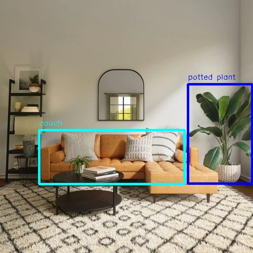

# EfficientNet_Det

```mdx-code-block
import Tabs from '@theme/Tabs';
import TabItem from '@theme/TabItem';
```

## 功能介绍

EfficientNet_Det目标检测算法示例使用图片作为输入，利用BPU进行算法推理，发布包含目标类别和检测框的算法msg。

EfficientNet_Det是从 <https://github.com/HorizonRobotics-Platform/ModelZoo/tree/master/EfficientDet> 获得的 Onnx 模型，使用[COCO数据集](http://cocodataset.org/)进行训练，支持的目标检测类型包括人、动物、水果、交通工具等共80种类型。

代码仓库：<https://github.com/HorizonRDK/hobot_dnn>

应用场景：EfficientNet_Det可实现车辆检测等功能，主要应用于自动驾驶、智能家居等领域。

烟雾检测案例：<https://github.com/abg3/Smoke-Detection-using-Tensorflow-2.2>

## 支持平台

| 平台                  | 运行方式     | 示例功能                                                     |
| --------------------- | ------------ | ------------------------------------------------------------ |
| RDK X3, RDK X3 Module | Ubuntu 20.04 (Foxy), Ubuntu 22.04 (Humble) | · 启动MIPI/USB摄像头，并通过web展示推理渲染结果<br/>· 使用本地回灌，渲染结果保存在本地 |

## 准备工作

### 地平线RDK平台

1. 地平线RDK已烧录好地平线提供的Ubuntu 20.04/Ubuntu 22.04系统镜像。

2. 地平线RDK已成功安装TogetheROS.Bot。

3. 地平线RDK已安装MIPI或者USB摄像头，无摄像头的情况下通过回灌本地JPEG/PNG格式图片或者MP4、H.264和H.265的视频方式体验算法效果。

4. 确认PC机能够通过网络访问地平线RDK。

## 使用介绍

### 地平线RDK平台

#### 使用MIPI摄像头发布图片

EfficientNet_Det目标检测算法示例订阅sensor package发布的图片，经过推理后发布算法msg，通过websocket package实现在PC端浏览器上渲染显示发布的图片和对应的算法结果。

<Tabs groupId="tros-distro">
<TabItem value="foxy" label="Foxy">

```shell
# 配置tros.b环境
source /opt/tros/setup.bash

# 配置MIPI摄像头
export CAM_TYPE=mipi

# 启动launch文件
ros2 launch dnn_node_example dnn_node_example.launch.py dnn_example_config_file:=config/efficient_det_workconfig.json dnn_example_image_width:=480 dnn_example_image_height:=272
```

</TabItem>

<TabItem value="humble" label="Humble">

```shell
# 配置tros.b环境
source /opt/tros/humble/setup.bash

# 配置MIPI摄像头
export CAM_TYPE=mipi

# 启动launch文件
ros2 launch dnn_node_example dnn_node_example.launch.py dnn_example_config_file:=config/efficient_det_workconfig.json dnn_example_image_width:=480 dnn_example_image_height:=272
```

</TabItem>

</Tabs>

#### 使用USB摄像头发布图片

<Tabs groupId="tros-distro">
<TabItem value="foxy" label="Foxy">

```shell
# 配置tros.b环境
source /opt/tros/setup.bash

# 配置USB摄像头
export CAM_TYPE=usb

# 启动launch文件
ros2 launch dnn_node_example dnn_node_example.launch.py dnn_example_config_file:=config/efficient_det_workconfig.json dnn_example_image_width:=480 dnn_example_image_height:=272
```

</TabItem>

<TabItem value="humble" label="Humble">

```shell
# 配置tros.b环境
source /opt/tros/humble/setup.bash

# 配置USB摄像头
export CAM_TYPE=usb

# 启动launch文件
ros2 launch dnn_node_example dnn_node_example.launch.py dnn_example_config_file:=config/efficient_det_workconfig.json dnn_example_image_width:=480 dnn_example_image_height:=272
```

</TabItem>

</Tabs>

#### 使用本地图片回灌

EfficientNet_Det目标检测算法示例使用本地JPEG/PNG格式图片回灌，经过推理后将算法结果渲染后的图片存储在本地的运行路径下。


<Tabs groupId="tros-distro">
<TabItem value="foxy" label="Foxy">

```shell
# 配置tros.b环境
source /opt/tros/setup.bash

# 启动launch文件
ros2 launch dnn_node_example dnn_node_example_feedback.launch.py dnn_example_config_file:=config/efficient_det_workconfig.json dnn_example_image:=config/target.jpg
```

</TabItem>

<TabItem value="humble" label="Humble">

```shell
# 配置tros.b环境
source /opt/tros/humble/setup.bash

# 启动launch文件
ros2 launch dnn_node_example dnn_node_example_feedback.launch.py dnn_example_config_file:=config/efficient_det_workconfig.json dnn_example_image:=config/target.jpg
```

</TabItem>

</Tabs>

## 结果分析

### 使用摄像头发布图片

在运行终端输出如下信息：

```shell
[example-3] [WARN] [1655093196.041759782] [example]: Create ai msg publisher with topic_name: hobot_dnn_detection
[example-3] [WARN] [1655093196.041878985] [example]: Create img hbmem_subscription with topic_name: /hbmem_img
[example-3] [WARN] [1655093197.405840936] [img_sub]: Sub img fps 8.57
[example-3] [WARN] [1655093197.687361687] [example]: Smart fps 8.04
[example-3] [WARN] [1655093198.559784569] [img_sub]: Sub img fps 6.94
[example-3] [WARN] [1655093198.891958094] [example]: Smart fps 6.64
[example-3] [WARN] [1655093199.735312707] [img_sub]: Sub img fps 6.81
[example-3] [WARN] [1655093200.013067298] [example]: Smart fps 7.14
[example-3] [WARN] [1655093200.890569474] [img_sub]: Sub img fps 6.93
[example-3] [WARN] [1655093201.175239677] [example]: Smart fps 6.88
[example-3] [WARN] [1655093202.011887441] [img_sub]: Sub img fps 7.14
[example-3] [WARN] [1655093202.302124315] [example]: Smart fps 7.10
```

输出log显示，发布算法推理结果的topic为`hobot_dnn_detection`，订阅图片的topic为`/hbmem_img`。

在PC端的浏览器输入http://IP:8000 即可查看图像和算法渲染效果（IP为地平线RDK的IP地址）：


### 使用本地图片回灌

在运行终端输出如下信息：

```shell
[example-1] [INFO] [1654931461.278066695] [example]: Output from image_name: config/target.jpg, frame_id: feedback, stamp: 0.0
[example-1] [INFO] [1654931461.278186816] [PostProcessBase]: outputs size: 10
[example-1] [INFO] [1654931461.278231981] [PostProcessBase]: out box size: 2
[example-1] [INFO] [1654931461.278303520] [PostProcessBase]: det rect: 380.107 170.888 511.048 372.511, det type: potted plant, score:1.16971
[example-1] [INFO] [1654931461.278396934] [PostProcessBase]: det rect: 79.3884 263.497 373.645 372.554, det type: couch, score:1.0287
```

输出log显示，算法使用输入的图片推理出2个目标，并输出了目标检测框坐标（输出的坐标顺序分别是人体框的左上的x和y坐标，和右下的x和y坐标）和类别。存储的渲染图片文件名为render_feedback_0_0.jpeg，渲染图片效果：


