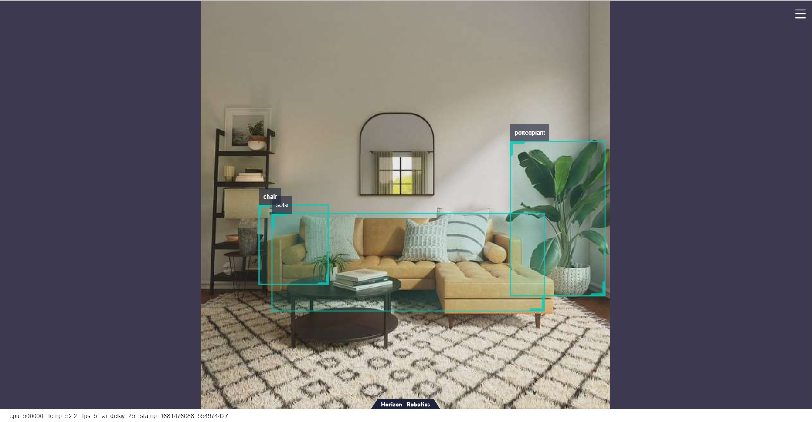

# MobileNet_SSD

```mdx-code-block
import Tabs from '@theme/Tabs';
import TabItem from '@theme/TabItem';
```

## 功能介绍

MobileNet_SSD目标检测算法示例使用图片作为输入，利用BPU进行算法推理，发布包含目标类别和检测框的算法msg。

Mobilenet_SSD是从 <https://github.com/chuanqi305/MobileNet-SSD> 获得的 caffe 模型，使用[VOC数据集](http://host.robots.ox.ac.uk/pascal/VOC/voc2012/)进行训练，支持的目标检测类型包括人、动物、水果、交通工具等共20种类型。

代码仓库：<https://github.com/HorizonRDK/hobot_dnn>

应用场景：MobileNet_SSD是以MobileNet为基础的目标检测算法，具有速度快，易于部署的优点，可实现物体检测、垃圾识别等功能，主要应用于自动驾驶、智能家居等领域。

人脸检测案例：<https://github.com/bruceyang2012/Face-detection-with-mobilenet-ssd>    
车牌检测案例：<https://github.com/soonhahwang/Mobilenet-SSD-to-detect-Licence-Plate>

## 支持平台

| 平台                  | 运行方式     | 示例功能                                                     |
| --------------------- | ------------ | ------------------------------------------------------------ |
| RDK X3, RDK X3 Module | Ubuntu 20.04 (Foxy), Ubuntu 22.04 (Humble) | · 启动MIPI/USB摄像头，并通过web展示推理渲染结果<br/>· 使用本地回灌，渲染结果保存在本地 |
| X86                   | Ubuntu 20.04 (Foxy) | · 使用本地回灌，渲染结果保存在本地                           |

## 准备工作

### 地平线RDK平台

1. 地平线RDK已烧录好地平线提供的Ubuntu 20.04/Ubuntu 22.04系统镜像。

2. 地平线RDK已成功安装TogetheROS.Bot。

3. 地平线RDK已安装MIPI或者USB摄像头，无摄像头的情况下通过回灌本地JPEG/PNG格式图片或者MP4、H.264和H.265的视频方式体验算法效果。

4. 确认PC机能够通过网络访问地平线RDK。

### X86平台

1. X86环境已配置好Ubuntu 20.04系统镜像。

2. X86环境系统已成功安装tros.b。

## 使用介绍

### 地平线RDK平台

#### 使用MIPI摄像头发布图片

MobileNet_SSD目标检测算法示例订阅sensor package发布的图片，经过推理后发布算法msg，通过websocket package实现在PC端浏览器上渲染显示发布的图片和对应的算法结果。


<Tabs groupId="tros-distro">
<TabItem value="foxy" label="Foxy">

```bash
# 配置tros.b环境
source /opt/tros/setup.bash
```

</TabItem>

<TabItem value="humble" label="Humble">

```bash
# 配置tros.b环境
source /opt/tros/humble/setup.bash
```

</TabItem>

</Tabs>

```shell
# 配置MIPI摄像头
export CAM_TYPE=mipi

# 启动launch文件
ros2 launch dnn_node_example dnn_node_example.launch.py dnn_example_config_file:=config/mobilenet_ssd_workconfig.json dnn_example_image_width:=480 dnn_example_image_height:=272
```

#### 使用USB摄像头发布图片


<Tabs groupId="tros-distro">
<TabItem value="foxy" label="Foxy">

```bash
# 配置tros.b环境
source /opt/tros/setup.bash
```

</TabItem>

<TabItem value="humble" label="Humble">

```bash
# 配置tros.b环境
source /opt/tros/humble/setup.bash
```

</TabItem>

</Tabs>

```shell
# 配置USB摄像头
export CAM_TYPE=usb

# 启动launch文件
ros2 launch dnn_node_example dnn_node_example.launch.py dnn_example_config_file:=config/mobilenet_ssd_workconfig.json dnn_example_image_width:=480 dnn_example_image_height:=272
```

#### 使用本地图片回灌

MobileNet_SSD目标检测算法示例使用本地JPEG/PNG格式图片回灌，经过推理后将算法结果渲染后的图片存储在本地的运行路径下。


<Tabs groupId="tros-distro">
<TabItem value="foxy" label="Foxy">

```bash
# 配置tros.b环境
source /opt/tros/setup.bash
```

</TabItem>

<TabItem value="humble" label="Humble">

```bash
# 配置tros.b环境
source /opt/tros/humble/setup.bash
```

</TabItem>

</Tabs>

```shell
# 启动launch文件
ros2 launch dnn_node_example dnn_node_example_feedback.launch.py dnn_example_config_file:=config/mobilenet_ssd_workconfig.json dnn_example_image:=config/target.jpg
```

### X86平台

#### 使用本地图片回灌

MobileNet_SSD目标检测算法示例使用本地JPEG/PNG格式图片回灌，经过算法推理后将算法结果渲染后的图片存储在本地的运行路径下。

```bash
# 配置tros.b环境
source /opt/tros/setup.bash

# 启动launch文件
ros2 launch dnn_node_example dnn_node_example_feedback.launch.py dnn_example_config_file:=config/mobilenet_ssd_workconfig.json dnn_example_image:=config/target.jpg
```

## 结果分析

### 使用摄像头发布图片

在运行终端输出如下信息：

```shell
[example-3] [WARN] [1655095279.473675326] [example]: Create ai msg publisher with topic_name: hobot_dnn_detection
[example-3] [WARN] [1655095279.473789113] [example]: Create img hbmem_subscription with topic_name: /hbmem_img
[example-3] [WARN] [1655095280.697388819] [img_sub]: Sub img fps 31.16
[example-3] [WARN] [1655095280.710505278] [example]: Smart fps 31.50
[example-3] [WARN] [1655095281.697831409] [img_sub]: Sub img fps 30.00
[example-3] [WARN] [1655095281.743811574] [example]: Smart fps 30.01
[example-3] [WARN] [1655095282.730768103] [img_sub]: Sub img fps 30.04
[example-3] [WARN] [1655095282.744084511] [example]: Smart fps 30.00
```

输出log显示，发布算法推理结果的topic为`hobot_dnn_detection`，订阅图片的topic为`/hbmem_img`，订阅到的图片和算法推理输出帧率约为30fps。

在PC端的浏览器输入http://IP:8000 即可查看图像和算法渲染效果（IP为地平线RDK的IP地址）：



### 使用本地图片回灌

在运行终端输出如下信息：

```shell
[example-1] [INFO] [1654930510.201326806] [example]: Output from image_name: config/target.jpg, frame_id: feedback, stamp: 0.0
[example-1] [INFO] [1654930510.201485092] [PostProcessBase]: outputs size: 12
[example-1] [INFO] [1654930510.201581047] [PostProcessBase]: out box size: 2
[example-1] [INFO] [1654930510.201672794] [PostProcessBase]: det rect: 227.27 101.873 299.219 223.667, det type: pottedplant, score:0.995207
[example-1] [INFO] [1654930510.201778415] [PostProcessBase]: det rect: 62.3792 155.731 221.676 223.179, det type: sofa, score:0.982129
```

输出log显示，算法使用输入的图片推理出2个目标，并输出了目标检测框坐标（输出的坐标顺序分别是人体框的左上的x和y坐标，和右下的x和y坐标）和类别。存储的渲染图片文件名为render_feedback_0_0.jpeg，渲染图片效果：


