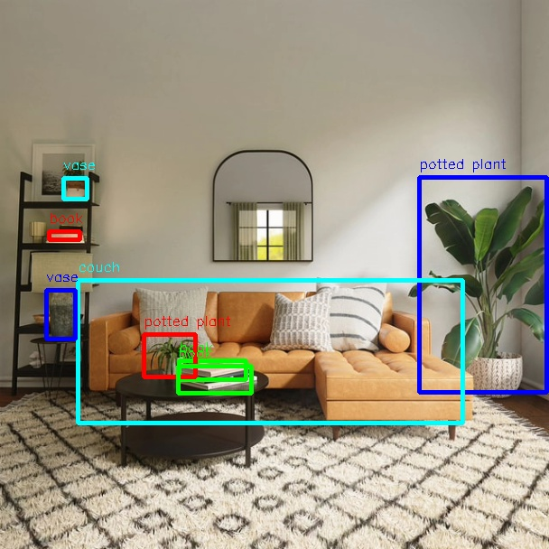

# YOLO

```mdx-code-block
import Tabs from '@theme/Tabs';
import TabItem from '@theme/TabItem';
```

## 功能介绍

YOLO目标检测算法示例使用图片作为输入，利用BPU进行算法推理，发布包含目标类别和检测框的算法msg。目前支持yolov2、yolov3、yolov5、yolov5x四个版本。

模型使用[COCO数据集](http://cocodataset.org/)进行训练，支持的目标检测类型包括人、动物、水果、交通工具等共80种类型。

代码仓库：<https://github.com/HorizonRDK/hobot_dnn>

应用场景：YOLO系列作为单阶段目标检测中的代表算法，具有速度快，泛化性好的优点，可实现垃圾识别、车辆检测等功能，主要应用于自动驾驶、智能家居等领域。

车辆检测案例：<https://github.com/JunshengFu/vehicle-detection>   
摔倒检测案例：<https://github.com/xiaobin1231/Fall-Detection-By-YOLOV3-and-LiteFlowNet>

## 支持平台

| 平台                  | 运行方式     | 支持算法             | 示例功能                                                     |
| --------------------- | ------------ | -------------------- | ------------------------------------------------------------ |
| RDK X3, RDK X3 Module | Ubuntu 20.04 (Foxy), Ubuntu 22.04 (Humble) | yolov2/yolov3/yolov5 | · 启动MIPI/USB摄像头，并通过web展示推理渲染结果<br/>· 使用本地回灌，渲染结果保存在本地 |
| RDK Ultra             | Ubuntu 20.04 (Foxy) | yolov5x              | · 启动MIPI/USB摄像头，并通过web展示推理渲染结果<br/>· 使用本地回灌，渲染结果保存在本地 |
| X86                   | Ubuntu 20.04 (Foxy) | yolov2/yolov3        | · 使用本地回灌，渲染结果保存在本地                           |

## 准备工作

### 地平线RDK平台

1. 地平线RDK已烧录好地平线提供的Ubuntu 20.04/Ubuntu 22.04系统镜像。

2. 地平线RDK已成功安装TogetheROS.Bot。

3. 地平线RDK已安装MIPI或者USB摄像头，无摄像头的情况下通过回灌本地JPEG/PNG格式图片或者MP4、H.264和H.265的视频方式体验算法效果。

4. 确认PC机能够通过网络访问地平线RDK。

### X86平台

1. X86环境已配置好Ubuntu 20.04系统镜像。

2. X86环境系统已成功安装tros.b。

## 使用介绍

### 地平线RDK X3和RDK X3 Module平台

#### 使用MIPI摄像头发布图片

YOLOv2目标检测算法示例订阅MIPI摄像头发布的图片，经过算法推理后发布算法msg，通过websocket package实现在PC端浏览器上渲染显示发布的图片和对应的算法结果。


<Tabs groupId="tros-distro">
<TabItem value="foxy" label="Foxy">

```bash
# 配置tros.b环境
source /opt/tros/setup.bash
```

</TabItem>

<TabItem value="humble" label="Humble">

```bash
# 配置tros.b环境
source /opt/tros/humble/setup.bash
```

</TabItem>

</Tabs>

```shell
# 配置MIPI摄像头
export CAM_TYPE=mipi

# 启动launch文件
ros2 launch dnn_node_example dnn_node_example.launch.py dnn_example_config_file:=config/yolov2workconfig.json dnn_example_image_width:=480 dnn_example_image_height:=272
```

#### 使用USB摄像头发布图片

YOLOv2目标检测算法示例订阅USB摄像头发布的图片，经过算法推理后发布算法msg，通过websocket package实现在PC端浏览器上渲染显示发布的图片和对应的算法结果。


<Tabs groupId="tros-distro">
<TabItem value="foxy" label="Foxy">

```bash
# 配置tros.b环境
source /opt/tros/setup.bash
```

</TabItem>

<TabItem value="humble" label="Humble">

```bash
# 配置tros.b环境
source /opt/tros/humble/setup.bash
```

</TabItem>

</Tabs>

```shell
# 配置USB摄像头
export CAM_TYPE=usb

# 启动launch文件
ros2 launch dnn_node_example dnn_node_example.launch.py dnn_example_config_file:=config/yolov2workconfig.json dnn_example_image_width:=480 dnn_example_image_height:=272
```

#### 使用本地图片回灌

YOLOv2目标检测算法示例使用本地JPEG/PNG格式图片回灌，经过推理后将算法结果渲染后的图片存储在本地的运行路径下。


<Tabs groupId="tros-distro">
<TabItem value="foxy" label="Foxy">

```bash
# 配置tros.b环境
source /opt/tros/setup.bash
```

</TabItem>

<TabItem value="humble" label="Humble">

```bash
# 配置tros.b环境
source /opt/tros/humble/setup.bash
```

</TabItem>

</Tabs>

```shell
# 启动launch文件
ros2 launch dnn_node_example dnn_node_example_feedback.launch.py dnn_example_config_file:=config/yolov2workconfig.json dnn_example_image:=config/target.jpg
```

除了YOLOv2算法，还支持YOLOv3和YOLOv5算法。启动命令中使用参数config_file切换算法，如使用YOLOv3算法的启动配置为`dnn_example_config_file:="config/yolov3workconfig.json"`，使用YOLOv5算法的启动配置为`dnn_example_config_file:="config/yolov5workconfig.json"`。

### 地平线RDK Ultra平台

#### 使用MIPI摄像头发布图片

YOLOv5x目标检测算法示例订阅MIPI摄像头发布的图片，经过算法推理后发布算法msg，通过websocket package实现在PC端浏览器上渲染显示发布的图片和对应的算法结果。

<Tabs groupId="tros-distro">
<TabItem value="foxy" label="Foxy">

```bash
# 配置tros.b环境
source /opt/tros/setup.bash
```

</TabItem>

<TabItem value="humble" label="Humble">

```bash
# 配置tros.b环境
source /opt/tros/humble/setup.bash
```

</TabItem>

</Tabs>

```shell
# 配置MIPI摄像头
export CAM_TYPE=mipi

# 启动launch文件
ros2 launch dnn_node_example dnn_node_example.launch.py dnn_example_config_file:=config/yolov5xworkconfig.json dnn_example_image_width:=672 dnn_example_image_height:=672
```

#### 使用USB摄像头发布图片

YOLOv5x目标检测算法示例订阅USB摄像头发布的图片，经过算法推理后发布算法msg，通过websocket package实现在PC端浏览器上渲染显示发布的图片和对应的算法结果。

<Tabs groupId="tros-distro">
<TabItem value="foxy" label="Foxy">

```bash
# 配置tros.b环境
source /opt/tros/setup.bash
```

</TabItem>

<TabItem value="humble" label="Humble">

```bash
# 配置tros.b环境
source /opt/tros/humble/setup.bash
```

</TabItem>

</Tabs>

```shell
# 配置USB摄像头
export CAM_TYPE=usb

# 启动launch文件
ros2 launch dnn_node_example dnn_node_example.launch.py dnn_example_config_file:=config/yolov5xworkconfig.json dnn_example_image_width:=672 dnn_example_image_height:=672
```

#### 使用本地图片回灌

YOLOv5x目标检测算法示例使用本地JPEG/PNG格式图片回灌，经过推理后将算法结果渲染后的图片存储在本地的运行路径下。

<Tabs groupId="tros-distro">
<TabItem value="foxy" label="Foxy">

```bash
# 配置tros.b环境
source /opt/tros/setup.bash
```

</TabItem>

<TabItem value="humble" label="Humble">

```bash
# 配置tros.b环境
source /opt/tros/humble/setup.bash
```

</TabItem>

</Tabs>

```shell
# 启动launch文件
ros2 launch dnn_node_example dnn_node_example_feedback.launch.py dnn_example_config_file:=config/yolov5xworkconfig.json dnn_example_image:=config/target.jpg
```

### X86平台

#### 使用本地图片回灌

YOLOv2目标检测算法示例使用本地JPEG/PNG格式图片回灌，经过推理后将算法结果渲染后的图片存储在本地的运行路径下。

```bash
# 配置tros.b环境
source /opt/tros/setup.bash

# 启动launch文件
ros2 launch dnn_node_example dnn_node_example_feedback.launch.py dnn_example_config_file:=config/yolov2workconfig.json dnn_example_image:=config/target.jpg
```

除了YOLOv2算法，还支持YOLOv3算法，YOLOv5算法暂不支持。启动命令中使用参数config_file切换算法，如使用YOLOv3算法的启动配置为`dnn_example_config_file:="config/yolov3workconfig.json"`。

## 结果分析

### 使用摄像头发布图片

在运行终端输出如下信息：

```text
[example-3] [WARN] [1655095347.608475236] [example]: Create ai msg publisher with topic_name: hobot_dnn_detection
[example-3] [WARN] [1655095347.608640353] [example]: Create img hbmem_subscription with topic_name: /hbmem_img
[example-3] [WARN] [1655095348.709411619] [img_sub]: Sub img fps 12.95
[example-3] [WARN] [1655095348.887570945] [example]: Smart fps 12.10
[example-3] [WARN] [1655095349.772225728] [img_sub]: Sub img fps 11.30
[example-3] [WARN] [1655095349.948913662] [example]: Smart fps 11.31
[example-3] [WARN] [1655095350.834951431] [img_sub]: Sub img fps 11.30
[example-3] [WARN] [1655095351.011915729] [example]: Smart fps 11.30
```

输出log显示，发布算法推理结果的topic为`hobot_dnn_detection`，订阅图片的topic为`/hbmem_img`。

在PC端的浏览器输入http://IP:8000 即可查看图像和算法渲染效果（IP为地平线RDK的IP地址）：


### 使用本地图片回灌

在运行终端输出如下信息：

```text
[example-1] [INFO] [1654925067.952159234] [PostProcessBase]: out box size: 8
[example-1] [INFO] [1654925067.952227232] [PostProcessBase]: det rect: 464.03 196.145 605.525 434.865, det type: potted plant, score:0.813219
[example-1] [INFO] [1654925067.952319229] [PostProcessBase]: det rect: 86.5421 310.158 512.542 468.201, det type: couch, score:0.669208
[example-1] [INFO] [1654925067.952392268] [PostProcessBase]: det rect: 198.968 399.91 273.841 421.767, det type: book, score:0.539755
[example-1] [INFO] [1654925067.952465182] [PostProcessBase]: det rect: 159.861 370.656 217.685 417.746, det type: potted plant, score:0.480698
[example-1] [INFO] [1654925067.952533221] [PostProcessBase]: det rect: 51.2147 321.047 84.0969 375.842, det type: vase, score:0.433644
[example-1] [INFO] [1654925067.952607802] [PostProcessBase]: det rect: 70.0548 197.381 96.1826 221.062, det type: vase, score:0.399885
[example-1] [INFO] [1654925067.952675924] [PostProcessBase]: det rect: 197.706 405.271 278.929 435.743, det type: book, score:0.384268
[example-1] [INFO] [1654925067.952743463] [PostProcessBase]: det rect: 54.0955 256.68 88.6269 266.159, det type: book, score:0.307426
```

输出log显示，算法使用输入的图片推理出8个目标，并输出了目标检测框坐标（输出的坐标顺序分别是人体框的左上的x和y坐标，和右下的x和y坐标）和类别。存储的渲染图片文件名为render_feedback_0_0.jpeg，渲染图片效果：


