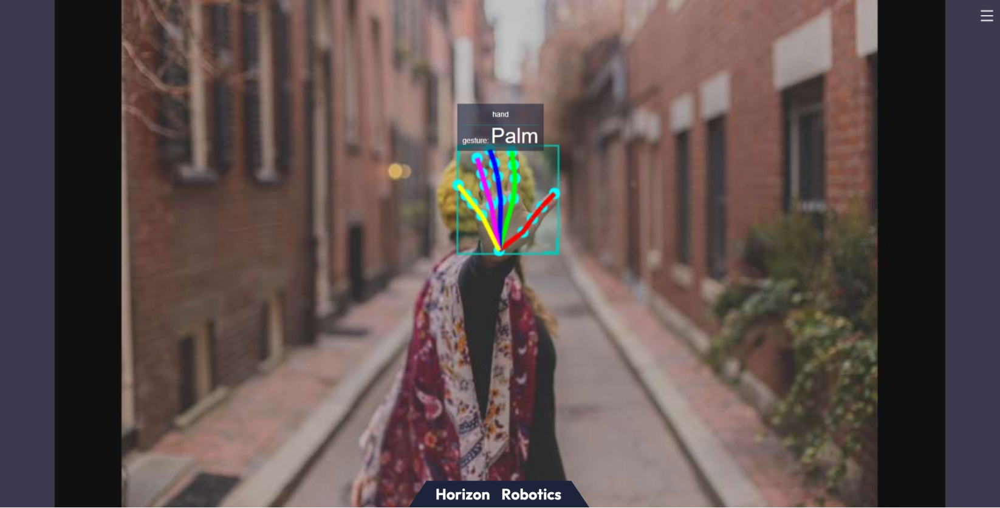

# 手势识别

```mdx-code-block
import Tabs from '@theme/Tabs';
import TabItem from '@theme/TabItem';
```

## 功能介绍

手势识别算法示例订阅包含人手框、人手关键点信息的算法msg，利用BPU进行推理，发布包含手势信息的智能结果msg。

算法支持的手势识别类别，以及手势类别在算法msg（Attribute成员，type为"gesture"）中对应的数值如下：

| 手势       | 说明       | 数值 |
| ---------- | ---------- | ---- |
| ThumbUp    | 竖起大拇指 | 2    |
| Victory    | “V”手势    | 3    |
| Mute       | “嘘”手势   | 4    |
| Palm       | 手掌       | 5    |
| Okay       | OK手势     | 11   |
| ThumbLeft  | 大拇指向左 | 12   |
| ThumbRight | 大拇指向右 | 13   |
| Awesome    | 666手势    | 14   |

代码仓库：

<https://github.com/HorizonRDK/hand_lmk_detection>

<https://github.com/HorizonRDK/hand_gesture_detection>

<https://github.com/HorizonRDK/mono2d_body_detection>

应用场景：手势识别算法集成了人手关键点检测，手势分析等技术，使得计算机能够将人的手势解读为对应指令，可实现手势控制以及手语翻译等功能，主要应用于智能家居，智能座舱、智能穿戴设备等领域。

小车手势控制案例：[4.5. 小车手势控制 — 地平线机器人平台用户手册](../../apps/car_gesture_control)

基于手势识别以及人体姿态分析实现游戏人物控制案例：[玩转X3派，健身游戏两不误](https://developer.horizon.cc/forumDetail/112555512834430487)

## 支持平台

| 平台                             | 运行方式     | 示例功能                                        |
| -------------------------------- | ------------ | ----------------------------------------------- |
| RDK X3, RDK X3 Module | Ubuntu 20.04 (Foxy), Ubuntu 22.04 (Humble) | 启动MIPI/USB摄像头，并通过Web展示推理渲染结果 |
| RDK Ultra | Ubuntu 20.04 (Foxy) | 启动MIPI/USB摄像头，并通过Web展示推理渲染结果 |

## 准备工作

### 地平线RDK平台

1. 地平线RDK已烧录好地平线提供的Ubuntu 20.04/Ubuntu 22.04系统镜像。

2. 地平线RDK已成功安装TogetheROS.Bot。

3. 地平线RDK已安装MIPI或者USB摄像头。

4. 确认PC机能够通过网络访问地平线RDK。

## 使用介绍

手势识别(hand_gesture_detection)package订阅人手关键点检测package发布的人手关键点检测结果，经过推理后发布算法msg，通过websocket package实现在PC端浏览器上渲染显示发布的图片和对应的算法结果。

**使用MIPI摄像头发布图片**


<Tabs groupId="tros-distro">
<TabItem value="foxy" label="Foxy">

```bash
# 配置tros.b环境
source /opt/tros/setup.bash
```

</TabItem>

<TabItem value="humble" label="Humble">

```bash
# 配置tros.b环境
source /opt/tros/humble/setup.bash
```

</TabItem>

</Tabs>

```shell
# 从tros.b的安装路径中拷贝出运行示例需要的配置文件。
cp -r /opt/tros/${TROS_DISTRO}/lib/mono2d_body_detection/config/ .
cp -r /opt/tros/${TROS_DISTRO}/lib/hand_lmk_detection/config/ .
cp -r /opt/tros/${TROS_DISTRO}/lib/hand_gesture_detection/config/ .

# 配置MIPI摄像头
export CAM_TYPE=mipi

# 启动launch文件
ros2 launch hand_gesture_detection hand_gesture_detection.launch.py
```

**使用USB摄像头发布图片**

<Tabs groupId="tros-distro">
<TabItem value="foxy" label="Foxy">

```bash
# 配置tros.b环境
source /opt/tros/setup.bash
```

</TabItem>

<TabItem value="humble" label="Humble">

```bash
# 配置tros.b环境
source /opt/tros/humble/setup.bash
```

</TabItem>

</Tabs>

```shell
# 从tros.b的安装路径中拷贝出运行示例需要的配置文件。
cp -r /opt/tros/${TROS_DISTRO}/lib/mono2d_body_detection/config/ .
cp -r /opt/tros/${TROS_DISTRO}/lib/hand_lmk_detection/config/ .
cp -r /opt/tros/${TROS_DISTRO}/lib/hand_gesture_detection/config/ .

# 配置USB摄像头
export CAM_TYPE=usb

# 启动launch文件
ros2 launch hand_gesture_detection hand_gesture_detection.launch.py
```

## 结果分析

在运行终端输出如下信息：

```shell
[hand_gesture_detection-5] [C][32711][08-12][09:39:39:575][configuration.cpp:49][EasyDNN]EasyDNN version: 0.4.11
[hand_gesture_detection-5] [DNN] Runtime version = 1.9.7_(3.14.5 HBRT)
[hand_gesture_detection-5] [WARN] [1660268379.611419981] [hand gesture det node]: input_idx: 0, tensorType = 8, tensorLayout = 0
[hand_gesture_detection-5] [WARN] [1660268379.619313022] [hand gesture det node]: Create subscription with topic_name: /hobot_hand_lmk_detection
[hand_gesture_detection-5] [WARN] [1660268379.629207314] [hand gesture det node]: ai_msg_pub_topic_name: /hobot_hand_gesture_detection
[mono2d_body_detection-3] (MOTMethod.cpp:39): MOTMethod::Init config/iou2_euclid_method_param.json
[mono2d_body_detection-3] 
[mono2d_body_detection-3] (IOU2.cpp:34): IOU2 Mot::Init config/iou2_euclid_method_param.json
[mono2d_body_detection-3] 
[mono2d_body_detection-3] (MOTMethod.cpp:39): MOTMethod::Init config/iou2_method_param.json
[mono2d_body_detection-3] 
[mono2d_body_detection-3] (IOU2.cpp:34): IOU2 Mot::Init config/iou2_method_param.json
[mono2d_body_detection-3] 
[mono2d_body_detection-3] (MOTMethod.cpp:39): MOTMethod::Init config/iou2_method_param.json
[mono2d_body_detection-3] 
[mono2d_body_detection-3] (IOU2.cpp:34): IOU2 Mot::Init config/iou2_method_param.json
[mono2d_body_detection-3] 
[mono2d_body_detection-3] (MOTMethod.cpp:39): MOTMethod::Init config/iou2_method_param.json
[mono2d_body_detection-3] 
[mono2d_body_detection-3] (IOU2.cpp:34): IOU2 Mot::Init config/iou2_method_param.json
[mono2d_body_detection-3] 
[hand_gesture_detection-5] [WARN] [1660268381.026173815] [hand_gesture_det]: Sub smart fps 31.16
[hand_gesture_detection-5] [WARN] [1660268381.206196565] [hand_gesture_det]: Pub smart fps 30.17
[hand_gesture_detection-5] [WARN] [1660268382.054034899] [hand_gesture_det]: Sub smart fps 30.19
[hand_gesture_detection-5] [WARN] [1660268382.234087357] [hand_gesture_det]: Pub smart fps 30.19
[hand_gesture_detection-5] [WARN] [1660268383.055988982] [hand_gesture_det]: Sub smart fps 29.97
[hand_gesture_detection-5] [WARN] [1660268383.235230316] [hand_gesture_det]: Pub smart fps 30.00
[hand_gesture_detection-5] [WARN] [1660268384.087152150] [hand_gesture_det]: Sub smart fps 30.10
[hand_gesture_detection-5] [WARN] [1660268384.256141566] [hand_gesture_det]: Pub smart fps 30.39
```

输出log显示，程序运行成功，推理时算法输入和输出帧率为30fps，每秒钟刷新一次统计帧率。

输出log显示，订阅到的算法msg中有一个hand（包含人手框和人手关键点检测结果），手势识别算法输出的手势分类结果是“Palm”手势（分类结果为5）。

在PC端的浏览器输入http://IP:8000 即可查看图像和算法渲染效果（IP为地平线RDK的IP地址）：


