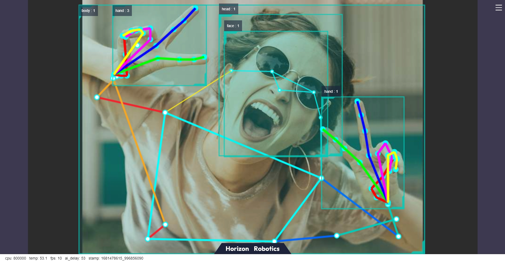

# 人手关键点检测

```mdx-code-block
import Tabs from '@theme/Tabs';
import TabItem from '@theme/TabItem';
```

## 功能介绍

人手关键点检测算法示例订阅图片和包含人手框信息的智能msg，利用BPU进行算法推理，发布包含人手关键点信息的算法msg。

人手关键点索引如下图：


代码仓库：

<https://github.com/HorizonRDK/hand_lmk_detection>

<https://github.com/HorizonRDK/mono2d_body_detection>

应用场景：人手关键点检测算法主要用于捕捉人手部的骨骼关键点，可实现自定义手势识别等功能，主要应用于智能家居、虚拟现实、游戏娱乐等领域。

## 支持平台

| 平台                             | 运行方式     | 示例功能                                        |
| -------------------------------- | ------------ | ----------------------------------------------- |
| RDK X3, RDK X3 Module | Ubuntu 20.04 (Foxy), Ubuntu 22.04 (Humble) | 启动MIPI/USB摄像头，并通过web展示推理渲染结果 |
| RDK Ultra | Ubuntu 20.04 (Foxy) | 启动MIPI/USB摄像头，并通过web展示推理渲染结果 |

## 准备工作

### 地平线RDK平台

1. 地平线RDK已烧录好地平线提供的Ubuntu 20.04/Ubuntu 22.04系统镜像。

2. 地平线RDK已成功安装TogetheROS.Bot。

3. 地平线RDK已安装MIPI或者USB摄像头。

4. 确认PC机能够通过网络访问地平线RDK。

## 使用介绍

人手关键点检测(hand_lmk_detection)package订阅sensor package发布的图片以及人体检测和跟踪package发布的人手框检测结果，经过推理后发布算法msg，通过websocket package实现在PC端浏览器上渲染显示发布的图片和对应的算法结果。

**使用MIPI摄像头发布图片**


<Tabs groupId="tros-distro">
<TabItem value="foxy" label="Foxy">

```bash
# 配置tros.b环境
source /opt/tros/setup.bash
```

</TabItem>

<TabItem value="humble" label="Humble">

```bash
# 配置tros.b环境
source /opt/tros/humble/setup.bash
```

</TabItem>

</Tabs>

```shell
# 从tros.b的安装路径中拷贝出运行示例需要的配置文件。
cp -r /opt/tros/${TROS_DISTRO}/lib/mono2d_body_detection/config/ .
cp -r /opt/tros/${TROS_DISTRO}/lib/hand_lmk_detection/config/ .

# 配置MIPI摄像头
export CAM_TYPE=mipi

# 启动launch文件
ros2 launch hand_lmk_detection hand_lmk_detection.launch.py
```

**使用USB摄像头发布图片**


<Tabs groupId="tros-distro">
<TabItem value="foxy" label="Foxy">

```bash
# 配置tros.b环境
source /opt/tros/setup.bash
```

</TabItem>

<TabItem value="humble" label="Humble">

```bash
# 配置tros.b环境
source /opt/tros/humble/setup.bash
```

</TabItem>

</Tabs>

```shell
# 从tros.b的安装路径中拷贝出运行示例需要的配置文件。
cp -r /opt/tros/${TROS_DISTRO}/lib/mono2d_body_detection/config/ .
cp -r /opt/tros/${TROS_DISTRO}/lib/hand_lmk_detection/config/ .

# 配置USB摄像头
export CAM_TYPE=usb

# 启动launch文件
ros2 launch hand_lmk_detection hand_lmk_detection.launch.py
```

## 结果分析

在运行终端输出如下信息：

```shell
[mono2d_body_detection-3] (MOTMethod.cpp:39): MOTMethod::Init config/iou2_euclid_method_param.json
[mono2d_body_detection-3] 
[mono2d_body_detection-3] (IOU2.cpp:34): IOU2 Mot::Init config/iou2_euclid_method_param.json
[mono2d_body_detection-3] 
[mono2d_body_detection-3] (MOTMethod.cpp:39): MOTMethod::Init config/iou2_method_param.json
[mono2d_body_detection-3] 
[mono2d_body_detection-3] (IOU2.cpp:34): IOU2 Mot::Init config/iou2_method_param.json
[mono2d_body_detection-3] 
[mono2d_body_detection-3] (MOTMethod.cpp:39): MOTMethod::Init config/iou2_method_param.json
[mono2d_body_detection-3] 
[mono2d_body_detection-3] (IOU2.cpp:34): IOU2 Mot::Init config/iou2_method_param.json
[mono2d_body_detection-3] 
[mono2d_body_detection-3] (MOTMethod.cpp:39): MOTMethod::Init config/iou2_method_param.json
[mono2d_body_detection-3] 
[mono2d_body_detection-3] (IOU2.cpp:34): IOU2 Mot::Init config/iou2_method_param.json
[mono2d_body_detection-3] 
[hand_lmk_detection-4] [WARN] [1660269063.553205182] [hand_lmk_det]: input fps: 31.43, out fps: 31.47
[hand_lmk_detection-4] [WARN] [1660269064.579457516] [hand_lmk_det]: input fps: 30.21, out fps: 30.21
[hand_lmk_detection-4] [WARN] [1660269065.612579058] [hand_lmk_det]: input fps: 30.01, out fps: 30.01
[hand_lmk_detection-4] [WARN] [1660269066.612778892] [hand_lmk_det]: input fps: 30.00, out fps: 30.00
[hand_lmk_detection-4] [WARN] [1660269067.646101309] [hand_lmk_det]: input fps: 30.01, out fps: 30.01
[hand_lmk_detection-4] [WARN] [1660269068.679036184] [hand_lmk_det]: input fps: 30.04, out fps: 30.04
```

输出log显示，程序运行成功，推理时算法输入和输出帧率为30fps，每秒钟刷新一次统计帧率。

在PC端的浏览器输入http://IP:8000 即可查看图像和算法渲染效果（IP为地平线RDK的IP地址）：


