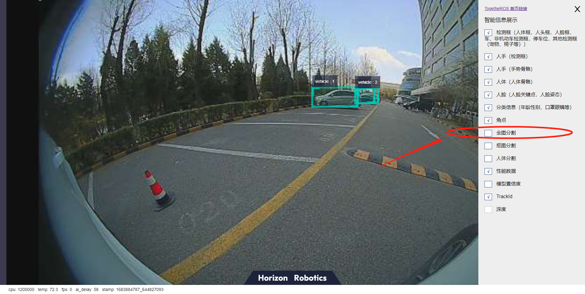
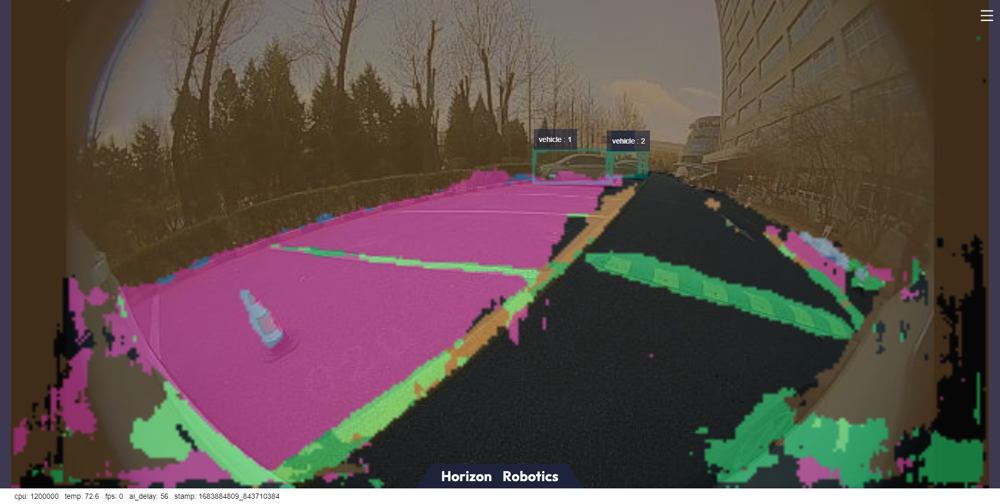

# 路面结构化

```mdx-code-block
import Tabs from '@theme/Tabs';
import TabItem from '@theme/TabItem';
```

## 功能介绍

parking_perception package 是基于 hobot_dnn package开发的路面结构化算法示例，利用BPU进行模型推理，从而得到算法推理结果。
本package支持直接订阅sensors/msg/image类型的话题，并且支持读取本地图片的形式进行推理，将算法信息通过话题发布的同时会将结果在Web页面渲染可视化，同时支持渲染图片保存在程序运行的result目录。

算法支持的目标检测类别如下：

| 类别         | 说明   |
| ------------ | ------ |
| cyclist      | 骑车人 |
| person       | 行人   |
| rear         | 车背   |
| vehicle      | 汽车   |
| parking_lock | 地锁   |

算法支持的语义分割类别如下：

| 类别          | 说明     |
| ------------- | -------- |
| road          | 道路     |
| background    | 背景     |
| lane_marking  | 车道线   |
| sign_line     | 标志线   |
| parking_lane  | 车位线   |
| parking_space | 车位区域 |
| parking_rod   | 停车杆   |
| parking_lock  | 地锁     |

代码仓库：<https://github.com/HorizonRDK/parking_perception.git>

应用场景：室外停车区检测算法基于语义分割，识别出图片中的停车区域，可实现自动泊车的功能，主要应用于自动驾驶领域。

小车车位寻找案例：[4.8. 小车车位寻找](../../apps/parking_search)

## 支持平台

| 平台                  | 运行方式     | 示例功能                                                     |
| --------------------- | ------------ | ------------------------------------------------------------ |
| RDK X3, RDK X3 Module | Ubuntu 20.04 (Foxy), Ubuntu 22.04 (Humble) | · 启动MIPI/USB摄像头/本地回灌，推理渲染结果在Web显示/保存在本地 |
| X86                   | Ubuntu 20.04 (Foxy) | · 启动本地回灌，推理渲染结果在Web显示/保存在本地             |

## 准备工作

### 地平线RDK平台

1. 地平线RDK已烧录好地平线提供的Ubuntu 20.04/Ubuntu 22.04系统镜像。

2. 地平线RDK已成功安装TogetheROS.Bot。

### X86平台

1. X86环境已配置Ubuntu 20.04系统镜像。

2. X86环境已成功安装tros.b。

## 使用介绍

package对外发布包含语义分割和目标检测信息的算法msg，用户可以订阅发布msg用于应用开发。

### 地平线RDK平台

**mipi摄像头发布图片**

<Tabs groupId="tros-distro">
<TabItem value="foxy" label="Foxy">

```shell
# 配置ROS2环境
source /opt/tros/setup.bash

# 从tros.b的安装路径中拷贝出运行示例需要的配置文件。
cp -r /opt/tros/${TROS_DISTRO}/lib/parking_perception/config/ .

# 配置MIPI摄像头
export CAM_TYPE=mipi

# 启动launch文件
ros2 launch parking_perception parking_perception.launch.py 
```

</TabItem>

<TabItem value="humble" label="Humble">

```shell
# 配置ROS2环境
source /opt/tros/humble/setup.bash

# 从tros.b的安装路径中拷贝出运行示例需要的配置文件。
cp -r /opt/tros/${TROS_DISTRO}/lib/parking_perception/config/ .

# 配置MIPI摄像头
export CAM_TYPE=mipi

# 启动launch文件
ros2 launch parking_perception parking_perception.launch.py 
```

</TabItem>

</Tabs>

**使用usb摄像头发布图片**

<Tabs groupId="tros-distro">
<TabItem value="foxy" label="Foxy">

```shell
# 配置ROS2环境
source /opt/tros/setup.bash

# 从tros的安装路径中拷贝出运行示例需要的配置文件。
cp -r /opt/tros/${TROS_DISTRO}/lib/parking_perception/config/ .

# 配置USB摄像头
export CAM_TYPE=usb

# 启动launch文件
ros2 launch parking_perception parking_perception.launch.py 
```

</TabItem>

<TabItem value="humble" label="Humble">

```shell
# 配置ROS2环境
source /opt/tros/humble/setup.bash

# 从tros的安装路径中拷贝出运行示例需要的配置文件。
cp -r /opt/tros/${TROS_DISTRO}/lib/parking_perception/config/ .

# 配置USB摄像头
export CAM_TYPE=usb

# 启动launch文件
ros2 launch parking_perception parking_perception.launch.py 
```

</TabItem>

</Tabs>

**使用单张回灌图片**

<Tabs groupId="tros-distro">
<TabItem value="foxy" label="Foxy">

```shell
# 配置ROS2环境
source /opt/tros/setup.bash

# 从tros的安装路径中拷贝出运行示例需要的配置文件。
cp -r /opt/tros/${TROS_DISTRO}/lib/parking_perception/config/ .

# 配置回灌图片
export CAM_TYPE=fb

# 启动launch文件
ros2 launch parking_perception parking_perception.launch.py 
```

</TabItem>

<TabItem value="humble" label="Humble">

```shell
# 配置ROS2环境
source /opt/tros/humble/setup.bash

# 从tros的安装路径中拷贝出运行示例需要的配置文件。
cp -r /opt/tros/${TROS_DISTRO}/lib/parking_perception/config/ .

# 配置回灌图片
export CAM_TYPE=fb

# 启动launch文件
ros2 launch parking_perception parking_perception.launch.py 
```

</TabItem>

</Tabs>

### X86平台

**使用单张回灌图片**

```bash
# 配置tros.b环境
source /opt/tros/setup.bash

# 从tros的安装路径中拷贝出运行示例需要的配置文件。
cp -r /opt/tros/${TROS_DISTRO}/lib/parking_perception/config/ .

# 配置回灌图片
export CAM_TYPE=fb

# 启动launch文件
ros2 launch parking_perception parking_perception.launch.py 
```

## 结果分析

**使用mipi摄像头发布图片**

package初始化后，在运行终端输出如下信息：

```
[INFO] [launch]: All log files can be found below /root/.ros/log/2022-08-02-06-46-55-605266-ubuntu-3669
[INFO] [launch]: Default logging verbosity is set to INFO
[INFO] [mipi_cam-1]: process started with pid [3671]
[INFO] [hobot_codec_republish-2]: process started with pid [3673]
[INFO] [parking_perception-3]: process started with pid [3675]
[INFO] [websocket-4]: process started with pid [3677]
[parking_perception-3] [WARN] [1659394017.194211788] [parking_perception]: Parameter:
[parking_perception-3] shared_men:1
[parking_perception-3]  is_sync_mode_: 1
[parking_perception-3]  model_file_name_: config/parking_perception_640x320.bin
[parking_perception-3] feed_image:
[parking_perception-3] [INFO] [1659394017.194695288] [dnn]: Node init.
[parking_perception-3] [INFO] [1659394017.194784038] [parking_perception]: Set node para.
[parking_perception-3] [INFO] [1659394017.194845413] [dnn]: Model init.
[parking_perception-3] [BPU_PLAT]BPU Platform Version(1.3.1)!
[parking_perception-3] [C][3675][08-02][06:46:57:202][configuration.cpp:49][EasyDNN]EasyDNN version: 0.4.11
[parking_perception-3] [HBRT] set log level as 0. version = 3.14.5
[parking_perception-3] [DNN] Runtime version = 1.9.7_(3.14.5 HBRT)
[parking_perception-3] [INFO] [1659394017.247423580] [dnn]: The model input 0 width is 640 and height is 320
[parking_perception-3] [INFO] [1659394017.247664997] [dnn]: Task init.
[parking_perception-3] [INFO] [1659394017.255848788] [dnn]: Set task_num [2]
[parking_perception-3] [INFO] [1659394017.255999663] [parking_perception]: The model input width is 640 and height is 320
[parking_perception-3] [INFO] [1659394017.263431163] [parking_perception]: msg_pub_topic_name: ai_msg_parking_perception
[parking_perception-3] [INFO] [1659394017.263554788] [parking_perception]: Detect images that use subscriptions
[parking_perception-3] [WARN] [1659394017.263597997] [parking_perception]: Create hbmem_subscription with topic_name: /hbmem_img
[parking_perception-3] [WARN] [1659394017.267204163] [parking_perception]: start success!!!
[parking_perception-3] [WARN] [1662036456.219133588] [parking_perception]: input fps: 29.73, out fps: 29.79
[parking_perception-3] [WARN] [1662036457.228303881] [parking_perception]: input fps: 29.73, out fps: 29.73
[parking_perception-3] [WARN] [1662036458.237841548] [parking_perception]: input fps: 29.73, out fps: 29.73
```

**使用单张回灌图片**

示例中读取本地图片推理的结果会渲染到图片上，在PC端的浏览器输入http://IP:8000 即可查看图像和算法渲染效果（IP为地平线RDK的IP地址），打开界面右上角设置。


选中”全图分割“选项，可以显示渲染效果。



可视化结果可以看到，室外场景下停车区域与行车区域有效分割开，区分了停车车道线和行车车道线，同时目标检测任务定位到远处车辆。



"dump_render_img"设置为"1"时，渲染效果保存在当前路径的result目录下。
