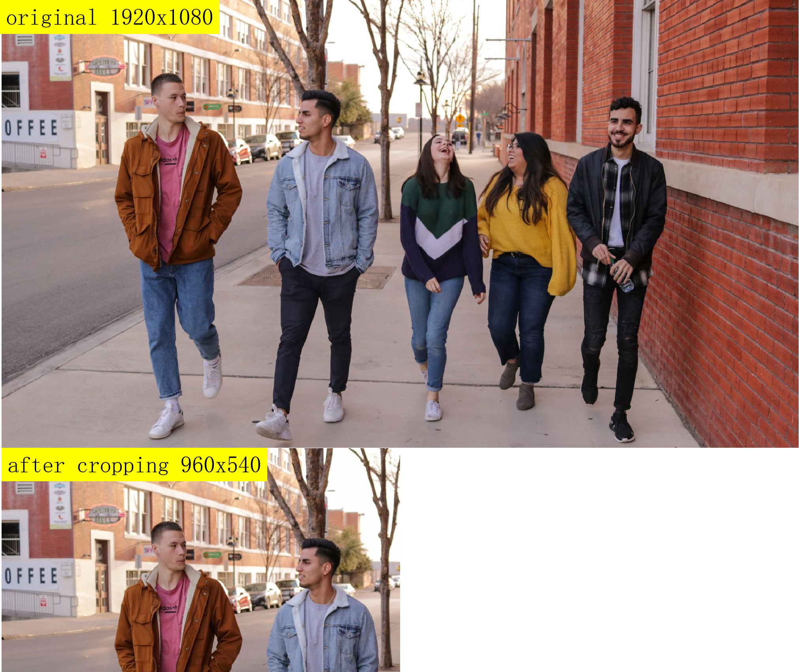
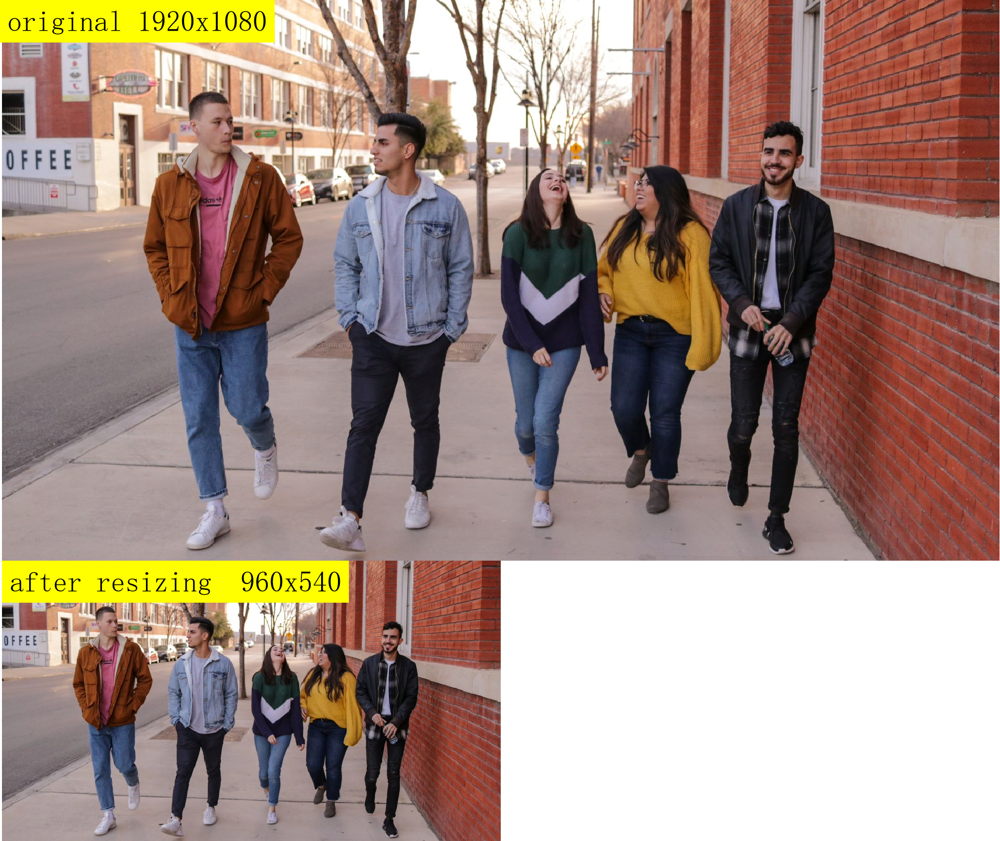

# 2.4 图像处理加速

```mdx-code-block
import Tabs from '@theme/Tabs';
import TabItem from '@theme/TabItem';
```

## 高斯滤波

### 功能介绍

实现高斯滤波功能，加速类型分为BPU加速和NEON加速，BPU加速暂时只支持int16格式，NEON加速暂时只支持int16和uint16格式。

代码仓库：<https://github.com/HorizonRDK/hobot_cv>

### 支持平台

| 平台    | 运行方式     | 示例功能                       |
| ------- | ------------ | ------------------------------ |
| RDK X3, RDK X3 Module| Ubuntu 20.04 (Foxy), Ubuntu 22.04 (Humble) | 读取ToF图片，进行高斯滤波 |

### 准备工作

#### 地平线RDK平台

1. 地平线RDK已烧录好地平线提供的Ubuntu 20.04/Ubuntu 22.04系统镜像。

2. 地平线RDK已成功安装TogetheROS.Bot。

### 使用介绍

#### BPU加速

当前版本支持的参数范围如下：

- 滤波类型：高斯滤波

- 支持的数据类型：int16

- 支持的分辨率：320x240。

- 滤波核：高斯3x3

- sigmax:  0

- sigmay: 0

#### NEON加速

当前版本支持的参数范围如下：

- 滤波类型：高斯滤波

- 支持的数据类型：int16、uint16

- 滤波核：高斯3x3，5x5

- sigmax:  0

- sigmay: 0

package中提供了简单测试程序，输入为本地的ToF图片，调用hobot_cv中接口实现高斯滤波功能。具体接口说明可参考hobot_cv pakcage中的README.md进一步了解。

#### 地平线RDK平台

<Tabs groupId="tros-distro">
<TabItem value="foxy" label="Foxy">

```bash
# 配置tros.b环境
source /opt/tros/setup.bash
```

</TabItem>

<TabItem value="humble" label="Humble">

```bash
# 配置tros.b环境
source /opt/tros/humble/setup.bash
```

</TabItem>

</Tabs>

```shell
# 从tros.b的安装路径中拷贝出运行示例需要的模型和配置文件。
cp -r /opt/tros/${TROS_DISTRO}/lib/hobot_cv/config/ .

# 启动BPU加速测试程序pkg
ros2 launch hobot_cv hobot_cv_gaussian_blur.launch.py

# 启动NEON加速测试程序pkg
ros2 launch hobot_cv hobot_cv_neon_blur.launch.py
```

### 结果分析

#### BPU加速

```text
输出结果：

===================
image name :images/frame1_4.png
infe cost time:1314
guss_time cost time:2685
hobotcv save rate:0.510615

analyse_result start 
---------GaussianBlur
out_filter type:2,cols:320,rows:240,channel:1
cls_filter type:2,cols:320,rows:240,channel:1
out_filter minvalue:96,max:2363
out_filter min,x:319,y:115
out_filter max,x:147,y:239
cls_filter minvalue:96,max:2364
cls_filter min,x:319,y:115
cls_filter max,x:147,y:239

diff diff diff
mat_diff minvalue:0,max:2
mat_diff min,x:2,y:0
mat_diff max,x:110,y:14

error sum:8.46524e+06,max:2,mean_error:0.439232
analyse_result,time_used_ms_end:2
analyse_result end 

------------------------- 
```

其中：

infe cost time:1314　//表示hobotcv加速的高斯滤波耗时1314微秒。

guss_time cost time:2685　//表示opencv的高斯滤波耗时2685微秒。

hobotcv save rate = （guss_time cost time - infe cost time）/ guss_time cost time = 0.510615

从以上比较结果，经过hobot_cv加速后性能提升50%。

error sum:8.46524e+06,max:2,mean_error:0.439232　//单张图片总误差是：8.46524e+06，单个像素最大误差是：2，平均误差：0.439232

平均误差　＝　sum / (width *height) = 8.46524e+06  / (320* 240)

hobot_cv高斯滤波BPU加速与opencv高斯滤波性能对比结果如下：

| 接口类型            | 滤波核大小     | 耗时(ms)    | 单核CPU占比(%) |
| ------------------ | ------------- | ----------- | --------------|
| Hobotcv gaussian   | Size(3,3)     | 1.10435     |    15.9       |
| Opencv gaussian    | Size(3,3)     | 2.41861     |    49.7       |

#### NEON加速

```text
输出结果：
[neon_example-1] ===================
[neon_example-1] image name :config/tof_images/frame1_4.png
[neon_example-1] hobotcv mean cost time:674
[neon_example-1] opencv mean cost time:1025
[neon_example-1] hobotcv mean save rate:0.342439
[neon_example-1]
[neon_example-1] analyse_result start
[neon_example-1] ---------Mean_Blur
[neon_example-1] error sum:8.43744e+06,max:1,mean_error:0.430833
[neon_example-1]
[neon_example-1] hobotcv gaussian cost time:603
[neon_example-1] opencv gaussian cost time:2545
[neon_example-1] hobotcv gaussian save rate:0.763065
[neon_example-1]
[neon_example-1] analyse_result start
[neon_example-1] ---------Gaussian_Blur
[neon_example-1] error sum:9.13206e+06,max:1,mean_error:0.466302
[neon_example-1]
[neon_example-1] -------------------------
```

hobotcv gaussian cost time:603 //hobotcv 高斯滤波neon加速接口耗时603微秒。
opencv gaussian cost time:2545 //表示opencv的高斯滤波耗时2545微秒。
hobotcv gaussian save rate = （opencv cost time - hobotcv cost time）/ opencv cost time = 0.763065
从以上比较结果，经过hobotcv加速后高斯滤波性能提升76%。

hobot_cv高斯滤波NEON加速与opencv高斯滤波性能对比结果如下：

| 接口类型            | 滤波核大小     | 耗时(ms)    | 单核CPU占比(%) |
| ------------------ | ------------- | ----------- | --------------|
| Hobotcv gaussian   | Size(3,3)     | 0.430284    |    27.1   |
| Opencv gaussian    | Size(3,3)     | 2.42225     |    47     |
| Hobotcv gaussian   | Size(5,5)     | 0.854871    |    39.1   |
| Opencv gaussian    | Size(5,5)     | 3.15647     |    99.8    |

## 均值滤波

### 功能介绍

实现均值滤波功能，加速方式为NEON加速，暂时只支持int16，uint16格式。

代码仓库：<https://github.com/HorizonRDK/hobot_cv>

### 支持平台

| 平台    | 运行方式      | 示例功能                       |
| ------- | ------------- | ------------------------------ |
| RDK X3, RDK X3 Module | Ubuntu 20.04 (Foxy), Ubuntu 22.04 (Humble) | 读取ToF图片，进行均值滤波 |

### 准备工作

#### 地平线RDK平台

1. 地平线RDK已烧录好地平线提供的Ubuntu 20.04/Ubuntu 22.04系统镜像。

2. 地平线RDK已成功安装TogetheROS.Bot。

### 使用介绍

当前版本支持的参数范围如下：

- 滤波类型：均值滤波

- 支持的数据类型：int16，uint16

- 滤波核：3x3，5x5

package中提供了简单测试程序，输入为本地的ToF图片，调用hobot_cv中接口实现均值滤波功能。具体接口说明可参考hobot_cv pakcage中的README.md进一步了解。

#### 地平线RDK平台

<Tabs groupId="tros-distro">
<TabItem value="foxy" label="Foxy">

```bash
# 配置tros.b环境
source /opt/tros/setup.bash
```

</TabItem>

<TabItem value="humble" label="Humble">

```bash
# 配置tros.b环境
source /opt/tros/humble/setup.bash
```

</TabItem>

</Tabs>

```shell
# 从TogetheROS的安装路径中拷贝出运行示例需要的配置文件。
cp -r /opt/tros/${TROS_DISTRO}/lib/hobot_cv/config/ .

# 启动测试程序pkg
ros2 launch hobot_cv hobot_cv_neon_blur.launch.py
```

### 结果分析

```text
输出结果：
[neon_example-1] ===================
[neon_example-1] image name :config/tof_images/frame1_4.png
[neon_example-1] hobotcv mean cost time:674
[neon_example-1] opencv mean cost time:1025
[neon_example-1] hobotcv mean save rate:0.342439
[neon_example-1]
[neon_example-1] analyse_result start
[neon_example-1] ---------Mean_Blur
[neon_example-1] error sum:8.43744e+06,max:1,mean_error:0.430833
[neon_example-1]
[neon_example-1] -------------------------
```

其中：

hobotcv mean cost time:674 //hobot_cv 均值滤波neon加速接口耗时674微秒。
opencv mean cost time:1025 //表示opencv的均值滤波耗时1025微秒。
hobotcv mean save rate = （opencv cost time - hobotcv cost time）/ opencv cost time = 0.342439
从以上比较结果，经过hobotcv加速后均值滤波性能提升34%

error sum:8.43744e+06,max:1,mean_error:0.430833　//均值滤波单张图片总误差是：8.43744e+06，单个像素最大误差是：1，平均误差：0.430833
均值滤波平均误差　＝　sum / (width x height) = 8.43744e+06 / (320 x 240)

#### hobot_cv与opencv处理性能对比

| 接口类型            | 滤波核大小     | 耗时(ms)    | 单核CPU占比(%) |
| ------------------ | ------------- | ----------- | --------------|
| Hobotcv mean       | Size(3,3)     | 0.466397    |       31.8   |
| Opencv mean        | Size(3,3)     | 0.676677    |       40.2   |
| Hobotcv mean       | Size(5,5)     | 0.737171    |       47.7   |
| Opencv mean        | Size(5,5)     | 0.798177    |       52.9   |

## crop

### 功能介绍

实现图像裁剪功能，暂时只支持NV12格式。

代码仓库：<https://github.com/HorizonRDK/hobot_cv>

### 支持平台

| 平台    | 运行方式      | 示例功能                       |
| ------- | ------------- | ------------------------------ |
| RDK X3, RDK X3 Module| Ubuntu 20.04 (Foxy), Ubuntu 22.04 (Humble) | 读取图片，进行抠图 |

### 准备工作

#### 地平线RDK平台

1. 地平线RDK已烧录好地平线提供的Ubuntu 20.04/Ubuntu 22.04系统镜像。

2. 地平线RDK已成功安装TogetheROS.Bot。

### 使用介绍

#### 地平线RDK平台


<Tabs groupId="tros-distro">
<TabItem value="foxy" label="Foxy">

```bash
# 配置tros.b环境
source /opt/tros/setup.bash
```

</TabItem>

<TabItem value="humble" label="Humble">

```bash
# 配置tros.b环境
source /opt/tros/humble/setup.bash
```

</TabItem>

</Tabs>

```shell
# 从tros.b的安装路径中拷贝出运行示例需要的模型和配置文件。
cp -r /opt/tros/${TROS_DISTRO}/lib/hobot_cv/config/ .

# 启动launch文件
ros2 launch hobot_cv hobot_cv_crop.launch.py
```

### 结果分析

```text
[INFO] [launch]: Default logging verbosity is set to INFO
[INFO] [crop_example-1]: process started with pid [3064]
[crop_example-1] [INFO] [1655951627.255477663] [example]: crop image to 960x540 pixels, time cost: 1 ms
[crop_example-1] [INFO] [1655951627.336889080] [example]: crop image to 960x540 pixels, time cost: 1 ms
[INFO] [crop_example-1]: process has finished cleanly [pid 3064]
```

根据log显示，测试程序完成了对本地1920x1080分辨率图片crop的处理，耗时如下：

| 图片处理                              | 运行耗时      |
| ------------------------------------- | ------------- |
| 1920x1080 crop出960x540               | 1ms           |

本地原图1920x1080、crop左上角960x540区域，效果图片展示如下：



## resize

### 功能介绍

实现图像缩放功能，暂时只支持NV12格式。

代码仓库：<https://github.com/HorizonRDK/hobot_cv>

### 支持平台

| 平台    | 运行方式      |
| ------- | ------------- |
| RDK X3, RDK X3 Module | Ubuntu 20.04 (Foxy), Ubuntu 22.04 (Humble)  |
| RDK Ultra| Ubuntu 20.04 (Foxy)  |
| X86     | Ubuntu 20.04 (Foxy) |

### 准备工作

#### 地平线RDK平台

1. 地平线RDK已烧录好地平线提供的Ubuntu 20.04/Ubuntu 22.04系统镜像。

2. 地平线RDK已成功安装TogetheROS.Bot。

#### X86平台

1. 确认X86平台系统为Ubuntu 20.04，且已成功安装TogetheROS.Bot。

### 使用介绍

#### 地平线RDK/X86

<Tabs groupId="tros-distro">
<TabItem value="foxy" label="Foxy">

```bash
# 配置tros.b环境
source /opt/tros/setup.bash
```

</TabItem>

<TabItem value="humble" label="Humble">

```bash
# 配置tros.b环境
source /opt/tros/humble/setup.bash
```

</TabItem>

</Tabs>

```shell
# 从TogetheROS的安装路径中拷贝出运行示例需要的模型和配置文件。
cp -r /opt/tros/${TROS_DISTRO}/lib/hobot_cv/config/ .

# 启动launch文件
ros2 launch hobot_cv hobot_cv_resize.launch.py
```

### 结果分析

#### 地平线RDK X3平台resize

```shell
[INFO] [launch]: Default logging verbosity is set to INFO
[INFO] [resize_example-1]: process started with pid [3083]
[resize_example-1] [INFO] [1655951649.930987924] [example]:
[resize_example-1] source image config/test.jpg is 1920x1080 pixels
[resize_example-1] [INFO] [1655951649.931155799] [example]: resize image to 960x540 pixels, time cost: 297 ms
[resize_example-1] [INFO] [1655951650.039223757] [example]: resize image to 960x540 pixels, time cost: 15 ms
[INFO] [resize_example-1]: process has finished cleanly [pid 3083]
```

根据log显示，测试程序完成了对本地1920x1080分辨率图片resize的处理。接口调用两次，两次耗时分别如下。

| 图片处理                               | 第一次运行耗时 | 第二次运行耗时 |
| ------------------------------------- | ------------- | ------------- |
| 1920x1080 resize到960x540              | 297ms        | 15ms          |

因为第一次运行，需要对vps硬件进行配置所以耗时较多，如果不再更改硬件配置属性，硬件直接进行处理，耗时就会显著降低。

本地原图1920x1080、resize后960x540图片如下：



#### 地平线RDK X3平台性能对比

使用top命令查看cpu占用，cpu占用为测试进程cpu占比。
耗时统计单位为ms，循环处理1000次取平均值。
测试时锁定cpu频率:

```shell
sudo bash -c 'echo performance > /sys/devices/system/cpu/cpufreq/policy0/scaling_governor'
```

| src wxh  | dst wxh   | vps耗时 | vps接口<br/>cpu占用  | bpu耗时| bpu接口<br/>cpu占用 | opencv耗时| opencv处理<br/>cpu占用|
| -------- | --------- | --------| -------------------|--------|-------------------|-----------|---------------------|
| 512x512  | 128x128   | 1.53789 |     25.9           |1.11054 |    89             |  1.71119  |        100.3        |
| 640x640  | 320x320   | 2.48536 |     28.5           |1.82232 |    88             |  1.82384  |        338.9        |
| 896x896  | 384x384   | 4.54422 |     24.6           |2.81954 |    79.7           |  7.84396  |        273.1        |
| 1024x1024| 512x512   | 6.01103 |     25.2           |3.89325 |    81.7           |  2.55761  |        381.7        |
| 1920x1088| 512x512   | 11.0406 |     20.6           |5.8513  |    71.1           |  8.19324  |        380.1        |
| 1920x1080| 960x544   | 11.1562 |     22.3           |7.09085 |    77.7           |  15.2978  |        382.4        |

## rotate

### 功能介绍

rotate实现图像旋转功能，暂时只支持NV12格式的图片，支持的旋转角度为90、180、270。

代码仓库：<https://github.com/HorizonRDK/hobot_cv>

### 支持平台

| 平台    | 运行方式      | 示例功能                       |
| ------- | ------------- | ------------------------------ |
| RDK X3, RDK X3 Module| Ubuntu 20.04 (Foxy), Ubuntu 22.04 (Humble) | 读取图片，进行旋转 |

### 准备工作

#### 地平线RDK平台

1. 地平线RDK已烧录好地平线提供的Ubuntu 20.04/Ubuntu 22.04系统镜像。

2. 地平线RDK已成功安装TogetheROS.Bot。

### 使用介绍

#### 地平线RDK平台


<Tabs groupId="tros-distro">
<TabItem value="foxy" label="Foxy">

```bash
# 配置tros.b环境
source /opt/tros/setup.bash
```

</TabItem>

<TabItem value="humble" label="Humble">

```bash
# 配置tros.b环境
source /opt/tros/humble/setup.bash
```

</TabItem>

</Tabs>

```shell
# 从tros.b的安装路径中拷贝出运行示例需要的模型和配置文件。
cp -r /opt/tros/${TROS_DISTRO}/lib/hobot_cv/config/ .

# 启动launch文件
ros2 launch hobot_cv hobot_cv_rotate.launch.py
```

### 结果分析

```shell
[INFO] [launch]: Default logging verbosity is set to INFO
[INFO] [rotate_example-1]: process started with pid [3096]
[rotate_example-1] [INFO] [1655951661.173422471] [example]: rotate image 180 , time cost: 415 ms
[rotate_example-1]
[rotate_example-1] [INFO] [1655951661.416188013] [example]: second rotate image 180 , time cost: 40 ms
[rotate_example-1]
[INFO] [rotate_example-1]: process has finished cleanly [pid 3096]
```

根据log显示，测试程序完成了对本地1920x1080分辨率图片rotate的处理。接口调用两次，两次耗时分别如下。

| 图片处理                               | 第一次运行耗时 | 第二次运行耗时 |
| ------------------------------------- | ------------- | ------------- |
| 1920x1080旋转180度                     | 415ms        | 40ms          |

因为第一次运行，需要对vps硬件进行配置所以耗时较多，如果不再更改硬件配置属性，硬件直接进行处理，耗时就会显著降低。

本地原图1920x1080、rotate后1920x1080图片如下：


#### hobot_cv与opencv处理性能对比

使用top命令查看cpu占用，cpu占用为测试进程cpu占比。
耗时统计单位为ms，循环处理1000次取平均值。
测试时锁定cpu频率:

```shell
sudo bash -c 'echo performance > /sys/devices/system/cpu/cpufreq/policy0/scaling_governor'
```

| src wxh    |  旋转角度  |  hobotcv耗时 | hobotcv接口cpu占用  | opencv耗时  | opencv处理cpu占用 |
| ---------- | --------- | ------------ | ------------------ |------------ |----------------- |
| 1920x1080  |    90     |    37.6568   |       61.6         |   55.8886   |     100.0        |
| 640x640    |    180    |    7.3133    |       66.8         |    5.1806   |     100.0        |
| 896x896    |    270    |    14.7723   |       62.5         |   13.6497   |     100.0        |

## pyramid

### 功能介绍

实现图像金字塔缩放功能，暂时只支持NV12格式。

代码仓库：<https://github.com/HorizonRDK/hobot_cv>

### 支持平台

| 平台    | 运行方式      | 示例功能                       |
| ------- | ------------- | ------------------------------ |
| RDK X3, RDK X3 Module| Ubuntu 20.04 (Foxy), Ubuntu 22.04 (Humble) | 读取图片，进行金字塔缩放 |

### 准备工作

#### 地平线RDK平台

1. 地平线RDK已烧录好地平线提供的Ubuntu 20.04/Ubuntu 22.04系统镜像。

2. 地平线RDK已成功安装TogetheROS.Bot。

### 使用介绍

#### 地平线RDK平台


<Tabs groupId="tros-distro">
<TabItem value="foxy" label="Foxy">

```bash
# 配置tros.b环境
source /opt/tros/setup.bash
```

</TabItem>

<TabItem value="humble" label="Humble">

```bash
# 配置tros.b环境
source /opt/tros/humble/setup.bash
```

</TabItem>

</Tabs>

```shell
# 从tros.b的安装路径中拷贝出运行示例需要的模型和配置文件。
cp -r /opt/tros/${TROS_DISTRO}/lib/hobot_cv/config/ .

# 启动launch文件
ros2 launch hobot_cv hobot_cv_pyramid.launch.py
```

### 结果分析

```shell
[INFO] [launch]: Default logging verbosity is set to INFO
[INFO] [pyramid_example-1]: process started with pid [3071]
[pyramid_example-1] [INFO] [1655951639.110992960] [example]: pyramid image , time cost: 299 ms
[pyramid_example-1]
[pyramid_example-1] [INFO] [1655951639.432398919] [example]: pyramid image , time cost: 19 ms
[pyramid_example-1]
[INFO] [pyramid_example-1]: process has finished cleanly [pid 3071]
```

根据log显示，测试程序完成了对本地1920x1080分辨率图片金字塔缩小的处理。接口调用两次，两次耗时分别如下。

| 图片处理                               | 第一次运行耗时 | 第二次运行耗时 |
| ------------------------------------- | ------------- | ------------- |
| 1920x1080金字塔六层基础层输出           | 299ms        | 19ms          |

因为第一次运行，需要对vps硬件进行配置所以耗时较多，如果不再更改硬件配置属性，硬件直接进行处理，耗时就会显著降低。

本地原图1920x1080、pyramid缩放后图片如下：


输出基础层六层，每一层size是上一层的1/2

#### 性能对比

输入图片1920x1080，向上获取5层输出获取到960x540、480x270、240x134、120x66、60x32分辨率的图片。分别对比opencv和hobotcv效率，结果如下：

cpu占用为单核百分比，耗时统计单位为ms

| VPS接口耗时 | vps接口cpu占比| opencv耗时 | opencv接口cpu占比|
| -----------| ------------- | ----------- | --------------|
|    19ms    |      42.5     |      56     |       100     |

