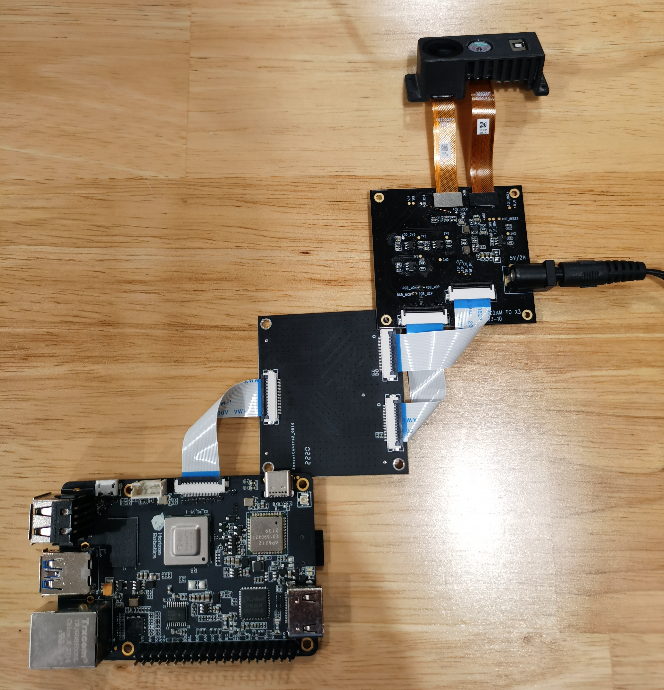
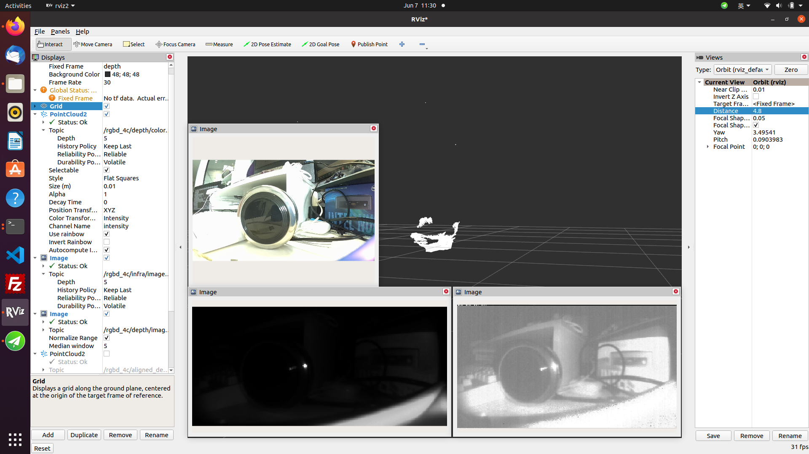

# 2.1 数据采集

## USB图像采集

### 功能介绍

为实现环境感知能力，机器人产品中通常会搭载摄像头以获取图像信息。USB摄像头易于获取，使用方便，通用性好，TogetheROS.Bot添加了对USB摄像头的支持，支持ROS2标准图像消息。

代码仓库：<https://github.com/HorizonRDK/hobot_usb_cam.git>

### 支持平台

| 平台    | 运行方式     |
| ------- | ------------ |
| RDK X3, RDK X3 Module, RDK Ultra| Ubuntu 20.04 |
| X86     | Ubuntu 20.04 |

### 准备工作

#### 地平线RDK平台

1. 确认手中USB摄像头工作正常，将USB摄像头接入地平线RDKUSB插槽

2. 地平线RDK已烧录好地平线提供的Ubuntu 20.04系统镜像

3. 地平线RDK已成功安装tros.b

4. 确认PC机能够通过网络访问地平线RDK

#### X86平台

1. 确认手中USB摄像头工作正常，将USB摄像头接入PC或服务器USB插槽

1. 确认X86平台系统为Ubuntu 20.04，且已成功安装tros.b

### 使用方式（默认usb_pixel_format为mjpeg）

地平线RDK和X86平台使用方式相同，其中以地平线RDK平台为例：

1. 通过SSH登录地平线RDK，确认USB摄像头设备名称，这里以`/dev/video8`为例

2. 并通过下述命令启动USB摄像头

    ```bash
    # 配置 tros.b 环境：
    source /opt/tros/setup.bash
    # launch方式启动：
    ros2 launch hobot_usb_cam hobot_usb_cam.launch.py usb_video_device:=/dev/video8
    ```

3. 如程序输出如下信息，说明节点已成功启动

    ```text
    [INFO] [launch]: All log files can be found below /root/.ros/log/2024-01-18-19-44-39-419588-ubuntu-3951
    [INFO] [launch]: Default logging verbosity is set to INFO
    [INFO] [hobot_usb_cam-1]: process started with pid [3953]
    [hobot_usb_cam-1] [WARN] [1705578280.808870437] [hobot_usb_cam]: framerate: 30
    [hobot_usb_cam-1] [WARN] [1705578280.809851560] [hobot_usb_cam]: pixel_format_name: mjpeg
    [hobot_usb_cam-1] [WARN] [1705578280.936697507] [hobot_usb_cam]: This devices supproted formats:
    [hobot_usb_cam-1] [WARN] [1705578280.936858791] [hobot_usb_cam]:        Motion-JPEG: 640 x 480 (30 Hz)
    [hobot_usb_cam-1] [WARN] [1705578280.936912830] [hobot_usb_cam]:        Motion-JPEG: 1920 x 1080 (30 Hz)
    [hobot_usb_cam-1] [WARN] [1705578280.936960328] [hobot_usb_cam]:        Motion-JPEG: 320 x 240 (30 Hz)
    [hobot_usb_cam-1] [WARN] [1705578280.937007285] [hobot_usb_cam]:        Motion-JPEG: 800 x 600 (30 Hz)
    [hobot_usb_cam-1] [WARN] [1705578280.937053241] [hobot_usb_cam]:        Motion-JPEG: 1280 x 720 (30 Hz)
    [hobot_usb_cam-1] [WARN] [1705578280.937098906] [hobot_usb_cam]:        Motion-JPEG: 1024 x 576 (30 Hz)
    [hobot_usb_cam-1] [WARN] [1705578280.937144528] [hobot_usb_cam]:        YUYV 4:2:2: 640 x 480 (30 Hz)
    [hobot_usb_cam-1] [WARN] [1705578280.937190068] [hobot_usb_cam]:        YUYV 4:2:2: 1920 x 1080 (5 Hz)
    [hobot_usb_cam-1] [WARN] [1705578280.937235858] [hobot_usb_cam]:        YUYV 4:2:2: 320 x 240 (30 Hz)
    [hobot_usb_cam-1] [WARN] [1705578280.937282064] [hobot_usb_cam]:        YUYV 4:2:2: 800 x 600 (20 Hz)
    [hobot_usb_cam-1] [WARN] [1705578280.937328020] [hobot_usb_cam]:        YUYV 4:2:2: 1280 x 720 (10 Hz)
    [hobot_usb_cam-1] [WARN] [1705578280.937373518] [hobot_usb_cam]:        YUYV 4:2:2: 1024 x 576 (15 Hz)
    ```

4. Web端查看USB摄像头图像，另起一个终端：

    ```bash
    # 配置 tros.b 环境：
    source /opt/tros/setup.bash
    # 启动websocket
    ros2 launch websocket websocket.launch.py websocket_image_topic:=/image websocket_only_show_image:=true
    ```

5. PC打开浏览器（chrome/firefox/edge）输入<http://IP:8000>（IP为地平线RDK IP地址），点击左上方Web端展示即可查看USB摄像头实时画面
    

### 使用方式2（usb_pixel_format为yuyv2rgb）
地平线RDK和X86平台使用方式相同，其中以地平线RDK平台为例：

1. 通过SSH登录地平线RDK，确认USB摄像头设备名称，这里以`/dev/video8`为例

2. 并通过下述命令启动USB摄像头

    ```bash
    # 配置 tros.b 环境：
    source /opt/tros/setup.bash
    # launch方式启动：
    ros2 launch hobot_usb_cam hobot_usb_cam.launch.py usb_video_device:=/dev/video8 usb_pixel_format:=yuyv2rgb usb_image_width:=640 usb_image_height:=480
    ```

3. 如程序输出如下信息，说明节点已成功启动

    ```text
    [INFO] [launch]: All log files can be found below /root/.ros/log/2024-01-18-19-44-39-419588-ubuntu-3951
    [INFO] [launch]: Default logging verbosity is set to INFO
    [INFO] [hobot_usb_cam-1]: process started with pid [3953]
    [hobot_usb_cam-1] [WARN] [1705578280.808870437] [hobot_usb_cam]: framerate: 30
    [hobot_usb_cam-1] [WARN] [1705578280.809851560] [hobot_usb_cam]: pixel_format_name: yuyv2rgb
    [hobot_usb_cam-1] [WARN] [1705578280.936697507] [hobot_usb_cam]: This devices supproted formats:
    [hobot_usb_cam-1] [WARN] [1705578280.936858791] [hobot_usb_cam]:        Motion-JPEG: 640 x 480 (30 Hz)
    [hobot_usb_cam-1] [WARN] [1705578280.936912830] [hobot_usb_cam]:        Motion-JPEG: 1920 x 1080 (30 Hz)
    [hobot_usb_cam-1] [WARN] [1705578280.936960328] [hobot_usb_cam]:        Motion-JPEG: 320 x 240 (30 Hz)
    [hobot_usb_cam-1] [WARN] [1705578280.937007285] [hobot_usb_cam]:        Motion-JPEG: 800 x 600 (30 Hz)
    [hobot_usb_cam-1] [WARN] [1705578280.937053241] [hobot_usb_cam]:        Motion-JPEG: 1280 x 720 (30 Hz)
    [hobot_usb_cam-1] [WARN] [1705578280.937098906] [hobot_usb_cam]:        Motion-JPEG: 1024 x 576 (30 Hz)
    [hobot_usb_cam-1] [WARN] [1705578280.937144528] [hobot_usb_cam]:        YUYV 4:2:2: 640 x 480 (30 Hz)
    [hobot_usb_cam-1] [WARN] [1705578280.937190068] [hobot_usb_cam]:        YUYV 4:2:2: 1920 x 1080 (5 Hz)
    [hobot_usb_cam-1] [WARN] [1705578280.937235858] [hobot_usb_cam]:        YUYV 4:2:2: 320 x 240 (30 Hz)
    [hobot_usb_cam-1] [WARN] [1705578280.937282064] [hobot_usb_cam]:        YUYV 4:2:2: 800 x 600 (20 Hz)
    [hobot_usb_cam-1] [WARN] [1705578280.937328020] [hobot_usb_cam]:        YUYV 4:2:2: 1280 x 720 (10 Hz)
    [hobot_usb_cam-1] [WARN] [1705578280.937373518] [hobot_usb_cam]:        YUYV 4:2:2: 1024 x 576 (15 Hz)
    ```

4. 通过hobot codec进行编码成mjpeg

    ```bash
    # 配置 tros.b 环境：
    source /opt/tros/setup.bash
    # launch方式启动：
    ros2 launch hobot_codec hobot_codec_encode.launch.py codec_in_mode:=ros codec_in_format:=rgb8 codec_out_mode:=ros codec_sub_topic:=/image codec_pub_topic:=/image_mjpeg
    ```

5. Web端查看USB摄像头图像，另起一个终端：

    ```bash
    # 配置 tros.b 环境：
    source /opt/tros/setup.bash
    # 启动websocket
    ros2 launch websocket websocket.launch.py websocket_image_topic:=/image_mjpeg websocket_only_show_image:=true
    ```

6. PC打开浏览器（chrome/firefox/edge）输入<http://IP:8000>（IP为地平线RDK IP地址），点击左上方Web端展示即可查看USB摄像头实时画面
    


### 注意事项

1. USB摄像头需要进行标定，并设置相机标定文件的读取路径，否则无法发布相机内参，但不影响其它功能
2. 设置相机标定文件读取路径，具体步骤如下：

    ```bash
    # 配置 tros.b 环境：
    source /opt/tros/setup.bash
    # launch 方式启动
    ros2 launch hobot_usb_cam hobot_usb_cam.launch.py usb_camera_calibration_file_path:=（实际标定文件绝对路径）
    ```

3. 对于X86平台，如果Ubuntu 20.04系统运行在虚拟机中，需要在`虚拟机设置`中将`USB控制器`的`USB兼容性`设置为`USB 3.1`。

4. pixel_format配置的更改

   hobot_usb_cam支持以下配置集：
   "mjpeg","mjpeg2rgb","rgb8","yuyv","yuyv2rgb","uyvy","uyvy2rgb","m4202rgb","mono8","mono16","y102mono8"
   
   通过第一种的默认参数启动usb camera查询设备硬件所支持支持的formats，如下log：

    ```text
    [hobot_usb_cam-1] [WARN] [1705548544.174669672] [hobot_usb_cam]: This devices supproted formats:
    [hobot_usb_cam-1] [WARN] [1705548544.174844917] [hobot_usb_cam]:        Motion-JPEG: 640 x 480 (30 Hz)
    [hobot_usb_cam-1] [WARN] [1705548544.174903166] [hobot_usb_cam]:        Motion-JPEG: 1920 x 1080 (30 Hz)
    [hobot_usb_cam-1] [WARN] [1705548544.174950581] [hobot_usb_cam]:        Motion-JPEG: 320 x 240 (30 Hz)
    [hobot_usb_cam-1] [WARN] [1705548544.174996788] [hobot_usb_cam]:        Motion-JPEG: 800 x 600 (30 Hz)
    [hobot_usb_cam-1] [WARN] [1705548544.175043412] [hobot_usb_cam]:        Motion-JPEG: 1280 x 720 (30 Hz)
    [hobot_usb_cam-1] [WARN] [1705548544.175089161] [hobot_usb_cam]:        Motion-JPEG: 1024 x 576 (30 Hz)
    [hobot_usb_cam-1] [WARN] [1705548544.175135035] [hobot_usb_cam]:        YUYV 4:2:2: 640 x 480 (30 Hz)
    [hobot_usb_cam-1] [WARN] [1705548544.175180325] [hobot_usb_cam]:        YUYV 4:2:2: 1920 x 1080 (5 Hz)
    [hobot_usb_cam-1] [WARN] [1705548544.175226449] [hobot_usb_cam]:        YUYV 4:2:2: 320 x 240 (30 Hz)
    [hobot_usb_cam-1] [WARN] [1705548544.175272365] [hobot_usb_cam]:        YUYV 4:2:2: 800 x 600 (20 Hz)
    [hobot_usb_cam-1] [WARN] [1705548544.175318697] [hobot_usb_cam]:        YUYV 4:2:2: 1280 x 720 (10 Hz)
    [hobot_usb_cam-1] [WARN] [1705548544.175365195] [hobot_usb_cam]:        YUYV 4:2:2: 1024 x 576 (15 Hz)
    ```

    a.查询usb camera支持的图像格式，如上述log，log显示支持mjpeg和YUYV;

    b.则只能设置"mjpeg","mjpeg2rgb","yuyv","yuyv2rgb"；否则hobot_usb_cam程序退出。

## MIPI图像采集

### 功能介绍

为实现环境感知能力，机器人产品中通常会搭载摄像头、ToF等类型的传感器。为降低用户传感器适配和使用成本，TogetheROS.Bot会对多种常用传感器进行封装，并抽象成hobot_sensor模块，支持ROS标准图像消息。当配置的传感器参数与接入的摄像头不符时，程序会自动适应正确的传感器类型。目前已支持的MIPI传感器类型如下所示：

| 类型 | 型号 | 规格 | 支持平台 |
| ------ | ------ | ------ | ------ |
| 摄像头| F37 | 200W | RDK X3, RDK X3 Module |
| 摄像头| GC4663 | 400W | RDK X3, RDK X3 Module |
| 摄像头| IMX219 | 200W | RDK X3, RDK X3 Module, RDK Ultra |
| 摄像头| IMX477 | 200W | RDK X3, RDK X3 Module |
| 摄像头| OV5647 | 200W | RDK X3, RDK X3 Module |

代码仓库：<https://github.com/HorizonRDK/hobot_mipi_cam.git>

### 支持平台

| 平台   | 运行方式      | 示例功能                          |
| ------ | ------------- | --------------------------------- |
|RDK X3, RDK X3 Module, RDK Ultra| Ubuntu 20.04  | 启动MIPI摄像头，并通过Web展示图像 |

### 准备工作

#### 地平线RDK平台

1. 确认摄像头正确接入地平线RDK，例如 F37 摄像头的接入RDK X3方式如下图：

    

2. 地平线RDK已烧录好地平线提供的Ubuntu 20.04系统镜像

3. 地平线RDK已成功安装tros.b

4. 确认PC机能够通过网络访问地平线RDK

### 使用方式

#### 地平线RDK平台

下面以 F37 为例，介绍摄像头数据获取和预览的方法：

1. 通过 SSH 登录地平线RDK，确定摄像头型号，这里以`F37`为例，确定相机标定文件的读取路径，这里以`/opt/tros/${TROS_DISTRO}/lib/mipi_cam/config/F37_calibration.yaml`为例

2. 并通过下述命令启动 hobot_sensor 节点  

    ```shell
    # 配置 tros.b 环境：
    source /opt/tros/setup.bash
    # launch 方式启动
    ros2 launch mipi_cam mipi_cam.launch.py mipi_video_device:=F37 mipi_camera_calibration_file_path:=/opt/tros/${TROS_DISTRO}/lib/mipi_cam/config/F37_calibration.yaml
    ```

3. 如程序输出如下信息，说明节点已成功启动

    ```text
    [INFO] [launch]: All log files can be found below /root/.ros/log/2022-06-11-15-16-13-641715-ubuntu-8852
    [INFO] [launch]: Default logging verbosity is set to INFO
    [INFO] [mipi_cam-1]: process started with pid [8854]
    ...
    ```

4. Web端查看 F37 摄像头图像，由于发布原始数据，需要编码JPEG图像，另起两个终端：一个进行订阅 MIPI 数据编码为JPEG，一个用webservice发布

    ```shell
    # 一个终端编码
    source /opt/tros/setup.bash
    # 启动编码
    ros2 launch hobot_codec hobot_codec_encode.launch.py

    # 再起一个终端
    source /opt/tros/setup.bash
    # 启动websocket
    ros2 launch websocket websocket.launch.py websocket_image_topic:=/image_jpeg websocket_only_show_image:=true
    ```

5. PC打开浏览器（chrome/firefox/edge）输入<http://IP:8000>（IP为地平线RDK IP地址），点击左上方Web端展示即可看到F37输出的实时画面
    

6. 在PC机上查询相机内参（具体数据以读取的相机标定文件为准），命令及结果如下:

    ```shell
    root@ubuntu:~# source /opt/ros/foxy/setup.bash
    root@ubuntu:~# ros2 topic echo /camera_info
        header:
    stamp:
        sec: 1662013622
        nanosec: 672922214
    frame_id: default_cam
    height: 1080
    width: 1920
    distortion_model: plumb_bob
    d:
    - 0.169978
    - -0.697303
    - -0.002944
    - -0.004961
    - 0.0
    k:
    - 1726.597634
    - 0.0
    - 904.979671
    - 0.0
    - 1737.359551
    - 529.123375
    - 0.0
    - 0.0
    - 1.0
    r:
    - 1.0
    - 0.0
    - 0.0
    - 0.0
    - 1.0
    - 0.0
    - 0.0
    - 0.0
    - 1.0
    p:
    - 1685.497559
    - 0.0
    - 881.6396
    - 0.0
    - 0.0
    - 1756.460205
    - 526.781147
    - 0.0
    - 0.0
    - 0.0
    - 1.0
    - 0.0
    binning_x: 0
    binning_y: 0
    roi:
    x_offset: 0
    y_offset: 0
    height: 0
    width: 0
    do_rectify: false

    ```

### 注意事项

1. mipi_cam提供F37以及GC4663两种摄像头的标定文件，默认读取F37的标定文件`F37_calibration.yaml`，如使用GC4663，请更改相机标定文件的读取路径，具体步骤如下：

    ```shell
    # 配置 tros.b 环境：
    source /opt/tros/setup.bash
    # launch 方式启动
    ros2 launch mipi_cam mipi_cam.launch.py mipi_video_device:=GC4663 mipi_camera_calibration_file_path:=/opt/tros/${TROS_DISTRO}/lib/mipi_cam/config/GC4663_calibration.yaml
    ```

2. 摄像头插拔注意事项

   **严禁在开发板未断电的情况下插拔摄像头，否则非常容易烧坏摄像头模组。**

3. 如遇到hobot_sensor节点启动异常，可通过下述步骤进行问题排查：
    - 检查硬件连接
    - 是否设置 tros.b 环境
    - 参数是否正确，具体参考 Hobot_Sensors README.md

## RGBD图像采集

### 功能介绍

为实现环境感知能力，机器人产品中通常会搭载摄像头、ToF等类型的传感器。为降低用户传感器适配和使用成本，TogetheROS.Bot会对多种常用传感器进行封装，并抽象成hobot_sensor模块，支持ROS标准图像消息，自定义图像消息输出以及相机标定数据发布。目前已支持的 RGBD 传感器类型如下所示：

| 类型 | 型号 | 规格 | 支持平台 |
| ------ | ------ | ------ | ---- |
| 摄像头| CP3AM | 200W | RDK X3 |

代码仓库：<https://github.com/HorizonRDK/hobot_rgbd_cam.git>

### 支持平台

| 平台   | 运行方式      | 示例功能                                           |
| ------ | ------------- | -------------------------------------------------- |
|RDK X3| Ubuntu 20.04  | 启动RGBD摄像头，并在PC端通过rviz2预览RGB图和深度图 |

**注意：仅支持RDK X3，RDK X3 Module暂不支持。**

### 准备工作

#### 地平线RDK平台

1. 确认摄像头正确接入地平线RDK，RGBD模组接入RDK X3方式如下图：

    

    **注意：RGBD模组需要额外转接板才能接到地平线RDK X3上**。
2. 地平线RDK已烧录好地平线提供的Ubuntu 20.04系统镜像。

3. 地平线RDK已成功安装tros.b

4. 确认PC机能够通过网络访问地平线RDK

5. PC端需安装 ros2 foxy 版本和 rviz2，安装命令如下：

```shell
  sudo apt install ros-foxy-rviz-common ros-foxy-rviz-default-plugins ros-foxy-rviz2
```

### 使用方式

#### 地平线RDK平台

下面以 CP3AM 为例，介绍摄像头数据获取和预览的方法：

1. 通过SSH登录地平线RDK，并通过下述命令启动hobot_sensor节点

    ```shell
    # 配置 tros.b 环境：
    source /opt/tros/setup.bash
    cp -r /opt/tros/${TROS_DISTRO}/lib/rgbd_sensor/parameter .
    # lanuch 方式启动
    ros2 launch rgbd_sensor rgbd_sensor.launch.py
    ```

2. 如程序输出如下信息，说明节点已成功启动

    ```text
    [WARN] [1654573498.706920307] [example]: [wuwl]->This is rgbd!
    sh: 1: echo: echo: I/O error
    pipeId[1], mipiIdx[1], vin_vps_mode[3]
    [ERROR]["LOG"][irs2381c_utility.c:192] 2381 enter sensor_init_setting
    [ERROR]["LOG"][irs2381c_utility.c:200] start write 2381c reg
    camera read reg: 0xa001 val:0x7
    ...
    [ERROR]["LOG"][irs2381c_utility.c:207] end write 2381c reg
    HB_MIPI_InitSensor end
    HB_MIPI_SetDevAttr end
    pstHbVideoDev->vin_fd = 29
    sensorID: 634-2362-2676-68d0 
    find local calib_file
    
    find local calib_file
    
    SDK Version: V4.4.35 build 20220525 09:27:53.
    read file(./calib-0634-2362-2676-68d0.bin), ok, file_len=132096, read_len=132096.......
    module config file(user custom) is: ./parameter/T00P11A-17.ini.
    parse calib data, data len:132096...
    sunny_degzip2 decode_len=155575.
    calib data with crc.
    parse calib data, ok.
    max roi (firstly): (0, 224, 0, 128).
    cur roi (firstly): (0, 224, 0, 128).
    HB_MIPI_InitSensor end
    HB_MIPI_SetDevAttr end
    pstHbVideoDev->vin_fd = 55
    vencChnAttr.stRcAttr.enRcMode=11
    mmzAlloc paddr = 0x1a6e6000, vaddr = 0x917e1000
    camera read reg: 0x9400 val:0x1
    ...
    
    [wuwl-StartCamera]->camT=3, ret=0.
    camera read reg: 0x3e val:0x40
    [ERROR]["vio_devop"][utils/dev_ioctl.c:121] [499334.399304]dev_node_dqbuf_ispoll[121]: failed to ioctl: dq (14 - Bad address)
    [ERROR]["vio_devop"][utils/dev_ioctl.c:189] [499334.399355]entity_node_dqbuf_ispoll[189]: dev type(9) dq failed
    
    [ERROR]["vio_core"][commom_grp/binding_main.c:1034] [499334.399371]comm_dq_no_data[1034]: G1 MIPI_SIF_MODULE module chn0 dq failed! maybe framedrop error_detail -14
    
    [wuwl-StartCamera]->camT=1, ret=0.
    [INFO] [1654573500.226606117] [rclcpp]: [childStart]-> ret=0 !
    
    [INFO] [1654573500.226831567] [rclcpp]: [StartStream]->pthread create sucess
    
    [INFO] [1654573500.226963854] [rclcpp]: <========>[doCapStreamLoop]->Start.
    
    [WARN] [1654573500.226998103] [rgbd_node]: [RgbdNode]->mipinode init sucess.
    
    [WARN] [1654573500.227352507] [example]: [wuwl]->rgbd init!
    [WARN] [1654573500.228502174] [example]: [wuwl]->rgbd add_node!

    [INFO] [1662723985.860666547] [rgbd_node]: publish camera info.
    [INFO] [1662723985.866077156] [rgbd_node]: [pub_ori_pcl]->pub pcl w:h=24192:1,nIdx-24192:sz=24192.
    [INFO] [1662723985.876428980] [rgbd_node]: [timer_ros_pub]->pub dep w:h=224:129,sz=982464, infra w:h=224:108, sz=24192.

    [INFO] [1662723985.946767230] [rgbd_node]: publish camera info.
    [INFO] [1662723985.951415418] [rgbd_node]: [pub_ori_pcl]->pub pcl w:h=24192:1,nIdx-24192:sz=24192.
    [INFO] [1662723985.960161280] [rgbd_node]: [timer_ros_pub]->pub dep w:h=224:129,sz=982464, infra w:h=224:108, sz=24192.
    ...
    
    ```

3. PC机上查询当前话题，查询命令及返回结果如下：

    ```bash
    source /opt/ros/foxy/setup.bash
    ros2 topic list
    ```

    输出：

    ```text
    /rgbd_CP3AM/depth/image_rect_raw
    
    /rgbd_CP3AM/depth/color/points
    
    /rgbd_CP3AM/color/camera_info

    /rgbd_CP3AM/aligned_depth_to_color/color/points
    
    /rgbd_CP3AM/infra/image_rect_raw
    
    /rgbd_CP3AM/color/image_rect_raw
    
    /parameter_events
    
    /rosout
    ```

4. PC机上订阅话题，并预览摄像头数据

    ```bash
    source /opt/ros/foxy/setup.bash
    ros2 run rviz2 rviz2
    ```

    在 rviz2 界面上点击 add 按钮，添加rgbd_sensor 所发布 topic （参见目录3所标示的 rgbd_CP3AM 相关 topic），订阅点云需要把rviz2 配置的Global Options 里面的选项“Fixed Frame”修改为 “depth”，就可以观看实时点云信息。在 point 话题配置中，里面point type 选择points 即可。

    

5. 在PC机上查询相机内参

    ```bash
    source /opt/ros/foxy/setup.bash
    ros2 topic echo /rgbd_CP3AM/color/camera_info
    ```

    输出结果如下:

    ```text
    header:
    stamp:
        sec: 119811
        nanosec: 831645108
    frame_id: color
    height: 1080
    width: 1920
    distortion_model: plumb_bob
    d:
    - -0.32267
    - 0.083221
    - 0.000164
    - -0.002134
    - 0.0
    k:
    - 1066.158339
    - 0.0
    - 981.393777
    - 0.0
    - 1068.659998
    - 545.569587
    - 0.0
    - 0.0
    - 1.0
    r:
    - 1.0
    - 0.0
    - 0.0
    - 0.0
    - 1.0
    - 0.0
    - 0.0
    - 0.0
    - 1.0
    p:
    - 741.315308
    - 0.0
    - 968.865379
    - 0.0
    - 0.0
    - 969.43042
    - 546.524343
    - 0.0
    - 0.0
    - 0.0
    - 1.0
    - 0.0
    binning_x: 0
    binning_y: 0
    roi:
    x_offset: 0
    y_offset: 0
    height: 0
    width: 0
    do_rectify: false
    ```

### 注意事项

如遇到hobot_sensor节点启动异常，可通过下述步骤进行问题排查：

1. 检查硬件连接
2. 是否设置tros.b环境
3. 参数是否正确，具体参考Hobot_Sensors README.md
