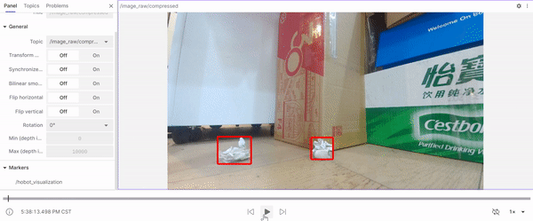

# 2.7 工具

```mdx-code-block
import Tabs from '@theme/Tabs';
import TabItem from '@theme/TabItem';
```

## 图像发布工具

### 功能介绍

图片发布工具支持批量读取本地图片或视频文件，并按照ROS消息格式发布，从而提高算法调试和部署效率。

对于图片发布，支持读取JPEG/JPG/PNG/NV12格式的图片，发布压缩图片或者将压缩图片转换为NV12格式进行发布。

对于视频发布，支持H264/H265/MP4格式，读取视频文件后提取相关的视频流进行发布。

代码仓库:<https://github.com/HorizonRDK/hobot_image_publisher.git>

### 支持平台

| 平台    | 运行方式     |
| ------- | ------------ |
| RDK X3, RDK X3 Module | Ubuntu 20.04 (Foxy), Ubuntu 22.04 (Humble) |
| RDK Ultra | Ubuntu 20.04 (Foxy) |
| X86     | Ubuntu 20.04 (Foxy) |

:::caution
X86平台不支持将H.264、H.265视频解码为NV12格式，因此H.264、H.265视频发布功能无法在X86平台展示。
RDK Ultra不支持将H.264视频解码为NV12格式，因此H.264视频发布功能无法在RDK Ultra平台展示。
:::

### 准备工作

#### 地平线RDK平台

1. 地平线RDK已烧录好地平线提供的Ubuntu 20.04/Ubuntu 22.04系统镜像

2. 地平线RDK已成功安装tros.b

3. 可以通过网络访问地平线RDK的PC

#### X86平台

1. X86环境已配置Ubuntu 20.04系统镜像

2. X86环境已安装X86版本 tros.b

### 图片发布使用介绍

循环读取本地的一张NV12格式图片并发布，使用图像编解码模块将图片压缩编码成JPEG格式，在PC的Web端展示图片。

#### 地平线RDK/X86平台

<Tabs groupId="tros-distro">
<TabItem value="foxy" label="Foxy">

```bash
# 配置tros.b环境
source /opt/tros/setup.bash
```

</TabItem>

<TabItem value="humble" label="Humble">

```bash
# 配置tros.b环境
source /opt/tros/humble/setup.bash
```

</TabItem>

</Tabs>

```shell
# 从tros.b的安装路径中拷贝出运行示例需要的图片文件
cp -r /opt/tros/${TROS_DISTRO}/lib/hobot_image_publisher/config/ .

# 启动launch文件
ros2 launch hobot_image_publisher hobot_image_publisher_demo.launch.py
```

### 图片发布结果分析

在运行终端输出如下信息：

```text
[INFO] [launch]: All log files can be found below /root/.ros/log/2022-08-19-12-58-02-288516-ubuntu-24492
[INFO] [launch]: Default logging verbosity is set to INFO
webserver has launch
[INFO] [hobot_image_pub-1]: process started with pid [24511]
[INFO] [hobot_codec_republish-2]: process started with pid [24513]
[INFO] [websocket-3]: process started with pid [24519]
```

输出log显示出webserver已启动，hobot_image_pub、hobot_codec_republish、websocket都正常运行

在PC端的浏览器输入<http://IP:8000> 即可查看图像展示效果（IP为地平线RDK/X86设备的IP地址）：


### 视频发布使用介绍

读取本地video.list文件，获取list文件中的视频文件路径，循环读取视频文件并发布，先使用图像编解码模块将视频流解码成NV12格式图片，再使用图像编解码模块将图片压缩编码成JPEG格式，在PC的Web端展示图片。

#### 地平线RDK平台


<Tabs groupId="tros-distro">
<TabItem value="foxy" label="Foxy">

```bash
# 配置tros.b环境
source /opt/tros/setup.bash
```

</TabItem>

<TabItem value="humble" label="Humble">

```bash
# 配置tros.b环境
source /opt/tros/humble/setup.bash
```

</TabItem>

</Tabs>

```shell
# 从tros.b的安装路径中拷贝出运行示例需要的图片文件
cp -r /opt/tros/${TROS_DISTRO}/lib/hobot_image_publisher/config/ .

# 启动launch文件
ros2 launch hobot_image_publisher hobot_image_publisher_videolist_demo.launch.py
```

#### X86平台


<Tabs groupId="tros-distro">
<TabItem value="foxy" label="Foxy">

```bash
# 配置tros.b环境
source /opt/tros/setup.bash
```

</TabItem>

<TabItem value="humble" label="Humble">

```bash
# 配置tros.b环境
source /opt/tros/humble/setup.bash
```

</TabItem>

</Tabs>

```shell
# 从tros.b的安装路径中拷贝出运行示例需要的图片文件
cp -r /opt/tros/${TROS_DISTRO}/lib/hobot_image_publisher/config/ .

# 启动图片发布节点，使用本地MP4格式视频文件进行发布（可以根据自己的需求进行参数配置），暂不支持Web端显示
/opt/tros/${TROS_DISTRO}/lib/hobot_image_publisher/hobot_image_pub --ros-args -p image_source:=./config/video.list -p fps:=30 -p image_format:=mp4
```

### 视频发布结果分析

在运行终端输出如下信息：

```text
[INFO] [launch]: All log files can be found below /root/.ros/log/2022-10-22-21-44-03-663907-ubuntu-702475
[INFO] [launch]: Default logging verbosity is set to INFO
webserver has launch
[INFO] [hobot_image_pub-1]: process started with pid [702597]
[INFO] [hobot_codec_republish-2]: process started with pid [702599]
[INFO] [hobot_codec_republish-3]: process started with pid [702601]
[INFO] [websocket-4]: process started with pid [702603]
```

输出log显示出webserver已启动，hobot_image_pub、hobot_codec_republish、websocket都正常运行

在PC端的浏览器输入<http://IP:8000> 即可查看图像展示效果（IP为地平线RDK/X86设备的IP地址）：


## Trigger记录工具

### 功能介绍

所谓Trigger，是在设定好已有Trigger机制基础上，监测Trigger模块订阅的消息变化，例如检测框结果数量变化，小车控制信息变化等，触发对应Trigger事件，记录指定时间区间内的ROS2消息，从而帮助开发人员定位和复现机器人场景中的感知、规控等问题。

trigger_node package 是地平线基于ROS2开发的Trigger基础模块，用于在触发Trigger事件后，获取指定rosbag数据的功能包。package支持直接订阅ai_msg/msg/PerceptionTargets类型的话题，在话题回调函数中，判断是否触发Trigger事件，并记录Trigger事件相关的rosbag包，最后将Trigger事件信息保存，并发布std_msg/msg/String类型的Trigger事件话题。

本章节展示的示例，是地平线在自定义trigger基础模块基础上，开发的Trigger模块使用示例。本示例展示的功能，是订阅垃圾检测框信息，根据垃圾检测框的数量是否大于等于3，判断是否触发Trigger事件。若检测框数量大于等于3，则触发Trigger事件。

代码仓库：<https://github.com/HorizonRDK/hobot_trigger.git>

应用场景：机器人数据闭环链路，机器人Trigger事件上报场景，可配合感知、规控等任务，记录Trigger事件发生时的rosbag数据。

### 支持平台

| 平台    | 运行方式      | 示例功能                       |
| ------- | ------------ | ------------------------------ |
| RDK X3, RDK X3 Module| Ubuntu 20.04 (Foxy), Ubuntu 22.04 (Humble) | · 启动MIPI/USB摄像头，触发记录的rosbag数据记录在本地 |

### 使用说明

#### Trigger初始化配置说明   

Trigger基础模块，定义了初始化配置需要的参数。

config_file配置文件格式为json格式，具体配置如下：

```bash
{ 
  "domain": Trigger事件domain。如扫地机、人型机等，Trigger类型不同，通过domain区分不同领域类型机器人Trigger。

  "desc": Trigger模块描述信息。

  "duration_ts_back": 录制Trigger发生后持续时长。

  "duration_ts_front": 录制Tirgger发生前持续时长。
  
  "level": Trigger事件的优先级, 多个不同Trigger发生时, 可利用一个总节点，筛选一些高优或低优的Trigger事件。
  
  "src_module_id": 发生Trigger的模块ID, 用于管理不同的Trigger模块, 满足业务不同Trigger模块管理需求。
  
  "status": Trigger状态, '0': 关闭, '1': 打开。
  
  "strategy_version": Trigger模块策略的版本号。
  
  "topics": 需要记录的话题list，包含话题名。
  
  "trigger_type": Trigger类型ID。每个Trigger模块并不是只有一种触发情况，比如检测到2个垃圾触发是一种类型，检测到3个垃圾是一种类型。
  
  "unique_id": 设备唯一标识。
  
  "version": Trigger模块版本信息。
  
  "extra_kv": 其他冗余扩展信息可记录在此。
}
  ```

#### Trigger事件触发配置说明

在trigger_node基类中，定义了Config结构体，其中部分配置与初始化时Trigger配置保持一致，剩下内容需由Trigger触发时根据实际情况填充。

用户基于Trigger_node进行二次开发时，仅需要在每次Trigger发生时，实例化一个结构体变量，将Trigger发生时的相关信息填入结构体变量，如 "timestamp"、"gps_pos"等，送入Trigger事件记录队列 "requests_"中。

在此基础上，用户就可以开发自定义的Trigger模块，更多信息请在代码仓库中参考 trigger_node_example 的实现方式。

代码仓库：<https://github.com/HorizonRDK/hobot_trigger.git>

结构体信息如下：

```c++
struct Config {
  std::string domain;       // Trigger事件domain
  std::string desc;         // Trigger描述信息
  long duration_ts_back;    // 录制Trigger 发生后持续时长
  long duration_ts_front;   // 录制tirgger 发生前持续时长
  GPS_POS gps_pos;          // GPS定位
  int level;                // 优先级
  std::string rosbag_path;  // Trigger发生后rosbag本地文件路径
  int src_module_id;        // 发生Trigger的模块
  int status;               // Trigger状态
  std::string strategy_version; // 策略版本号
  long timestamp;           // Trigger发生时间戳
  std::vector<std::string> topics;    // 需要记录的话题list，包含话题名和话题类型
  int trigger_type;         // Trigger类型
  std::string unique_id;    // 设备唯一标识
  std::string version;      // Trigger版本信息
  std::vector<EXTRA_KV> extra_kv;   // 额外信息
};
```

### 准备工作

#### 地平线RDK平台

1. 地平线RDK已烧录好地平线提供的Ubuntu 20.04/Ubuntu 22.04系统镜像。

2. 地平线RDK已成功安装TogetheROS.Bot。

### 使用介绍

#### 地平线RDK平台

**使用MIPI摄像头发布图片**

<Tabs groupId="tros-distro">
<TabItem value="foxy" label="Foxy">

```bash
# 配置tros.b环境
source /opt/tros/setup.bash
```

</TabItem>

<TabItem value="humble" label="Humble">

```bash
# 安装mcap包
apt install ros-humble-rosbag2-storage-mcap

# 配置tros.b环境
source /opt/tros/humble/setup.bash
```

</TabItem>

</Tabs>

```shell
# 从tros的安装路径中拷贝出运行示例需要的配置文件。
cp -r /opt/tros/${TROS_DISTRO}/lib/mono2d_trash_detection/config/ .
cp -r /opt/tros/${TROS_DISTRO}/lib/trigger_node_example/config/ .

# 配置MIPI摄像头
export CAM_TYPE=mipi

# 启动launch文件
ros2 launch trigger_node_example hobot_trigger_example.launch.py
```

**使用usb摄像头发布图片**

<Tabs groupId="tros-distro">
<TabItem value="foxy" label="Foxy">

```bash
# 配置tros.b环境
source /opt/tros/setup.bash
```

</TabItem>

<TabItem value="humble" label="Humble">

```bash
# 配置tros.b环境
source /opt/tros/humble/setup.bash
```

</TabItem>

</Tabs>

```shell
# 从tros的安装路径中拷贝出运行示例需要的配置文件。
cp -r /opt/tros/${TROS_DISTRO}/lib/mono2d_trash_detection/config/ .
cp -r /opt/tros/${TROS_DISTRO}/lib/trigger_node_example/config/ .

# 配置USB摄像头
export CAM_TYPE=usb

# 启动launch文件
ros2 launch trigger_node_example hobot_trigger_example.launch.py
```


### 结果分析

**使用mipi摄像头发布图片**

package初始化后，在终端输出如下信息：

```shell
  [INFO] [launch]: All log files can be found below /root/.ros/log/2023-05-13-17-31-53-158704-ubuntu-2981490
   [INFO] [launch]: Default logging verbosity is set to INFO
   [INFO] [trigger_node_example-1]: process started with pid [2981766]
   [trigger_node_example-1] [WARN] [1683970314.850652382] [hobot_trigger]: Parameter:
   [trigger_node_example-1]  cache_path: /home/hobot/recorder/
   [trigger_node_example-1]  config_file: config/trigger_config.json
   [trigger_node_example-1]  format: mcap
   [trigger_node_example-1]  isRecord(1:record, 0:norecord): 1
   [trigger_node_example-1]  agent_msg_sub_topic_name: /hobot_agent
   [trigger_node_example-1]  event_msg_sub_topic_name: /ai_msg_mono2d_trash_detection
   [trigger_node_example-1]  msg_pub_topic_name: /hobot_trigger
   [trigger_node_example-1]  config detail: {"domain":"robot","desc":"trigger lane","duration_ts_back":5000,"duration_ts_front":5000,"level":1,"rosbag_path":"","src_module_id":203,"timestamp":-1,"topic":["/image_raw/compressed","/ai_msg_mono2d_trash_detection"],"trigger_type":1110,"unique_id":"v1.0.0\n","version":"v1.0.0\n"}
   [trigger_node_example-1] [WARN] [1683970314.893573769] [hobot_trigger]: TriggerNode Init Succeed!
   [trigger_node_example-1] [WARN] [1683970314.898132256] [example]: TriggerExampleNode Init.
   [trigger_node_example-1] [WARN] [1683970315.931225440] [example]: Trigger Event!
   [trigger_node_example-1] [WARN] [1683970322.178604839] [rosbag2_storage_mcap]: no message indices found, falling back to reading in file order
   [trigger_node_example-1] [WARN] [1683970323.007470033] [hobot_trigger]: Trigger Event Report. Trigger moudle id: 203, type id: 1110
   [trigger_node_example-1]  Report message: {"domain":"","desc":"trigger lane","duration_ts_back":5000,"duration_ts_front":5000,"level":1,"rosbag_path":"trigger/OriginBot002_20230513-173155-931/OriginBot002_20230513-173155-931_0.mcap","src_module_id":203,"timestamp":1683970315931,"topic":["/image_raw/compressed","/ai_msg_mono2d_trash_detection"],"trigger_type":1110,"unique_id":"bot","version":"v1.0.0"}

```

运行后Trigger触发产生的rosbag数据，将记录在当前运行目录 "trigger" 目录下。记录的rosbag数据，可以在foxglove中播放。在foxglove中播放rosbag文件的方法，可以参考手册 2.2 数据展示——foxglove展示。

foxglove中播放效果：



说明：该Trigger示例记录了事件发生前5s和事件发生后5s的数据。同时看到在事件中间时刻，记录了Trigger事件发生的原因：即在场景中丢入了一个垃圾,使得场景中垃圾达到三个，触发Trigger。


### 拓展功能

#### 给Trigger模块下发任务

Trigger模块支持由其他节点下发Trigger任务,控制Trigger配置。下发方式,通过发布std_msg的话题消息,消息数据为json格式的String数据。将任务协议发送到Trigger模块。

##### Trigger任务协议
```json
{
   "version": "v0.0.1_20230421",       // Trigger模块版本信息。
   "trigger_status": true,             // Trigger状态, 'false': 关闭, 'true': 打开。
   "strategy": [
      {
            "src_module_id": 203,      // 发生Trigger的模块ID
            "trigger_type": 1110,      // Trigger类型ID。
            "level": 1,                // Trigger事件的优先级
            "desc": "",                // Trigger模块描述信息。
            "duration_ts_back": 5000,  // 录制Trigger发生后持续时长
            "duration_ts_front": 3000  // 录制Tirgger 发生前持续时长
      }
   ]
}
```


##### 运行

在前面启动Trigger节点基础上,在另一个终端,发布话题名为"/hobot_agent"的std_msg话题消息。

<Tabs groupId="tros-distro">
<TabItem value="foxy" label="Foxy">

```bash
# 配置tros.b环境
source /opt/tros/setup.bash
```

</TabItem>

<TabItem value="humble" label="Humble">

```bash
# 配置tros.b环境
source /opt/tros/humble/setup.bash
```

</TabItem>

</Tabs>

```shell
# 发布话题名为"/hobot_agent"的std_msg话题消息
ros2 topic pub /hobot_agent std_msgs/String "data: '{\"version\":\"v0.0.1_20230421\",\"trigger_status\":true,\"strategy\":[{\"src_module_id\":203,\"trigger_type\":1110,\"status\":true,\"level\":1,\"desc\":\"test\",\"duration_ts_back\":5000,\"duration_ts_front\":3000}]}'"
```

##### 日志信息
```shell
   [WARN] [1691670626.026737642] [hobot_trigger]: TriggerNode Init Succeed!
   [WARN] [1691670626.026859316] [example]: TriggerExampleNode Init.
   [INFO] [1691670626.517232775] [TriggerNode]: Updated Trigger Config: {"domain":"robot","desc":"trigger lane","duration_ts_back":5000,"duration_ts_front":3000,"gps_pos":{"latitude":-1,"longitude":-1},"level":1,"rosbag_path":"","src_module_id":203,"strategy_version":"Robot_sweeper_V1.0_20230526","timestamp":0,"topic":["/image_raw/compressed","/ai_msg_mono2d_trash_detection","/hobot_visualization"],"trigger_type":1110,"unique_id":"OriginBot002","version":"v0.0.1_20230421","extra_kv":[]}
```
分析: 对Trigger模块下发配置任务的时候,可以成功更新Trigger节点的配置。（Trigger节点Log日志为INFO时可看到日志更新）