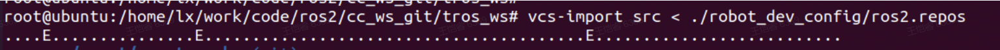

# 1.3 源码安装

```mdx-code-block
import Tabs from '@theme/Tabs';
import TabItem from '@theme/TabItem';
```

本章节介绍地平线RDK和X86平台如何通过源码安装TogetheROS.Bot。

## 地平线RDK平台

前提：

- 开发机能够正常访问地平线[Horizon Robotics](https://github.com/HorizonRDK)组织
- 开发机已安装docker

### 编译tros.b

#### 1 使用docker文件

该部分操作均在开发机的docker内完成。

<Tabs groupId="tros-distro">
<TabItem value="foxy" label="Foxy">

```shell
## 创建目录
cd  /mnt/data/kairui.wang/test
mkdir -p cc_ws/tros_ws/src
## 获取交叉编译用docker
wget http://sunrise.horizon.cc/TogetheROS/cross_compile_docker/pc_tros_v1.0.5.tar.gz
## 加载docker镜像
sudo docker load --input pc_tros_v1.0.5.tar.gz 
## 查看pc_tros对应的image ID
sudo docker images
## 启动docker挂载目录
sudo docker run -it --entrypoint="/bin/bash" -v PC本地目录:docker目录 imageID，这里以 sudo docker run -it --entrypoint="/bin/bash" -v /mnt/data/kairui.wang/test:/mnt/test 9c2ca340973e 为例
```

</TabItem>
<TabItem value="humble" label="Humble">


```shell
## 创建目录
cd  /mnt/data/kairui.wang/test
mkdir -p cc_ws/tros_ws/src
## 获取交叉编译用docker
wget http://sunrise.horizon.cc/TogetheROS/cross_compile_docker/pc_tros_ubuntu22.04_v1.0.0.tar.gz
## 加载docker镜像
sudo docker load --input pc_tros_ubuntu22.04_v1.0.0.tar.gz 
## 查看pc_tros对应的image ID
sudo docker images
## 启动docker挂载目录
sudo docker run -it --entrypoint="/bin/bash" -v PC本地目录:docker目录 imageID，这里以 sudo docker run -it --entrypoint="/bin/bash" -v /mnt/data/kairui.wang/test:/mnt/test 9c2ca340973e 为例
```

</TabItem>
</Tabs>


#### 2 获取tros.b源码

该部分操作均在开发机的docker内完成。

这里以docker中/mnt/test目录为例。

<Tabs groupId="tros-distro">
<TabItem value="foxy" label="Foxy">

```shell
cd /mnt/test/cc_ws/tros_ws
## 获取配置文件
git clone https://github.com/HorizonRDK/robot_dev_config.git -b foxy 
## 执行cd robot_dev_config，使用 git tag --list 命令查看可用的发布版本
## 使用 git reset --hard [tag号] 命令指定发布版本。详细说明参考本页面 编译指定版本tros.b 内容
## 拉取代码
vcs-import src < ./robot_dev_config/ros2_release.repos 
```

</TabItem>
<TabItem value="humble" label="Humble">


```shell
cd /mnt/test/cc_ws/tros_ws
## 获取配置文件
git clone https://github.com/HorizonRDK/robot_dev_config.git -b develop 
## 执行cd robot_dev_config，使用 git tag --list 命令查看可用的发布版本
## 使用 git reset --hard [tag号] 命令指定发布版本。详细说明参考本页面 编译指定版本tros.b 内容
## 拉取代码
vcs-import src < ./robot_dev_config/ros2_release.repos 
```

</TabItem>
</Tabs>

整个工程目录结构如下

```text
├── cc_ws
│   ├── sysroot_docker
│   │   ├── etc
│   │   ├── lib -> usr/lib
│   │   ├── opt
│   │   └── usr
│   └── tros_ws
│       ├── robot_dev_config
│       └── src
```

其中`tros_ws/robot_dev_config`路径包含代码拉取、编译、打包等功能所需要的配置、脚本文件；`tros_ws/src`路径存放拉取的代码；`sysroot_docker`路径包含交叉编译依赖的头文件和库，和地平线RDK的`/`目录对应。例如媒体库在`sysroot_docker`中的路径为`sysroot_docker/usr/lib/hbmedia/`，在地平线RDK中的路径为`/usr/lib/hbmedia/`。

编译时，在`robot_dev_config/aarch64_toolchainfile.cmake`编译脚本中通过`CMAKE_SYSROOT`宏指定`sysroot_docker`的安装路径。

#### 3 交叉编译

该部分操作均在开发机的docker内完成。

```shell
## 使用build.sh编译X3版本tros.b
bash ./robot_dev_config/build.sh -p X3

## 使用build.sh编译RDK Ultra版本tros.b
bash ./robot_dev_config/build.sh -p Rdkultra
```

编译成功后会提示总计N packages编译通过。

若使用minimal_build.sh进行最小化编译，还可通过执行./minimal_deploy.sh -d “install_path”，进一步压缩部署包大小。

### 安装tros.b

将编译生成的install目录拷贝至地平线RDK中并重命名为tros，这里我们将部署包放在/opt/tros目录下与deb安装目录保持一致

### 编译指定版本tros.b

在本章节**编译tros.b**小节第2步**获取tros.b源码**中，默认是获取的最新版本tros.b源码。如果需要获取某个指定发布版本源码，该步骤需要做如下修改

```bash
## 获取配置文件
git clone https://github.com/HorizonRDK/robot_dev_config.git
cd robot_dev_config
## 查看可用的发布版本
git tag --list
## 切换至指定版本号，这里以tros.b 2.0.0为例
git reset --hard tros_2.0.0
cd ..
## 拉取代码
vcs-import src < ./robot_dev_config/ros2_release.repos
```

## X86平台

### 系统要求

必须为Ubuntu 20.04 64位系统，也可使用X3平台交叉编译docker镜像，但编译和运行必须都在docker中进行

### 系统设置

#### 设置local

确保语言环境支持 UTF-8

```shell
locale  # check for UTF-8

sudo apt update && sudo apt install locales
sudo locale-gen en_US en_US.UTF-8
sudo update-locale LC_ALL=en_US.UTF-8 LANG=en_US.UTF-8
export LANG=en_US.UTF-8

locale  # verify settings
```

#### 添加apt源

```shell
# 首先确保已启用 Ubuntu Universe
sudo apt install software-properties-common
sudo add-apt-repository universe

sudo apt update && sudo apt install curl

# 添加ROS2官方源
sudo curl -sSL https://raw.githubusercontent.com/ros/rosdistro/master/ros.key -o /usr/share/keyrings/ros-archive-keyring.gpg
echo "deb [arch=$(dpkg --print-architecture) signed-by=/usr/share/keyrings/ros-archive-keyring.gpg] http://packages.ros.org/ros2/ubuntu $(. /etc/os-release && echo $UBUNTU_CODENAME) main" | sudo tee /etc/apt/sources.list.d/ros2.list > /dev/null

# 添加tros.b官方源
sudo curl -sSL http://sunrise.horizon.cc/keys/sunrise.gpg -o /usr/share/keyrings/sunrise.gpg
echo "deb [arch=amd64 signed-by=/usr/share/keyrings/sunrise.gpg] http://sunrise.horizon.cc/ubuntu-rdk-sim focal main" | sudo    tee /etc/apt/sources.list.d/sunrise.list > /dev/null
```

#### 安装ROS工具包

```shell
sudo apt update && sudo apt install -y \
  libbullet-dev \
  python3-pip \
  python3-pytest-cov \
  ros-dev-tools
```

### 获取tros.b源码

```shell
git config --global credential.helper store

mkdir -p ~/cc_ws/tros_ws/src
cd ~/cc_ws/tros_ws/

git clone https://github.com/HorizonRDK/robot_dev_config.git -b develop 
vcs-import src < ./robot_dev_config/ros2_release.repos
```

### 安装依赖项

安装源码编译依赖的包

```shell
# install some pip packages needed for testing
python3 -m pip install -U \
  argcomplete \
  flake8-blind-except \
  flake8-builtins \
  flake8-class-newline \
  flake8-comprehensions \
  flake8-deprecated \
  flake8-docstrings \
  flake8-import-order \
  flake8-quotes \
  pytest-repeat \
  pytest-rerunfailures \
  pytest

# install Fast-RTPS dependencies
sudo apt install --no-install-recommends -y \
  libasio-dev \
  libtinyxml2-dev

# install Cyclone DDS dependencies
sudo apt install --no-install-recommends -y \
  libcunit1-dev

# install tros.b basic models
sudo apt install --no-install-recommends -y \
  hobot-models-basic

# install other packages dependencies
sudo apt install --no-install-recommends -y \
  qt5-qmake \
  libpyside2-dev \
  libshiboken2-dev \
  pyqt5-dev \
  python3-pyqt5 \
  python3-pyqt5.qtsvg \
  python3-pyside2.qtsvg \
  python3-sip-dev \
  shiboken2 \
  libyaml-dev \
  qtbase5-dev \
  libzstd-dev \
  libeigen3-dev \
  libxml2-utils \
  libtinyxml-dev \
  libssl-dev \
  python3-numpy \
  libconsole-bridge-dev \
  pydocstyle \
  libqt5core5a \
  libqt5gui5 \
  libgtest-dev \
  cppcheck \
  tango-icon-theme \
  libqt5opengl5 \
  libqt5widgets5 \
  python3-lark \
  libspdlog-dev \
  google-mock \
  clang-format \
  python3-flake8 \
  libbenchmark-dev \
  python3-pygraphviz \
  python3-pydot \
  python3-psutil \
  libfreetype6-dev \
  libx11-dev \
  libxaw7-dev \
  libxrandr-dev \
  libgl1-mesa-dev \
  libglu1-mesa-dev \
  python3-pytest-mock \
  python3-mypy \
  default-jdk \
  libcunit1-dev \
  libopencv-dev \
  python3-ifcfg \
  python3-matplotlib \
  graphviz \
  uncrustify \
  python3-lxml \
  libcppunit-dev \
  libcurl4-openssl-dev \
  python3-mock \
  python3-nose \
  libsqlite3-dev \
  pyflakes3 \
  clang-tidy \
  python3-lttng \
  liblog4cxx-dev \
  python3-babeltrace \
  python3-pycodestyle \
  libassimp-dev \
  libboost-dev \
  libboost-python-dev \
  python3-opencv \
  libboost-python1.71.0
```

### 编译

```shell
# 使用build.sh编译
bash ./robot_dev_config/build.sh -p X86
```

编译成功后会提示总计N packages编译通过。

### 安装tros.b

将编译生成的install目录拷贝至/opt目录下并重命名为tros，与deb安装目录保持一致

## 常见问题

Q1： 如何判断VCS是否成功拉取代码

A1：如下图所示，vcs import过程中打印.表示成功拉取repo，如果打印E表示该repo拉取失败可以通过执行后的log看到具体失败的repo，碰到这种情况可以尝试删除src里面的内容重新vcs import或者手动拉取失败的repo.



Q2：条件受限无法从github拉取代码

A2：可以直接在[TogetheROS文件服务器](http://sunrise.horizon.cc/TogetheROS/source_code/)中选择下载需要的版本代码。例如`tros_2.0.0_source_code.tar.gz`文件对应于tros.b 2.0.0版本。