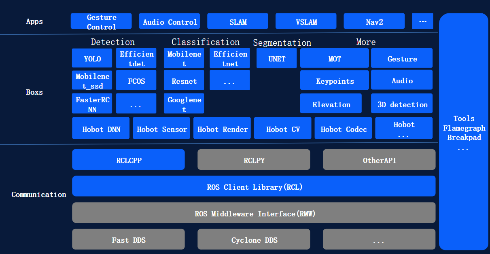

# TogetheROS.Bot
TogetheROS.Bot是地平线面向机器人厂商和生态开发者推出的机器人操作系统，旨在释放机器人场景的智能潜能，助力生态开发者和商业客户能够高效、便捷的进行机器人开发，打造具有竞争力的智能机器人产品。

Horizon Robotics Developer Kits，简称[地平线RDK平台](https://developer.horizon.cc/api/v1/fileData/documents_rdk/index.html)，是基于地平线智能芯片打造的机器人开发者套件，包括**RDK X3（旭日X3派）**、**RDK X3 Module（旭日X3模组）**、**RDK X5 Ultra**。目前TogetheROS.Bot支持在地平线RDK平台上运行，同时提供模拟器版本在X86平台上运行。地平线RDK平台涵盖下图所示的全部功能，X86平台支持以图片回灌方式体验部分功能，提高用户算法开发和验证效率，并能够快速迁移到地平线RDK平台。

TogetheROS.Bot源码托管在GitHub地平线[HorizonRDK组织](https://github.com/HorizonRDK)。

## Communication通信组件

Communication是地平线在ROS2 Foxy版本通信核心组件基础上进行的功能优化和扩展。

主要特性如下：

其中蓝色部分为地平线优化、新增模块，TogetheROS.Bot主要特性如下：

- 提供“hobot_sensor”适配机器人常用传感器，节省开发时间，聚焦核心竞争力
- 提供“hobot_dnn”简化板端算法模型推理与部署，释放BPU算力，降低智能算法使用门槛
- 提供“hobot_codec”软硬结合加速视频编解码，节省CPU资源，提升并行处理能力
- 提供“hobot_cv”软硬结合提升常见CV算子性能，节省CPU资源，提升运行效率
- 提供“hobot Render”Web端和HDMI动态可视化功能，实时渲染算法结果（仅限Web端），便于展示与调试
- 增加“zero-copy”进程间零拷贝通信机制，降低数据传输时延，减少系统资源消耗
- 丰富中间件软件调试以及性能调优工具，提升问题定位效率，方便系统性能优化
- 与ROS2 foxy版本接口保持完全兼容，便于复用ROS丰富工具包，加快原型验证
- 支持最小化和模块化剪裁，方便根据需要部署在资源受限的嵌入式产品中

## Boxs算法仓库

Boxs是地平线面向机器人厂商和生态开发者推出的基于TogetheROS.Bot的智能算法包，旨在提升基于地平线机器人操作系统进行机器人智能算法集成和落地的效率。

- 图像检测算法如FCOS、YOLO、FasterRCNN、Efficientdet、Mobilenet_ssd;
- 图像分类模型如Mobilenet
- 语义分割模型如Unet
- 应用算法模型如人体检测与跟踪、手势识别、人手关键点检测、单目高程网络、单目3D检测、语音处理等

## Apps应用示例

Apps是基于地平线机器人操作系统Communication和Boxs开发的算法应用示例，旨在打通图像输入、感知、策略等完整链路，展示应用效果，加速客户demo开发效率。

## 常见名词解释

| 名词                              | 含义                                                    |
| ----------------------------------| --------------------------------------------------------|
| zero-copy                         | 进程间零拷贝通信方式                                     |
| hobot dnn                         | 基于BPU的模型推理功能封装                                |
| SLAM                              | 定位与地图构建                                          |
| DOA                               | 声源定位                                                |
| ASR                               | 自动语音识别                                            |
| TogetheROS.Bot                    | TogetheROS.Bot机器人操作系统                            |
| tros.b                            | TogetheROS.Bot缩写                                      |
| RDK                               | Robotics Developer Kits缩写，地平线机器人开发者套件       |