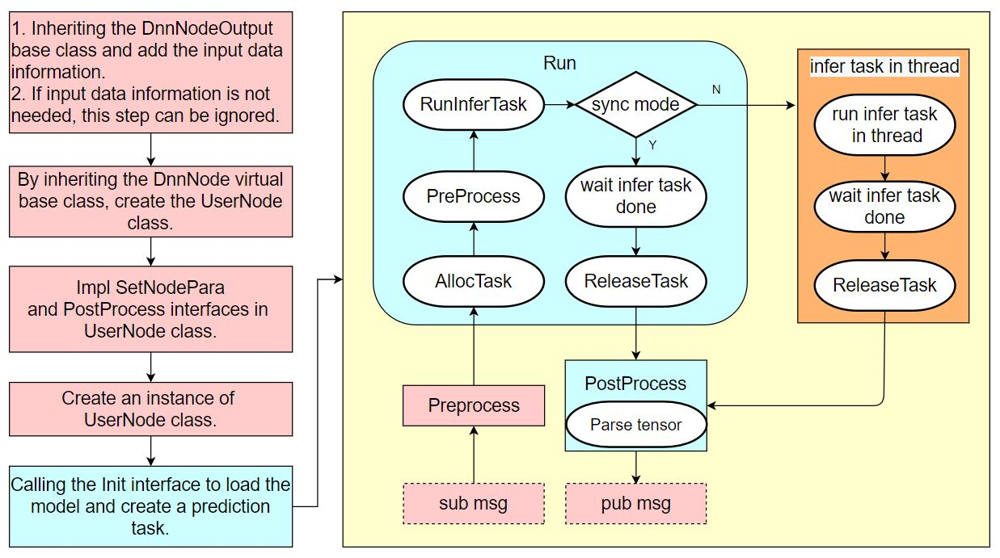
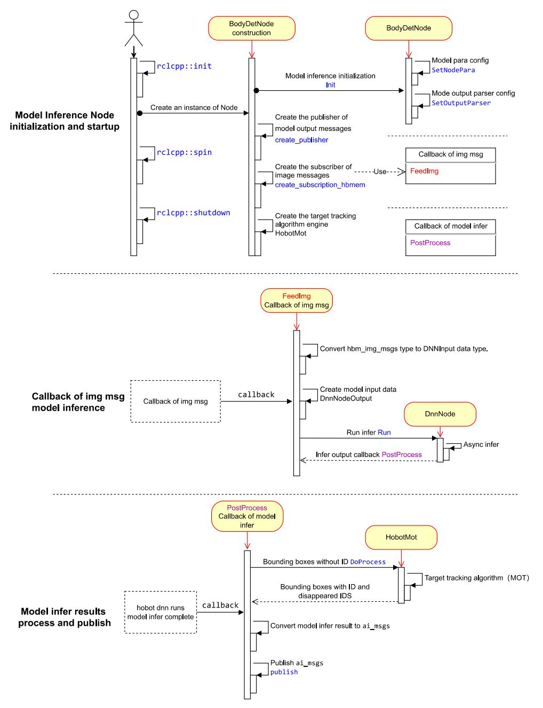
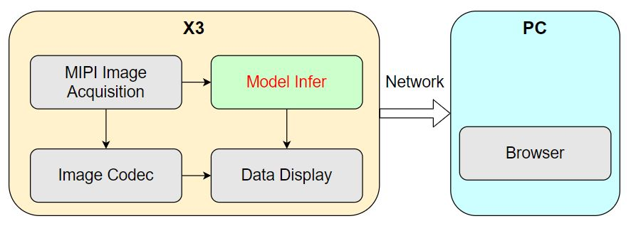
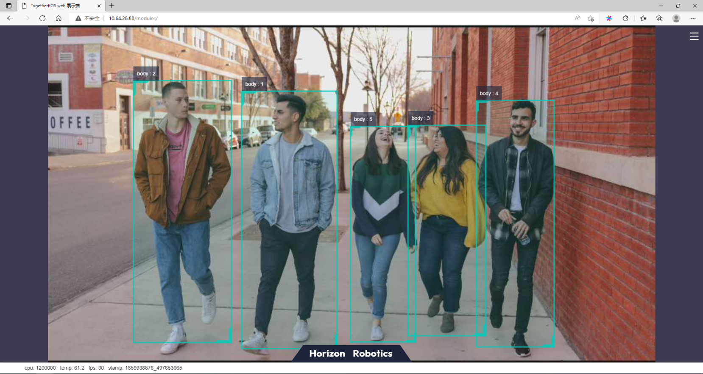
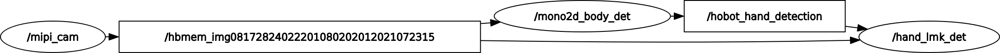

# 5.2 模型推理

## 模型推理开发

### 功能背景

`hobot_dnn`是TogetheROS.Bot软件栈中的板端算法推理框架，在地平线地平线RDK上利用BPU处理器实现算法推理功能，基于地平线算法推理框架和ROS2 Node进行二次开发，为机器人应用开发提供更简单易用的模型集成开发接口，包括模型管理、基于模型描述的输入处理及结果解析，以及模型输出内存分配管理等功能。

通过阅读本章节，用户可以使用地平线提供的模型，在地平线RDK上基于`hobot_dnn`创建并运行一个人体检测的算法Node。借助tros.b提供的组件，订阅摄像头采集&发布的图像，对图像进行算法推理检测出人体框后，使用多目标跟踪（`multi-target tracking`，即`MOT`）算法对检测框进行跟踪和目标编号分配，最终实现在PC端的Web浏览器上实时渲染展示图像、人体框检测和目标跟踪结果。

### 前置条件

1 地平线RDK开发板，并且已安装好相关软件，包括：

- 地平线提供的Ubuntu 20.04/Ubuntu 22.04系统镜像。

- tros.b软件包。

- ROS2软件包构建系统ament_cmake。安装命令：`apt update; apt-get install python3-catkin-pkg; pip3 install empy`

- ROS2编译工具colcon。安装命令：`pip3 install -U colcon-common-extensions`

2 地平线RDK已安装F37或者GC4663摄像头。

3 可以通过网络访问地平线RDK的PC。

关于`hobot_dnn`的详细使用说明可以参考`hobot_dnn`代码中的[README.md](https://github.com/HorizonRDK/hobot_dnn/blob/develop/README.md)和[接口说明文档](https://github.com/HorizonRDK/hobot_dnn/blob/develop/dnn_node/docs/API-Manual/API-Manual.md)。hobot_dnn的使用逻辑流程如下：



在不了解`hobot_dnn`使用流程的情况下，用户也可以按照本章节流程使用`hobot_dnn`开发出模型推理示例。

:::info
本章节以下内容使用tros.b Foxy版本举例说明，如果您使用的是tros.b Humble版本，只需将`source /opt/tros/setup.bash`命令替换为`source /opt/tros/humble/setup.bash`。
:::

### 任务内容

#### 1 创建package

```shell
mkdir -p ~/dev_ws/src
cd ~/dev_ws/src
source /opt/tros/setup.bash
ros2 pkg create --build-type ament_cmake cpp_dnn_demo --dependencies rclcpp sensor_msgs hbm_img_msgs ai_msgs dnn_node hobot_mot
cd cpp_dnn_demo
touch src/body_det_demo.cpp
```

#### 2 编写示例

查看创建后的工程路径如下：

```shell
root@ubuntu:~# cd ~
root@ubuntu:~# tree dev_ws/
dev_ws/
└── src
    └── cpp_dnn_demo
        ├── CMakeLists.txt
        ├── include
        │   └── cpp_dnn_demo
        ├── package.xml
        └── src
            └── body_det_demo.cpp

5 directories, 3 files
```

在地平线RDK上使用vi/vim等工具打开创建的代码源文件`body_det_demo.cpp`：`vi ~/dev_ws/src/cpp_dnn_demo/src/body_det_demo.cpp`

拷贝如下代码到文件中：

```c++
#include "dnn_node/dnn_node.h"
#include "dnn_node/util/image_proc.h"
#include "dnn_node/util/output_parser/detection/fasterrcnn_output_parser.h"
#include "sensor_msgs/msg/image.hpp"
#include "ai_msgs/msg/perception_targets.hpp"
#include "hbm_img_msgs/msg/hbm_msg1080_p.hpp"
#include "hobot_mot/hobot_mot.h"

// 创建算法推理输出数据结构，添加消息头信息成员
struct FasterRcnnOutput : public hobot::dnn_node::DnnNodeOutput {
  std::shared_ptr<std_msgs::msg::Header> image_msg_header = nullptr;
};

// 继承DnnNode虚基类，创建算法推理节点
class BodyDetNode : public hobot::dnn_node::DnnNode {
 public:
  BodyDetNode(const std::string &node_name = "body_det",
  const rclcpp::NodeOptions &options = rclcpp::NodeOptions());

 protected:
  // 实现基类的纯虚接口，用于配置Node参数
  int SetNodePara() override;
  // 实现基类的虚接口，将解析后的模型输出数据封装成ROS Msg后发布
  int PostProcess(const std::shared_ptr<hobot::dnn_node::DnnNodeOutput> &node_output)
    override;

 private:
  // 算法模型输入图片数据的宽和高
  int model_input_width_ = -1;
  int model_input_height_ = -1;
  // 人体检测框结果对应的模型输出索引
  const int32_t box_output_index_ = 1;
  // 检测框输出索引集合
  const std::vector<int32_t> box_outputs_index_ = {box_output_index_};

  // 图片消息订阅者
  rclcpp::SubscriptionHbmem<hbm_img_msgs::msg::HbmMsg1080P>::ConstSharedPtr
      ros_img_subscription_ = nullptr;
  // 算法推理结果消息发布者
  rclcpp::Publisher<ai_msgs::msg::PerceptionTargets>::SharedPtr
      msg_publisher_ = nullptr;
  // 多目标跟踪算法引擎
  std::shared_ptr<HobotMot> hobot_mot_ = nullptr;

  // 图片消息订阅回调
  void FeedImg(const hbm_img_msgs::msg::HbmMsg1080P::ConstSharedPtr msg);
};

BodyDetNode::BodyDetNode(const std::string & node_name, const rclcpp::NodeOptions & options) :
  hobot::dnn_node::DnnNode(node_name, options) {
  // Init中使用BodyDetNode子类实现的SetNodePara()方法进行算法推理的初始化
  if (Init() != 0 ||
    GetModelInputSize(0, model_input_width_, model_input_height_) < 0) {
    RCLCPP_ERROR(rclcpp::get_logger("dnn_demo"), "Node init fail!");
    rclcpp::shutdown();
  }

  // 创建消息订阅者，从摄像头节点订阅图像消息
  ros_img_subscription_ =
          this->create_subscription_hbmem<hbm_img_msgs::msg::HbmMsg1080P>(
          "/hbmem_img", 10, std::bind(&BodyDetNode::FeedImg, this, std::placeholders::_1));
  // 创建消息发布者，发布算法推理消息
  msg_publisher_ = this->create_publisher<ai_msgs::msg::PerceptionTargets>(
      "/cpp_dnn_demo", 10);
  // 创建多目标跟踪（MOT）算法引擎
  hobot_mot_ = std::make_shared<HobotMot>("config/iou2_method_param.json");
}

int BodyDetNode::SetNodePara() {
  if (!dnn_node_para_ptr_) return -1;
  // 指定算法推理使用的模型文件路径和模型名
  dnn_node_para_ptr_->model_file = "config/multitask_body_kps_960x544.hbm";
  dnn_node_para_ptr_->model_name = "multitask_body_kps_960x544";
  return 0;
}

void BodyDetNode::FeedImg(const hbm_img_msgs::msg::HbmMsg1080P::ConstSharedPtr img_msg) {
  if (!rclcpp::ok()) {
    return;
  }

  // 对订阅到的图片消息进行验证，本示例只支持处理NV12格式图片数据
  if (!img_msg) return;
  if ("nv12" != std::string(reinterpret_cast<const char*>(img_msg->encoding.data()))) {
    RCLCPP_ERROR(rclcpp::get_logger("dnn_demo"), "Only support nv12 img encoding!");
    return;
  }

  // 根据模型输入图片分辨率，使用DnnNode中提供的方法创建模型输入数据
  auto inputs = std::vector<std::shared_ptr<hobot::dnn_node::DNNInput>>{
    hobot::dnn_node::ImageProc::GetNV12PyramidFromNV12Img(
      reinterpret_cast<const char*>(img_msg->data.data()),
      img_msg->height, img_msg->width, model_input_height_, model_input_width_)};
      
  // 创建模型输出数据，填充消息头信息
  auto dnn_output = std::make_shared<FasterRcnnOutput>();
  dnn_output->image_msg_header = std::make_shared<std_msgs::msg::Header>();
  dnn_output->image_msg_header->set__frame_id(std::to_string(img_msg->index));
  dnn_output->image_msg_header->set__stamp(img_msg->time_stamp);

  // 以异步模式运行推理
  Run(inputs, dnn_output, nullptr, false);
}

int BodyDetNode::PostProcess(const std::shared_ptr<hobot::dnn_node::DnnNodeOutput> &node_output) {
  if (!rclcpp::ok()) {
    return 0;
  }
  
  // 验证输出数据的有效性
  if (node_output->outputs.empty() ||
    static_cast<int32_t>(node_output->outputs.size()) < box_output_index_) {
    RCLCPP_ERROR(rclcpp::get_logger("dnn_demo"), "Invalid outputs");
    return -1;
  }

  // 创建解析输出数据
  // 检测框results的维度等于检测出来的目标类别数
  std::vector<std::shared_ptr<hobot::dnn_node::parser_fasterrcnn::Filter2DResult>>
      results;
  // 关键点数据
  std::shared_ptr<hobot::dnn_node::parser_fasterrcnn::LandmarksResult> output_body_kps = nullptr;

  // 使用hobot dnn内置的Parse解析方法，解析算法输出
  if (hobot::dnn_node::parser_fasterrcnn::Parse(node_output, nullptr,
  box_outputs_index_, -1, -1, results, output_body_kps) < 0) {
    RCLCPP_ERROR(rclcpp::get_logger("dnn_node_sample"),
                "Parse node_output fail!");
    return -1;
  }

  auto filter2d_result = results.at(box_output_index_);
  if (!filter2d_result) return -1;

  // 将算法推理输出的人体检测框转成MOT算法输入数据类型
  std::vector<MotBox> in_box_list;
  for (auto& rect : filter2d_result->boxes) {
    in_box_list.emplace_back(
        MotBox(rect.left, rect.top, rect.right, rect.bottom, rect.conf));
  }
  
  // 根据消息头计算当前帧的时间戳
  auto fasterRcnn_output =
      std::dynamic_pointer_cast<FasterRcnnOutput>(node_output);
  time_t time_stamp =
      fasterRcnn_output->image_msg_header->stamp.sec * 1000 +
      fasterRcnn_output->image_msg_header->stamp.nanosec / 1000 / 1000;
  
  // 创建MOT算法的输出：带有目标编号的人体检测框和消失的目标编号
  std::vector<MotBox> out_box_list;
  std::vector<std::shared_ptr<MotTrackId>> disappeared_ids;

  // 运行多目标跟踪算法
  if (hobot_mot_->DoProcess(in_box_list,
                            out_box_list,
                            disappeared_ids,
                            time_stamp,
                            model_input_width_,
                            model_input_height_) < 0) {
    RCLCPP_ERROR(rclcpp::get_logger("dnn_demo"), "Do mot fail");
    return -1;
  }

  // 创建用于发布推理结果的ROS Msg
  ai_msgs::msg::PerceptionTargets::UniquePtr pub_data(
      new ai_msgs::msg::PerceptionTargets());

  // 将消息头填充到ROS Msg
  pub_data->header.set__stamp(fasterRcnn_output->image_msg_header->stamp);
  pub_data->header.set__frame_id(fasterRcnn_output->image_msg_header->frame_id);

  // 将算法推理输出帧率填充到ROS Msg
  if (node_output->rt_stat) {
    pub_data->set__fps(round(node_output->rt_stat->output_fps));
    // 如果算法推理统计有更新，输出算法模型输入和输出的帧率统计
    if (node_output->rt_stat->fps_updated) {
      RCLCPP_WARN(rclcpp::get_logger("dnn_demo"),
                  "input fps: %.2f, out fps: %.2f",
                  node_output->rt_stat->input_fps,
                  node_output->rt_stat->output_fps);
    }
  }

  for (auto& rect : out_box_list) {
    // 验证目标跟踪结果的有效性
    if (rect.id < 0) {
      continue;
    }
    // 将目标跟踪结果和检测框填充到ROS Msg
    ai_msgs::msg::Target target;
    target.set__type("person");
    target.set__track_id(rect.id);
    ai_msgs::msg::Roi roi;
    roi.type = "body";
    roi.rect.set__x_offset(rect.x1);
    roi.rect.set__y_offset(rect.y1);
    roi.rect.set__width(rect.x2 - rect.x1);
    roi.rect.set__height(rect.y2 - rect.y1);
    target.rois.emplace_back(roi);
    pub_data->targets.emplace_back(std::move(target));
  }

  // 将消失的目标填充到ROS Msg
  for (const auto& id_info : disappeared_ids) {
    if (id_info->value < 0 ||
        hobot_mot::DataState::INVALID == id_info->state_) {
      continue;
    }
    ai_msgs::msg::Target target;
    target.set__type("person");
    target.set__track_id(id_info->value);
    ai_msgs::msg::Roi roi;
    roi.type = "body";
    target.rois.emplace_back(roi);
    pub_data->disappeared_targets.emplace_back(std::move(target));
  }

  // 发布ROS Msg
  msg_publisher_->publish(std::move(pub_data));

  return 0;
}

int main(int argc, char** argv) {
  rclcpp::init(argc, argv);
  rclcpp::spin(std::make_shared<BodyDetNode>());
  rclcpp::shutdown();
  return 0;
}

```


##### 2.1 Node设计

示例的人体检测算法Node主要包含三部分逻辑独立的功能。

**（1）Node初始化和启动**

配置算法使用的模型信息，创建算法推理消息的发布者和图像消息的订阅者，启动目标跟踪算法引擎。

**（2）订阅消息和算法推理**

在创建图像消息订阅者时，注册了消息回调`FeedImg`，实现图像数据的处理并用于算法模型推理，回调中不等待算法推理完成。

**（3）推理结果的处理和发布**

算法推理完成后，通过注册的回调`PostProcess`输出推理结果，回调中对检测结果进行多目标跟踪算法（`HobotMot`）处理后，发布算法推理结果消息。

Node的设计和流程逻辑如下图：




##### 2.2 代码说明

**添加头文件**

推理框架头文件`dnn_node/dnn_node.h`，用于算法模型管理和推理。

算法模型输入处理头文件`dnn_node/util/image_proc.h`，用于算法模型输入图片处理。

算法模型输出解析方法头文件`dnn_node/util/output_parser/detection/fasterrcnn_output_parser.h`，用于模型推理完成后，从输出地址解析出结构化数据（对于本示例使用的人体检测算法，对应的结构化数据为人体检测框）。

ROS Msg头文件，用于消息的订阅和发布。

MOT算法引擎头文件，用于对检测出的人体框进行目标跟踪。

```c++
#include "dnn_node/dnn_node.h"
#include "dnn_node/util/image_proc.h"
#include "dnn_node/util/output_parser/detection/fasterrcnn_output_parser.h"
#include "sensor_msgs/msg/image.hpp"
#include "ai_msgs/msg/perception_targets.hpp"
#include "hbm_img_msgs/msg/hbm_msg1080_p.hpp"
#include "hobot_mot/hobot_mot.h"
```

**创建算法推理输出数据结构**

继承`hobot_dnn`中的`DnnNodeOutput`基类，添加消息头信息成员，用于表示推理输出对应的图片信息。

```C++
struct FasterRcnnOutput : public hobot::dnn_node::DnnNodeOutput {
  std::shared_ptr<std_msgs::msg::Header> image_msg_header = nullptr;
};
```

**创建算法推理Node**

继承`hobot_dnn`中的`DnnNode`虚基类，定义算法推理节点`BodyDetNode`，实现`DnnNode`中定义的虚接口。

  `int SetNodePara()`：配置模型参数。

  `int PostProcess(const std::shared_ptr<hobot::dnn_node::DnnNodeOutput> &node_output)`：推理结果回调，将解析后结构化的模型输出数据封装成ROS Msg后发布。

```c++
class BodyDetNode : public hobot::dnn_node::DnnNode {
 public:
  BodyDetNode(const std::string &node_name = "body_det",
  const rclcpp::NodeOptions &options = rclcpp::NodeOptions());

 protected:
  int SetNodePara() override;
  int PostProcess(const std::shared_ptr<hobot::dnn_node::DnnNodeOutput> &node_output)
    override;
```

**实现BodyDetNode子类的构造**

`BodyDetNode`子类的构造函数中进行Node的初始化，同时通过`GetModelInputSize`接口获取了模型输入图片的尺寸，包括图片的宽`model_input_width_`和高`model_input_height_`，用于模型前处理，不同的模型一般输入图片的尺寸不同。

通过零拷贝的通信方式，创建图片消息的订阅者，从摄像头节点订阅图像消息，用于算法模型推理。订阅的topic为`/hbmem_img`，消息类型为tros.b中定义的图片消息类型`hbm_img_msgs::msg::HbmMsg1080P`。

创建消息发布者，用于发布算法推理消息。发布的topic为`/cpp_dnn_demo`，消息类型为tros.b中定义的算法消息类型`ai_msgs::msg::PerceptionTargets`。

创建多目标跟踪（MOT）算法引擎，用于对每个人体检测框进行目标跟踪。

`BodyDetNode`构造函数实现：

```c++
BodyDetNode::BodyDetNode(const std::string & node_name, const rclcpp::NodeOptions & options) :
  hobot::dnn_node::DnnNode(node_name, options) {
  // Init中使用BodyDetNode子类实现的SetNodePara()方法进行算法推理的初始化
  if (Init() != 0 ||
    GetModelInputSize(0, model_input_width_, model_input_height_) < 0) {
    RCLCPP_ERROR(rclcpp::get_logger("dnn_demo"), "Node init fail!");
    rclcpp::shutdown();
  }

  // 创建消息订阅者，从摄像头节点订阅图像消息
  ros_img_subscription_ =
          this->create_subscription_hbmem<hbm_img_msgs::msg::HbmMsg1080P>(
          "/hbmem_img", 10, std::bind(&BodyDetNode::FeedImg, this, std::placeholders::_1));
  // 创建消息发布者，发布算法推理消息
  msg_publisher_ = this->create_publisher<ai_msgs::msg::PerceptionTargets>(
      "/cpp_dnn_demo", 10);
  // 创建多目标跟踪（MOT）算法引擎
  hobot_mot_ = std::make_shared<HobotMot>("config/iou2_method_param.json");
}
```

其中`Init()`是`DnnNode`基类中定义并实现的接口，执行算法推理初始化，只做pipeline的串联，具体的`SetNodePara()`步骤由用户（子类中）实现。串联的初始化流程如下：

```c++
int DnnNode::Init() {
  RCLCPP_INFO(rclcpp::get_logger("dnn"), "Node init.");

  int ret = 0;
  // 1. set model info in node para
  ret = SetNodePara();
  if (ret != 0) {
    RCLCPP_ERROR(rclcpp::get_logger("dnn"), "Set node para failed!");
    return ret;
  }

  // check node para
  if (ModelTaskType::InvalidType == dnn_node_para_ptr_->model_task_type) {
    RCLCPP_ERROR(rclcpp::get_logger("dnn"), "Invalid model task type");
    return -1;
  }

  // 2. model init
  ret = dnn_node_impl_->ModelInit();
  if (ret != 0) {
    RCLCPP_ERROR(rclcpp::get_logger("dnn"), "Model init failed!");
    return ret;
  }

  // 3. set output parser
  ret = SetOutputParser();
  if (ret != 0) {
    RCLCPP_ERROR(rclcpp::get_logger("dnn"), "Set output parser failed!");
    return ret;
  }

  // 4. task init
  ret = dnn_node_impl_->TaskInit();
  if (ret != 0) {
    RCLCPP_ERROR(rclcpp::get_logger("dnn"), "Task init failed!");
    return ret;
  }

  return ret;
}
```

**配置模型参数**

配置算法推理使用的模型文件路径和模型名。

```c++
int BodyDetNode::SetNodePara() {
  if (!dnn_node_para_ptr_) return -1;
  dnn_node_para_ptr_->model_file = "config/multitask_body_kps_960x544.hbm";
  dnn_node_para_ptr_->model_name = "multitask_body_kps_960x544";
  return 0;
}
```

**实现图片订阅结果回调**

创建`DNNInput`类型的模型输入数据。订阅到的消息中包含图片信息（图片的编码方式、内容数据和分辨率等信息），使用`hobot_dnn`中的算法模型输入图片处理接口`hobot::dnn_node::ImageProc::GetNV12PyramidFromNV12Img`，将订阅到的`nv12`格式的图片按照模型输入分辨率（`model_input_width_`和`model_input_height_`，在`BodyDetNode`的构造函数中通过`GetModelInputSize`接口从加载的模型中查询得到）转成模型输入的数据类型。接口定义如下：

```c++
//   - [in] in_img_data 图片数据
//   - [in] in_img_height 图片的高度
//   - [in] in_img_width 图片的宽度
//   - [in] scaled_img_height 模型输入的高度
//   - [in] scaled_img_width 模型输入的宽度
std::shared_ptr<NV12PyramidInput> GetNV12PyramidFromNV12Img(
    const char* in_img_data,
    const int& in_img_height,
    const int& in_img_width,
    const int& scaled_img_height,
    const int& scaled_img_width);
```

创建`FasterRcnnOutput`类型的模型输出数据。订阅到的消息中包含消息头（frame_id和时间戳），使用订阅到的消息头填充输出数据的消息头，用于表述算法推理输出对应的图片信息。

启动推理。使用`DnnNode`基类中的`Run`接口以异步模式运行推理，接口的第四个参数为`false`表示使用效率更高的异步推理模式。`Run`接口定义如下：

```c++
  // - 参数
  //   - [in] inputs 输入数据智能指针列表
  //   - [in] outputs 输出数据智能指针
  //   - [in] rois 抠图roi数据，只对ModelRoiInferType模型有效
  //   - [in] is_sync_mode 预测模式，true为同步模式，false为异步模式
  //   - [in] alloctask_timeout_ms 申请推理任务超时时间，单位毫秒
  //                               默认一直等待直到申请成功
  //   - [in] infer_timeout_ms 推理超时时间，单位毫秒，默认1000毫秒推理超时
  int Run(std::vector<std::shared_ptr<DNNInput>> &inputs,
          const std::shared_ptr<DnnNodeOutput> &output = nullptr,
          const std::shared_ptr<std::vector<hbDNNRoi>> rois = nullptr,
          const bool is_sync_mode = true,
          const int alloctask_timeout_ms = -1,
          const int infer_timeout_ms = 1000);
```

完整的图片订阅结果回调`FeedImg`实现如下：

```c++
void BodyDetNode::FeedImg(const hbm_img_msgs::msg::HbmMsg1080P::ConstSharedPtr img_msg) {
  if (!rclcpp::ok()) {
    return;
  }

  // 对订阅到的图片消息进行验证，本示例只支持处理NV12格式图片数据
  if (!img_msg) return;
  if ("nv12" != std::string(reinterpret_cast<const char*>(img_msg->encoding.data()))) {
    RCLCPP_ERROR(rclcpp::get_logger("dnn_demo"), "Only support nv12 img encoding!");
    return;
  }

  // 根据模型输入图片分辨率，使用hobot_dnn中提供的方法创建模型输入数据
  auto inputs = std::vector<std::shared_ptr<hobot::dnn_node::DNNInput>>{
    hobot::dnn_node::ImageProc::GetNV12PyramidFromNV12Img(
      reinterpret_cast<const char*>(img_msg->data.data()),
      img_msg->height, img_msg->width, model_input_height_, model_input_width_)};
      
  // 创建模型输出数据，填充消息头信息
  auto dnn_output = std::make_shared<FasterRcnnOutput>();
  dnn_output->image_msg_header = std::make_shared<std_msgs::msg::Header>();
  dnn_output->image_msg_header->set__frame_id(std::to_string(img_msg->index));
  dnn_output->image_msg_header->set__stamp(img_msg->time_stamp);

  // 以异步模式运行推理
  Run(inputs, dnn_output, nullptr, false);
}
```

**实现推理结果回调**

算法推理结果回调是将解析后结构化的模型输出数据经过MOT算法处理后，输出带有目标编号的人体检测框和消失的目标编号数据，封装成ROS Msg后发布。

创建`Filter2DResult`类型的结构化推理结果数据。

使用hobot dnn内置的Parse解析方法，解析人体检测算法输出。

运行多目标跟踪算法。将算法推理输出的人体检测框转成`MOT`算法输入数据类型，并根据消息头计算当前帧的时间戳，经过`MOT`算法处理后得到带有目标编号的人体检测框和消失的目标编号。

发布算法推理结果。创建ROS Msg，填充算法推理结果对应的图片消息头（帧ID和时间戳），带有目标编号的人体检测框，算法推理输出的帧率统计，消失的目标编号。发布的ROS Msg可以被其他ROS Node订阅和使用。

```c++
int BodyDetNode::PostProcess(const std::shared_ptr<hobot::dnn_node::DnnNodeOutput> &node_output) {
  if (!rclcpp::ok()) {
    return 0;
  }
  
  // 验证输出数据的有效性
  if (node_output->outputs.empty() ||
    static_cast<int32_t>(node_output->outputs.size()) < box_output_index_) {
    RCLCPP_ERROR(rclcpp::get_logger("dnn_demo"), "Invalid outputs");
    return -1;
  }

  // 创建解析输出数据
  // 检测框results的维度等于检测出来的目标类别数
  std::vector<std::shared_ptr<hobot::dnn_node::parser_fasterrcnn::Filter2DResult>>
      results;
  // 关键点数据
  std::shared_ptr<hobot::dnn_node::parser_fasterrcnn::LandmarksResult> output_body_kps = nullptr;

  // 使用hobot dnn内置的Parse解析方法，解析算法输出
  if (hobot::dnn_node::parser_fasterrcnn::Parse(node_output, nullptr,
  box_outputs_index_, -1, -1, results, output_body_kps) < 0) {
    RCLCPP_ERROR(rclcpp::get_logger("dnn_node_sample"),
                "Parse node_output fail!");
    return -1;
  }

  auto filter2d_result = results.at(box_output_index_);
  if (!filter2d_result) return -1;

  // 将算法推理输出的人体检测框转成MOT算法输入数据类型
  std::vector<MotBox> in_box_list;
  for (auto& rect : filter2d_result->boxes) {
    in_box_list.emplace_back(
        MotBox(rect.left, rect.top, rect.right, rect.bottom, rect.conf));
  }
  
  // 根据消息头计算当前帧的时间戳
  auto fasterRcnn_output =
      std::dynamic_pointer_cast<FasterRcnnOutput>(node_output);
  time_t time_stamp =
      fasterRcnn_output->image_msg_header->stamp.sec * 1000 +
      fasterRcnn_output->image_msg_header->stamp.nanosec / 1000 / 1000;
  
  // 创建MOT算法的输出：带有目标编号的人体检测框和消失的目标编号
  std::vector<MotBox> out_box_list;
  std::vector<std::shared_ptr<MotTrackId>> disappeared_ids;

  // 运行多目标跟踪算法
  if (hobot_mot_->DoProcess(in_box_list,
                            out_box_list,
                            disappeared_ids,
                            time_stamp,
                            model_input_width_,
                            model_input_height_) < 0) {
    RCLCPP_ERROR(rclcpp::get_logger("dnn_demo"), "Do mot fail");
    return -1;
  }

  // 创建用于发布推理结果的ROS Msg
  ai_msgs::msg::PerceptionTargets::UniquePtr pub_data(
      new ai_msgs::msg::PerceptionTargets());

  // 将消息头填充到ROS Msg
  pub_data->header.set__stamp(fasterRcnn_output->image_msg_header->stamp);
  pub_data->header.set__frame_id(fasterRcnn_output->image_msg_header->frame_id);

  // 将算法推理输出帧率填充到ROS Msg
  if (node_output->rt_stat) {
    pub_data->set__fps(round(node_output->rt_stat->output_fps));
    // 如果算法推理统计有更新，输出算法模型输入和输出的帧率统计
    if (node_output->rt_stat->fps_updated) {
      RCLCPP_WARN(rclcpp::get_logger("dnn_demo"),
                  "input fps: %.2f, out fps: %.2f",
                  node_output->rt_stat->input_fps,
                  node_output->rt_stat->output_fps);
    }
  }

  for (auto& rect : out_box_list) {
    // 验证目标跟踪结果的有效性
    if (rect.id < 0) {
      continue;
    }
    // 将目标跟踪结果和检测框填充到ROS Msg
    ai_msgs::msg::Target target;
    target.set__type("person");
    target.set__track_id(rect.id);
    ai_msgs::msg::Roi roi;
    roi.type = "body";
    roi.rect.set__x_offset(rect.x1);
    roi.rect.set__y_offset(rect.y1);
    roi.rect.set__width(rect.x2 - rect.x1);
    roi.rect.set__height(rect.y2 - rect.y1);
    target.rois.emplace_back(roi);
    pub_data->targets.emplace_back(std::move(target));
  }

  // 将消失的目标填充到ROS Msg
  for (const auto& id_info : disappeared_ids) {
    if (id_info->value < 0 ||
        hobot_mot::DataState::INVALID == id_info->state_) {
      continue;
    }
    ai_msgs::msg::Target target;
    target.set__type("person");
    target.set__track_id(id_info->value);
    ai_msgs::msg::Roi roi;
    roi.type = "body";
    target.rois.emplace_back(roi);
    pub_data->disappeared_targets.emplace_back(std::move(target));
  }

  // 发布ROS Msg
  msg_publisher_->publish(std::move(pub_data));

  return 0;
}
```

dnn node中内置了多种检测、分类和分割算法的模型输出解析方法，RDK X3上安装tros.b后查询支持的解析方法如下：

```shell
root@ubuntu:~# tree /opt/tros/include/dnn_node/util/output_parser
/opt/tros/include/dnn_node/util/output_parser
├── classification
│   └── ptq_classification_output_parser.h
├── detection
│   ├── fasterrcnn_output_parser.h
│   ├── fcos_output_parser.h
│   ├── nms.h
│   ├── ptq_efficientdet_output_parser.h
│   ├── ptq_ssd_output_parser.h
│   ├── ptq_yolo2_output_parser.h
│   ├── ptq_yolo3_darknet_output_parser.h
│   └── ptq_yolo5_output_parser.h
├── perception_common.h
├── segmentation
│   └── ptq_unet_output_parser.h
└── utils.h

3 directories, 12 files
```

可以看到`/opt/tros/include/dnn_node/util/output_parser`路径下有`classification`、`detection`和`segmentation`三个路径，分别对应分类、检测和分割算法的模型输出解析方法。

`perception_common.h`为定义的解析后的感知结果数据类型。

算法模型和对应的输出解析方法如下：

| 算法类别       | 算法                 | 算法输出解析方法 |
| ---------------------- | ---------------------- | ----------- |
| 目标检测       | [FCOS](../boxs/box_basic#fcos)           | fcos_output_parser.h         |
| 目标检测       | [EfficientNet_Det](../boxs/box_basic#efficientnet_det)           | ptq_efficientdet_output_parser.h         |
| 目标检测       | [MobileNet_SSD](../boxs/box_basic#mobilenet_ssd)        |   ptq_ssd_output_parser.h       |
| 目标检测       | [YoloV2](../boxs/box_basic#yolo)       |   ptq_yolo2_output_parser.h       |
| 目标检测       | [YoloV3](../boxs/box_basic#yolo)       |    ptq_yolo3_darknet_output_parser.h       |
| 目标检测       | [YoloV5](../boxs/box_basic#yolo)       |  ptq_yolo5_output_parser.h        |
| 人体检测       | [FasterRcnn](../boxs/box_adv#detection_and_track)             |  fasterrcnn_output_parser.h       |
| 图片分类       | [mobilenetv2](../boxs/box_basic#mobilenetv2)  |  ptq_classification_output_parser.h        |
| 语义分割       | [mobilenet_unet](../boxs/box_basic#mobilenet_unet)      |  ptq_unet_output_parser.h        |


**入口函数**

创建`BodyDetNode`的实例，在`BodyDetNode`的构造中初始化和启动推理任务，直到用户输入退出信号才停止推理。

```c++
int main(int argc, char** argv) {
  rclcpp::init(argc, argv);
  rclcpp::spin(std::make_shared<BodyDetNode>());
  rclcpp::shutdown();
  return 0;
}
```


##### 2.3 编译依赖

步骤1的创建package中通过`ros2 pkg create`命令创建了cpp_dnn_demo package，在`dev_ws/src/cpp_dnn_demo`路径下已经自动创建了CMakeLists.txt和package.xml。

在package.xml中自动添加了编译依赖的pkg，涉及到的依赖包括`rclcpp`、`sensor_msgs`、`ai_msgs`、`hbm_img_msgs`、`dnn_node`和`hobot_mot`。其中`ai_msgs`为TogatherROS中定义的算法输出消息格式，`hbm_img_msgs`为TogatherROS中定义的用于零拷贝通信方式下使用的图片消息格式，`dnn_node`为算法推理框架，`hobot_mot`为多目标跟踪算法。在TogatherROS安装时已安装这些pkg。

##### 2.4 编译脚本

在 CMakeLists.txt 中添加pkg依赖和编译安装信息。

（1）添加多目标跟踪算法和算法推理引擎库依赖

```cmake
link_directories(
  /opt/tros/lib/
  /usr/lib/hbbpu/
)
```

（2）添加pkg编译信息

```cmake
add_executable(${PROJECT_NAME}
  src/body_det_demo.cpp
)

ament_target_dependencies(
  ${PROJECT_NAME}
  rclcpp
  dnn_node
  sensor_msgs
  ai_msgs
  hobot_mot
  hbm_img_msgs
)
```

（3）添加pkg安装信息，实现通过ros2 run运行编译出来的pkg

```cmake
install(
  TARGETS ${PROJECT_NAME}
  RUNTIME DESTINATION lib/${PROJECT_NAME}
)
```

完整的CMakeLists.txt如下：

```cmake
cmake_minimum_required(VERSION 3.5)
project(cpp_dnn_demo)

# Default to C99
if(NOT CMAKE_C_STANDARD)
  set(CMAKE_C_STANDARD 99)
endif()

# Default to C++14
if(NOT CMAKE_CXX_STANDARD)
  set(CMAKE_CXX_STANDARD 14)
endif()

if(CMAKE_COMPILER_IS_GNUCXX OR CMAKE_CXX_COMPILER_ID MATCHES "Clang")
  add_compile_options(-Wall -Wextra -Wpedantic)
endif()

# find dependencies
find_package(ament_cmake REQUIRED)
find_package(rclcpp REQUIRED)
find_package(sensor_msgs REQUIRED)
find_package(ai_msgs REQUIRED)
find_package(hbm_img_msgs REQUIRED)
find_package(dnn_node REQUIRED)
find_package(hobot_mot REQUIRED)

link_directories(
  /opt/tros/lib/  
  /usr/lib/hbbpu/
)

add_executable(${PROJECT_NAME}
  src/body_det_demo.cpp
)

ament_target_dependencies(
  ${PROJECT_NAME}
  rclcpp
  dnn_node
  sensor_msgs
  ai_msgs
  hobot_mot
  hbm_img_msgs
)

# Install executables
install(
  TARGETS ${PROJECT_NAME}
  RUNTIME DESTINATION lib/${PROJECT_NAME}
)

ament_package()
```

#### 3 编译和运行

##### 3.1 编译

在安装了tros.b的地平线RDK上，执行以下命令编译pkg：

```shell
cd ~/dev_ws

# 配置tros.b环境
source /opt/tros/setup.bash

# 编译pkg
colcon build --packages-select cpp_dnn_demo
```

如果编译成功，在编译所在路径下产生cpp_dnn_demo pkg的部署包install，编译终端输出如下信息：

```shell
Starting >>> cpp_dnn_demo
[Processing: cpp_dnn_demo]                              
Finished <<< cpp_dnn_demo [32.7s]                       

Summary: 1 package finished [33.4s]
```

##### 3.2 编译常见错误

1、ModuleNotFoundError: No module named 'ament_package'

具体错误信息如下：

```
# colcon build --packages-select cpp_dnn_demo
Starting >>> cpp_dnn_demo
--- stderr: cpp_dnn_demo                         
CMake Error at CMakeLists.txt:19 (find_package):
  By not providing "Findament_cmake.cmake" in CMAKE_MODULE_PATH this project
  has asked CMake to find a package configuration file provided by
  "ament_cmake", but CMake did not find one.

  Could not find a package configuration file provided by "ament_cmake" with
  any of the following names:

    ament_cmakeConfig.cmake
    ament_cmake-config.cmake

  Add the installation prefix of "ament_cmake" to CMAKE_PREFIX_PATH or set
  "ament_cmake_DIR" to a directory containing one of the above files.  If
  "ament_cmake" provides a separate development package or SDK, be sure it
  has been installed.


---
Failed   <<< cpp_dnn_demo [2.83s, exited with code 1]

Summary: 0 packages finished [3.44s]
  1 package failed: cpp_dnn_demo
  1 package had stderr output: cpp_dnn_demo
```

说明ROS2环境没有配置成功。在终端输入ros2命令进行环境检查：

```
# ros2

-bash: ros2: command not found
```

如果提示“command not found”，说明ROS2环境没有配置成功，检查source /opt/tros/setup.bash命令是否执行成功。配置成功的输出信息如下：

```
# ros2

usage: ros2 [-h] Call `ros2 <command> -h` for more detailed usage. ...

ros2 is an extensible command-line tool for ROS 2.

optional arguments:
  -h, --help            show this help message and exit
```

2、查找不到dnn_node package

具体错误信息如下：

```
colcon build --packages-select cpp_dnn_demo
Starting >>> cpp_dnn_demo
[Processing: cpp_dnn_demo]
--- stderr: cpp_dnn_demo
CMake Error at CMakeLists.txt:22 (find_package):
 By not providing "Finddnn_node.cmake" in CMAKE_MODULE_PATH this project has
 asked CMake to find a package configuration file provided by "dnn_node",
 but CMake did not find one.
Could not find a package configuration file provided by "dnn_node" with any
 of the following names:
dnn_nodeConfig.cmake
dnn_node-config.cmake
Add the installation prefix of "dnn_node" to CMAKE_PREFIX_PATH or set
 "dnn_node_DIR" to a directory containing one of the above files. If
 "dnn_node" provides a separate development package or SDK, be sure it has
 been installed.
Failed <<< cpp_dnn_demo [59.7s, exited with code 1]
Summary: 0 packages finished [1min 1s]
 1 package failed: cpp_dnn_demo
 1 package had stderr output: cpp_dnn_demo
```

说明hobot_dnn环境没有配置成功，检查/opt/tros/share/dnn_node是否存在。

##### 3.3 运行

为了更好的展示算法推理效果，体验感知能力，使用tros.b中的MIPI摄像头图像采集、图像编码和WEB数据展示Node，提供数据传感和展示的能力，实现在RDK X3上发布摄像头采集到的图像，对图像进行算法推理检测出人体框后，在PC端的WEB浏览器上实时渲染展示图像和人体框检测结果。

运行时系统流程图如下：



RDK X3上的运行4个node，其中算法推理为本示例。

系统启动流程如下：

（1）RDK X3上打开终端1，启动算法推理node
```shell
cd ~/dev_ws

# 配置tros.b环境
source /opt/tros/setup.bash

# 配置cpp_dnn_demo环境
source ./install/setup.bash

# 从tros.b的安装路径中拷贝出运行示例需要的配置文件。
# 模型文件
mkdir -p config && cp /opt/tros/lib/dnn_benchmark_example/config/X3/multitask_body_kps_960x544.hbm config/
# 多目标跟踪配置文件
cp -r /opt/tros/${TROS_DISTRO}/lib/hobot_mot/config/iou2_method_param.json config/


# 运行cpp_dnn_demo pkg
ros2 run cpp_dnn_demo cpp_dnn_demo --ros-args --log-level warn
```

（2）RDK X3上打开终端2，启动tros.b中的图像发布、编码和展示Node

由于启动的Node比较多，使用启动脚本通过launch批量启动Node。在RDK X3的任意路径下创建启动脚本`cpp_dnn_demo.launch.py`，内容如下：

```python
import os

from launch import LaunchDescription
from launch_ros.actions import Node

from launch.actions import IncludeLaunchDescription
from launch.launch_description_sources import PythonLaunchDescriptionSource
from ament_index_python import get_package_share_directory
from ament_index_python.packages import get_package_prefix

def generate_launch_description():
    web_service_launch_include = IncludeLaunchDescription(
        PythonLaunchDescriptionSource(
            os.path.join(
                get_package_share_directory('websocket'),
                'launch/websocket_service.launch.py'))
    )

    return LaunchDescription([
        web_service_launch_include,
        # 启动图片发布pkg
        Node(
            package='mipi_cam',
            executable='mipi_cam',
            output='screen',
            parameters=[
                {"out_format": "nv12"},
                {"image_width": 960},
                {"image_height": 544},
                {"io_method": "shared_mem"},
                {"video_device": "F37"}
            ],
            arguments=['--ros-args', '--log-level', 'error']
        ),
        # 启动jpeg图片编码&发布pkg
        Node(
            package='hobot_codec',
            executable='hobot_codec_republish',
            output='screen',
            parameters=[
                {"channel": 1},
                {"in_mode": "shared_mem"},
                {"in_format": "nv12"},
                {"out_mode": "ros"},
                {"out_format": "jpeg"},
                {"sub_topic": "/hbmem_img"},
                {"pub_topic": "/image_jpeg"}
            ],
            arguments=['--ros-args', '--log-level', 'error']
        ),
        # 启动web展示pkg
        Node(
            package='websocket',
            executable='websocket',
            output='screen',
            parameters=[
                {"image_topic": "/image_jpeg"},
                {"image_type": "mjpeg"},
                {"smart_topic": "/cpp_dnn_demo"}
            ],
            arguments=['--ros-args', '--log-level', 'error']
        )
    ])
```

使用启动脚本：
```shell
# 配置tros.b环境
source /opt/tros/setup.bash

# 启动图像发布、编码和展示node
ros2 launch cpp_dnn_demo.launch.py
```

##### 3.4 运行常见错误

如果启动报如下错误信息：

`error while loading shared libraries: libdnn_node.so: cannot open shared object file: No such file or directory`

说明配置hobot_dnn环境失败，检查/opt/tros/share/dnn_node是否存在。

##### 3.5 运行结果

运行成功后，启动终端输出如下信息：

```shell
root@ubuntu:~/dev_ws# ros2 run cpp_dnn_demo cpp_dnn_demo
[BPU_PLAT]BPU Platform Version(1.3.1)!
[C][154775][10-25][00:33:53:266][configuration.cpp:49][EasyDNN]EasyDNN version: 0.4.11
[HBRT] set log level as 0. version = 3.14.5
[DNN] Runtime version = 1.9.7_(3.14.5 HBRT)
[WARN] [1666629233.325690884] [dnn]: Run default SetOutputParser.
[WARN] [1666629233.326263403] [dnn]: Set output parser with default dnn node parser, you will get all output tensors and should parse output_tensors in PostProcess.
(MOTMethod.cpp:34): MOTMethod::Init config/iou2_method_param.json

(IOU2.cpp:29): IOU2 Mot::Init config/iou2_method_param.json

[WARN] [1666629234.410291616] [dnn_demo]: input fps: 31.22, out fps: 31.28
[WARN] [1666629235.410357068] [dnn_demo]: input fps: 30.00, out fps: 30.00
[WARN] [1666629236.444863458] [dnn_demo]: input fps: 30.01, out fps: 29.98
[WARN] [1666629237.476656118] [dnn_demo]: input fps: 30.00, out fps: 30.07
[WARN] [1666629238.478156431] [dnn_demo]: input fps: 30.01, out fps: 29.97
[WARN] [1666629239.510039629] [dnn_demo]: input fps: 30.01, out fps: 30.07
[WARN] [1666629240.511561150] [dnn_demo]: input fps: 30.00, out fps: 29.97
[WARN] [1666629241.543333811] [dnn_demo]: input fps: 30.01, out fps: 30.07
[WARN] [1666629242.544654089] [dnn_demo]: input fps: 30.01, out fps: 29.97
[WARN] [1666629243.576435625] [dnn_demo]: input fps: 30.01, out fps: 30.07
```

输出log显示，初始化时算法推理使用的模型输入图片分辨率为960x544，使用一个推理任务，`MOT`算法引擎使用的配置文件为`config/iou2_method_param.json`。推理时算法输入和输出帧率为30fps，每秒钟刷新一次统计帧率。

在RDK X3上使用ros2命令查询并输出推理Node发布的`/cpp_dnn_demo`话题消息内容：

```shell
root@ubuntu:~# source /opt/tros/setup.bash
root@ubuntu:~# ros2 topic list
/cpp_dnn_demo
/hbmem_img08172824022201080202012021072315
/image_jpeg
/parameter_events
/rosout
root@ubuntu:~# ros2 topic echo /cpp_dnn_demo
header:
  stamp:
    sec: 1659938514
    nanosec: 550421888
  frame_id: '7623'
fps: 30
perfs: []
targets:
- type: person
  track_id: 1
  rois:
  - type: body
    rect:
      x_offset: 306
      y_offset: 106
      height: 416
      width: 151
      do_rectify: false
  attributes: []
  points: []
  captures: []
- type: person
  track_id: 2
  rois:
  - type: body
    rect:
      x_offset: 135
      y_offset: 89
      height: 423
      width: 155
      do_rectify: false
  attributes: []
  points: []
  captures: []
- type: person
  track_id: 3
  rois:
  - type: body
    rect:
      x_offset: 569
      y_offset: 161
      height: 340
      width: 123
      do_rectify: false
  attributes: []
  points: []
  captures: []
- type: person
  track_id: 4
  rois:
  - type: body
    rect:
      x_offset: 677
      y_offset: 121
      height: 398
      width: 123
      do_rectify: false
  attributes: []
  points: []
  captures: []
- type: person
  track_id: 5
  rois:
  - type: body
    rect:
      x_offset: 478
      y_offset: 163
      height: 348
      width: 103
      do_rectify: false
  attributes: []
  points: []
  captures: []
disappeared_targets: []
---

```

输出的`/cpp_dnn_demo`话题消息表明算法检测出5个人体框（rois type为body），并输出了每个检测框的坐标（rect）和对应的目标跟踪结果(track_id)。

在PC端的WEB浏览器上输入http://IP:8000（IP为RDK X3的IP地址，如本示例使用的IP地址为10.64.28.88）查看实时的图片和算法推理渲染效果：



每个检测框上渲染了检测框类型（如`body`表示是人体检测框）和目标跟踪结果，浏览器左下角的`fps`字段表示实时的算法推理输出帧率。

输入`Ctrl+C`命令退出程序。

### 本节总结

本章节介绍了如何使用地平线提供的模型，基于`hobot_dnn`创建并运行一个人体检测的算法推理示例。使用从摄像头发布的图片，获取算法输出并在PC端浏览器上实时渲染展示图片和算法推理结果。

用户可以参考`hobot_dnn`中的[README.md](https://github.com/HorizonRDK/hobot_dnn/blob/develop/README.md)和[接口说明文档](https://github.com/HorizonRDK/hobot_dnn/blob/develop/docs/API-Manual/API-Manual.md)，了解更丰富的算法推理功能。

## 算法wokflow构建

### 功能背景

ROS2的节点（[Node](http://docs.ros.org/en/foxy/Tutorials/Beginner-CLI-Tools/Understanding-ROS2-Nodes/Understanding-ROS2-Nodes.html)）将复杂的机器人软件系统拆解成多个功能和逻辑独立的模块，例如一个机器人应用可能包含多个传感和算法感知功能的Node。Node之间通过“话题”（[Topic](http://docs.ros.org/en/foxy/Tutorials/Beginner-CLI-Tools/Understanding-ROS2-Topics/Understanding-ROS2-Topics.html)）进行数据交换，机器人软件系统中不同功能的ROS2 Node通过Topic连接起来形成一个有向无环图（DAG）。

地平线TogetheROS.Bot软件栈中包含丰富的机器人开发组件和算法Node，其中传感Node支持从摄像头采集图像数据并发布，用于感知算法推理使用。感知算法库中的人手框检测算法Node使用图像数据进行推理，输出人手框检测结果；人手关键点检测算法Node使用图像数据和人手框检测结果推理输出人手关键点检测结果。因此人手关键点检测算法Node需要基于Topic通信，订阅人手框检测算法Node发布的人手框消息。

通过阅读本章节，用户可以在地平线RDK上使用tros.b中的传感Node、人手框检测和人手关键点检测算法Node，基于ROS2 Topic通信，串联起传感和感知Node，实现开发复杂机器人算法应用的目标。


### 前置条件

1 地平线RDK开发板，并且已安装好相关软件，包括：

- 地平线提供的Ubuntu 20.04/Ubuntu 22.04系统镜像。

- tros.b软件包。

2 地平线RDK已安装F37或者GC4663摄像头。

3 和地平线RDK在同一网段（有线或者连接同一无线网，IP地址前三段需保持一致）的PC，PC端需要安装的环境包括：

  - Ubuntu 20.04/Ubuntu 22.04系统

  - [ROS2 Foxy桌面版](https://docs.ros.org/en/foxy/Installation/Ubuntu-Install-Debians.html)

  - [rqt图形化工具](http://docs.ros.org/en/foxy/Concepts/About-RQt.html)


### 任务内容

#### 1 启动数据采集Node

地平线RDK上打开一个终端启动图像发布Node，从F37摄像头采集图像数据并发布，用于算法推理使用：

```shell
# 配置tros.b环境
source /opt/tros/setup.bash
# 启动Node
ros2 run mipi_cam mipi_cam --ros-args -p out_format:=nv12 -p image_width:=960 -p image_height:=544 -p video_device:=F37 -p io_method:=shared_mem --log-level warn
```

#### 2 启动人手框检测算法Node

地平线RDK上打开一个终端启动人手框检测算法Node，订阅数据采集Node发布的图像消息，检测并发布人手检测框消息。

启动命令中指定了发布的Topic为`hobot_hand_detection`。

```shell
# 配置tros.b环境
source /opt/tros/setup.bash
# 从tros.b的安装路径中拷贝出运行示例需要的配置文件。
cp -r /opt/tros/${TROS_DISTRO}/lib/mono2d_body_detection/config/ .
# 启动Node
ros2 run mono2d_body_detection mono2d_body_detection --ros-args --log-level warn --ros-args -p ai_msg_pub_topic_name:=hobot_hand_detection
```

#### 3 启动人手关键点检测算法Node

地平线RDK上打开一个终端启动人手关键点检测算法Node，订阅数据采集Node发布的图像消息以及人手框检测算法Node发布的人手框消息。

启动命令中指定了发布消息的Topic为`hobot_hand_lmk_detection`，订阅消息的Topic为`hobot_hand_detection`。

```shell
# 配置tros.b环境
source /opt/tros/setup.bash
# 从tros.b的安装路径中拷贝出运行示例需要的配置文件。
cp -r /opt/tros/${TROS_DISTRO}/lib/hand_lmk_detection/config/ .
# 启动Node
ros2 run hand_lmk_detection hand_lmk_detection --ros-args --log-level warn --ros-args -p ai_msg_pub_topic_name:=hobot_hand_lmk_detection -p ai_msg_sub_topic_name:=hobot_hand_detection
```

#### 4 查看算法推理结果输出

地平线RDK上打开一个终端使用ROS2命令查看算法推理Node发布的Topic消息。

**查看人手框检测算法Node发布出来的人手框检测消息**

查询命令：

```shell
# 配置tros.b环境
source /opt/tros/setup.bash
# 启动Node
ros2 topic echo /hobot_hand_detection
```

输出结果：

```
header:
  stamp:
    sec: 1660034025
    nanosec: 429969208
  frame_id: '8049'
fps: 30
targets:
- type: person
  track_id: 10
  rois:
  - type: hand
    rect:
      x_offset: 619
      y_offset: 128
      height: 229
      width: 168
      do_rectify: false
  attributes: []
  points: []
  captures: []
disappeared_targets: []
```

可以看到人手框检测算法Node发布出来的消息中包含一个人手框检测结果（roi type为hand）。

**查看人手关键点检测算法Node发布出来的人手关键点检测消息**

查询命令：

```shell
# 配置tros.b环境
source /opt/tros/setup.bash
# 启动Node
ros2 topic echo /hobot_hand_lmk_detection
```

输出结果：

```
header:
  stamp:
    sec: 1660034025
    nanosec: 429969208
  frame_id: '8049'
fps: 30
targets:
- type: person
  track_id: 10
  rois:
  - type: hand
    rect:
      x_offset: 619
      y_offset: 128
      height: 229
      width: 168
      do_rectify: false
  attributes: []
  points:
  - type: hand_kps
    point:
    - x: 715.2421875
      y: 348.0546875
      z: 0.0
    - x: 673.4921875
      y: 315.8515625
      z: 0.0
    - x: 655.2265625
      y: 294.3828125
      z: 0.0
    - x: 639.5703125
      y: 262.1796875
      z: 0.0
    - x: 621.3046875
      y: 229.9765625
      z: 0.0
    - x: 686.5390625
      y: 247.8671875
      z: 0.0
    - x: 683.9296875
      y: 201.3515625
      z: 0.0
    - x: 683.9296875
      y: 176.3046875
      z: 0.0
    - x: 681.3203125
      y: 147.6796875
      z: 0.0
    - x: 712.6328125
      y: 240.7109375
      z: 0.0
    - x: 717.8515625
      y: 194.1953125
      z: 0.0
    - x: 720.4609375
      y: 161.9921875
      z: 0.0
    - x: 723.0703125
      y: 129.7890625
      z: 0.0
    - x: 736.1171875
      y: 247.8671875
      z: 0.0
    - x: 743.9453125
      y: 201.3515625
      z: 0.0
    - x: 749.1640625
      y: 172.7265625
      z: 0.0
    - x: 749.1640625
      y: 140.5234375
      z: 0.0
    - x: 759.6015625
      y: 262.1796875
      z: 0.0
    - x: 770.0390625
      y: 226.3984375
      z: 0.0
    - x: 775.2578125
      y: 204.9296875
      z: 0.0
    - x: 775.2578125
      y: 179.8828125
      z: 0.0
    confidence: []
  captures: []
disappeared_targets: []
```

可以看到人手关键点检测算法Node在订阅到人手检测框消息并用于推理后，发布出来的消息中包含一个人手框和人手关键点检测结果（roi type为hand，points type为hand_kps）。发布出来的人手框消息内容来源于订阅到的人手框消息，和上一步查出来的数据一致。


#### 5 Node串联出来的Graph

地平线RDK上打开一个终端使用ROS2命令查看运行时设备的Node和Topic信息：

```shell
# 配置tros.b环境
root@ubuntu:~# source /opt/tros/setup.bash
# 查询Node信息
root@ubuntu:~# ros2 node list
/hand_lmk_det
/mipi_cam
/mono2d_body_det
# 查询Topic信息
root@ubuntu:~# ros2 topic list
/hbmem_img08172824022201080202012021072315
/hobot_hand_detection
/hobot_hand_lmk_detection
/image_raw
/parameter_events
/rosout
```

查询到地平线RDK上运行着3个Node。

在PC端（**PC需要和地平线RDK处于同一网段**）通过rqt的Node Graph功能可以可视化的展示地平线RDK上运行的Node，Node发布和订阅的topic，以及Node基于这些Topic组成的graph，如下图：



其中椭圆形框内为Node名，矩形框内为Topic名。可以看到，整个graph由3个Node和2个Topic组成。

mipi_cam（传感Node）为起点，实现从摄像头采集和发布图像。

mono2d_body_det（算法感知Node）为中间节点，订阅mipi_cam Node发布的图像数据，实现人手框的检测。

hand_lmk_det（算法感知Node）为终点，订阅mipi_cam Node发布的图像数据以及mono2d_body_det Node发布的人手框检测数据，实现人手关键点的检测。

### 本节总结

本章节介绍了在地平线RDK上使用地平线tros.b中的传感Node、人手框检测和人手关键点检测算法Node，基于ROS2 Topic通信，串联起两个感知算法Node，实现从摄像头采集图像后用于算法推理并发布检测出的人手关键点消息的功能。

基于本章节介绍的算法串联原理，用户可以在地平线RDK上串联更多算法Node，开发出功能丰富的机器人算法应用。