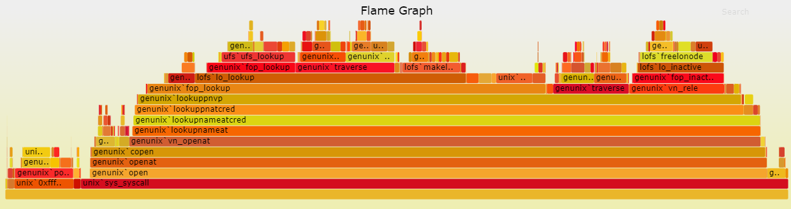
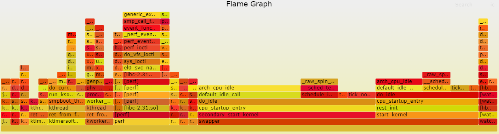

# 5.4 性能火焰图

## 功能介绍

火焰图是用图形化的方式来展现perf等工具采集的性能数据，对数据进行统计和分析，方便找出性能热点。



火焰图中的每一个方框是一个函数，方框的长度，代表了它的执行时间，所以越宽的函数，执行越久。

火焰图的楼层每高一层，就是更深一级的函数被调用，最顶层的函数，是叶子函数。

代码仓库：<https://github.com/brendangregg/FlameGraph.git>

## 支持平台

| 平台    | 运行方式 |
| ------- | ---------|
| RDK X3, RDK X3 Module | Ubuntu 20.04 (Foxy), Ubuntu 22.04 (Humble)    |
| RDK Ultra| Ubuntu 20.04 (Foxy) |

## 准备工作

### 地平线RDK平台

1. flamegraph工具分为两个部分，第一部分是可执行程序perf。perf是一款进行软件性能分析的工具，用于统计并输出系统或某一进程内的函数调用情况。perf工具地平线RDK的操作系统已经自带了，所以直接使用即可。

2. flamegraph工具的第二部分是解析perf文本的脚本，脚本用于解析perf统计的文本数据，生成SVG格式的函数调用火焰图，方便观察和分析。

## 使用介绍

1. 使用perf record工具采样地平线RDK系统内的函数调用情况，生成perf.data文件

    ```shell
    root@ubuntu:~# perf record -F 99 -a -g -- sleep 60
    ```

2. 使用perf script 解析perf.data文件生成out.perf

    ```shell
    root@ubuntu:~# perf script > out.perf
    ```

3. 在PC或者地平线RDK上 `git clone https://github.com/brendangregg/FlameGraph.git`，进入flamegraph目录，把第2步生成的out.perf拷贝到flamegraph目录内。使用flamegraph工具包内的stackcollapse-perf.pl 对out.perf 反折叠生成out.folded

    ```shell
    ./stackcollapse-perf.pl out.perf > out.folded
    ```

4. 使用flamegraph.pl 生成svg火焰图

    ```shell
    ./flamegraph.pl out.folded > flame.svg
    ```

其中1，2步骤在地平线RDK上完成，3，4步骤在PC或者地平线RDK上完成。

## 结果分析

经过前一节的使用流程，记录下来地平线RDK的系统内的函数调用如下图所示


