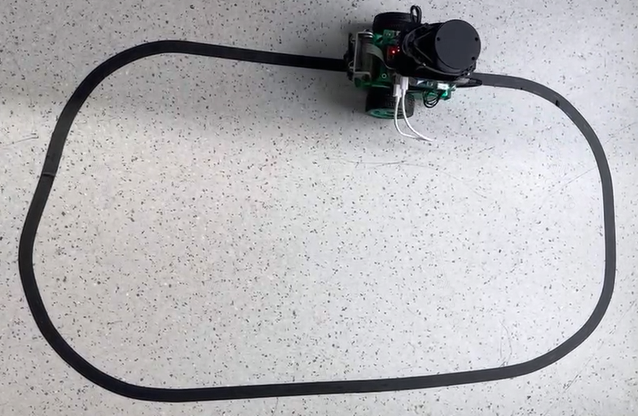
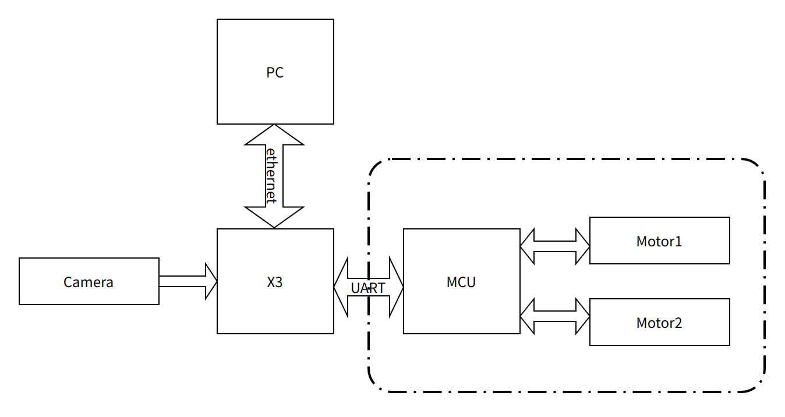
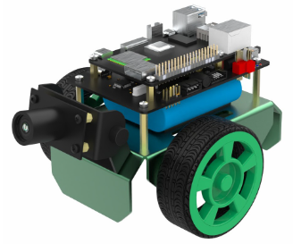
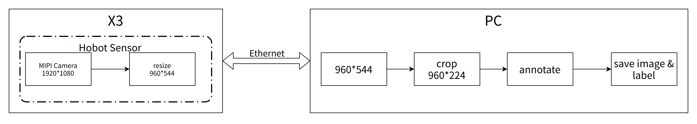
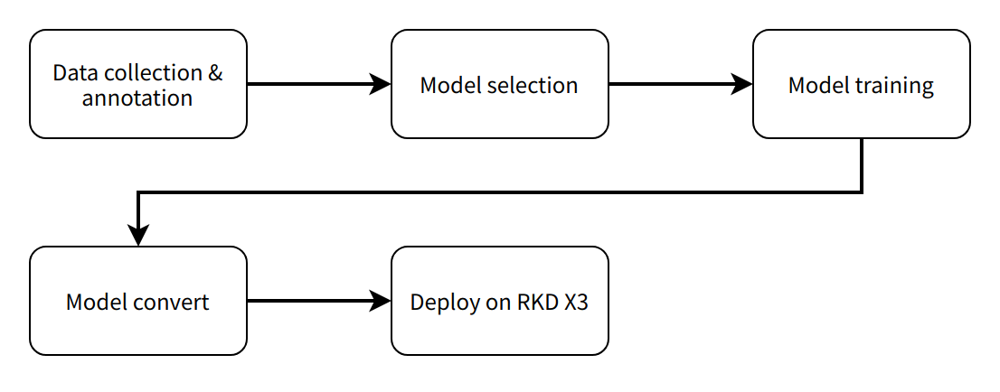
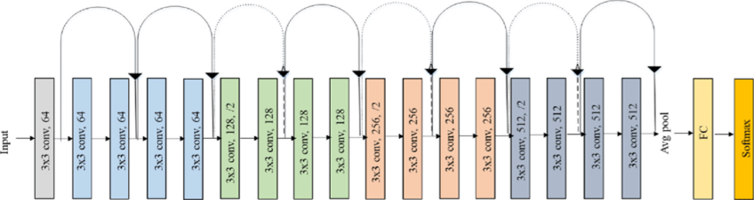
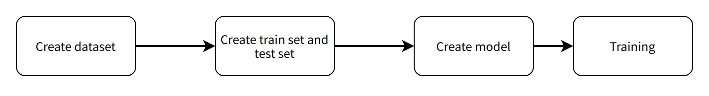

# 5.6 深度学习巡线小车

```mdx-code-block
import Tabs from '@theme/Tabs';
import TabItem from '@theme/TabItem';
```

## 功能介绍


巡线任务，即机器人小车能够自主跟着一条引导线向前运行，引导线往左，小车也跟着往左转，引导线往右，小车跟着往右转。该任务是轮式机器人中比较基础的任务，实现方式也有多种，比如：

- 通过安装多个光电传感器（灰度传感器），根据传感器的的返回值判断该传感器是否位于线上，进而调整机器人运动方向
- 通过摄像头基于传统的图像处理方法如边缘检测等获取线在图像中的位置，进而调整机器人运动方向

上述常用方法当光照环境、场地发生变化，一般需要反复通过采集图像调整阈值以及进行测试来实现比较好的识别结果。那有没有可能让机器人能够自行适应环境的变化，不再需要人为的调整阈值呢？卷积神经网络（CNN），是深度学习算法应用最成功的领域之一，具有不错的适应性和鲁棒性，近年来随着处理器的快速发展，已经可以在嵌入式端进行CNN推理，这里使用CNN的方式实现巡线任务中引导线的位置感知。

代码仓库：<https://github.com/HorizonRDK/line_follower>

## 支持平台

| 平台     | 运行方式     | 示例功能                       |
| -------- | ------------ | ------------------------------ |
| RDK X3, RDK X3 Module | Ubuntu 20.04 (Foxy), Ubuntu 22.04 (Humble) | 启动MIPI摄像头获取图像，并进行引导线检测和小车控制，最后通过实车运动展示巡线效果 |

## 准备工作

### 地平线RDK平台

1. 地平线RDK已烧录好地平线提供的Ubuntu 20.04/Ubuntu 22.04系统镜像。

2. 地平线RDK已成功安装TogetheROS.Bot。

3. 地平线RDK已安装MIPI或者USB摄像头。

4. 和地平线RDK在同一网段（有线或者连接同一无线网，IP地址前三段需保持一致）的PC，PC端需要安装的环境包括：

<Tabs groupId="tros-distro">
<TabItem value="foxy" label="Foxy">

   - Ubuntu 20.04系统和[ROS2 Foxy桌面版](https://docs.ros.org/en/foxy/Installation/Ubuntu-Install-Debians.html)

</TabItem>
<TabItem value="humble" label="Humble">

   - Ubuntu 22.04系统和[ROS2 Humble桌面版](https://docs.ros.org/en/humble/Installation/Ubuntu-Install-Debians.html)

</TabItem>
</Tabs>

   - 算法工具链OE包获取方式
`wget -c ftp://vrftp.horizon.ai/Open_Explorer_gcc_9.3.0/2.3.3/horizon_xj3_open_explorer_v2.3.3_20220727.tar.gz`
   - 算法工具链docker获取方式
`wget -c ftp://vrftp.horizon.ai/Open_Explorer_gcc_9.3.0/2.3.3/x3pi_toolchain/ai_toolchain_2.3.3.tar.gz`
   - 工程源码
`https://github.com/HorizonRDK/line_follower/tree/develop`
  
## 使用介绍

### 地平线RDK平台



小车本体这里选用OriginBot套件，该小车本体具有两个主动轮，一个从动轮，通过两个主动轮差速进行旋转控制。其中MCU模块主要用于小车的电机运动控制通过串口与主控地平线RDK进行通信。OriginBot网址：[www.originbot.org](https://www.originbot.org/)



整套系统如上图所示，地平线RDK通过摄像头获取小车前方环境数据，图像数据通过训练好的CNN模型进行推理得到引导线的坐标值，然后依据一定的控制策略计算小车的运动方式，通过UART向小车下发运动控制指令实现整个系统的闭环控制。

PC用于进行数据标注以及训练，为了提高效率这里采用地平线RDK将图片通过以太网发送至PC端进行标注的方式。



整个软件工程包括5个主要环节分别是：

- 数据采集与标注，根据任务目标获取相应的数据并进行标注，用于模型训练；
- 模型选择，根据任务目标选取合适的模型结构确保性能和精度都能够满足需要；
- 模型训练，使用标注的数据对模型进行训练，以达到满意的精度要求；
- 模型转换，使用算法工具链将训练得到的浮点模型转换为可以在地平线RDK上运行的定点模型；
- 端侧部署，在地平线RDK上运行转换后的模型，得到感知结果并控制机器人运动

**Ubuntu**

#### 数据采集与标注

模型训练离不开数据的采集和标注，这里利用tros.b中hobot_sensor提供的MIPI摄像头图像采集功能和跨设备通信能力，在PC上搭建一个简单的数据采集和标注系统。整个数据采集标注系统工作流程如下：sensor提供的MIPI摄像头图像采集功能和跨设备通信能力，在PC上搭建一个简单的数据采集和标注系统。整个数据采集标注系统工作流程如下：



地平线RDK上启动mipi_cam，选用的摄像头模组为F37，输出图像格式为BGR8，分辨率为960x544，消息通信方式为非零拷贝方式

<Tabs groupId="tros-distro">
<TabItem value="foxy" label="Foxy">

```bash
# 配置tros.b环境
source /opt/tros/setup.bash
```

</TabItem>

<TabItem value="humble" label="Humble">

```bash
# 配置tros.b环境
source /opt/tros/humble/setup.bash
```

</TabItem>

</Tabs>

```shell
export RMW_IMPLEMENTATION=rmw_cyclonedds_cpp
ros2 launch mipi_cam mipi_cam.launch.py mipi_out_format:=bgr8 mipi_io_method:=mmap
```

PC上运行

<Tabs groupId="tros-distro">
<TabItem value="foxy" label="Foxy">

```bash
source  /opt/ros/foxy/setup.bash
```

</TabItem>
<TabItem value="humble" label="Humble">

```bash
source  /opt/ros/humble/setup.bash
```

</TabItem>
</Tabs>

```shell
export RMW_IMPLEMENTATION=rmw_cyclonedds_cpp
# 编译line_follower_model，进入line_follower_model目录
colcon build --packages-select line_follower_model
# 加载编译出的line_follower_model
source install/setup.bash
# 运行PC端标注程序
ros2 run line_follower_model annotation
```

用鼠标右键点击画面垂直方向中间附件黑色引导线中心处，即可标记目标点。按下回车键，程序自动保存该图片至image_dataset文件和标记结果。图片命名方式为xy_[x坐标]_[y坐标]_[uuid].jpg，其中uuid为图片唯一标志符，避免出现文件名称相同。

根据以上数据方式采集和标注方式，采集一定数量的数据，建议至少100张，用于后续模型训练。当环境或者场地变化时也可采集对应的图片一起训练提高模型的适应性。


#### 模型选择

综合考虑模型成熟度、训练模型对CPU/GPU的硬件要求，这里选择ResNet网络作为backbone。残差神经网络（ResNet）是由微软研究院的何恺明、张祥雨、任少卿、孙剑等人提出，在2015 年的ILSVRC（ImageNet Large Scale Visual Recognition Challenge）中取得了冠军。ResNet巧妙地利用了shortcut连接，解决了深度网络中模型退化的问题，是当前应用最为广泛的CNN特征提取网络之一。[ResNet18](https://huggingface.co/microsoft/resnet-18)结构如下：



在地平线RDK上ResNet18推理性能高达232FPS，ResNet50推理性能也超过100FPS，高帧率保证了数据处理的实时性，是后续提高车速以及实现更复杂应用的必要条件。这里先使用ResNet18网络结构，后期遇到瓶颈考虑更深的ResNet50网络结构。为了满足输出引导线坐标值x，y这里需要修改ResNet18网络FC输出为2，即直接输出引导线的x，y坐标值。ResNet18输入分辨率为224x224。
训练框架选用最近比较火热的pytorch，这里安装CPU版本pytorch，若硬件上有GPU卡可选用GPU版本pytorch。安装命令如下：

```shell
pip3 install torch torchvision torchaudio --extra-index-url https://download.pytorch.org/whl/cpu
```

开发所用PC为普通笔记本，配置如下：

- CPU：Intel i5-7260U
- DDR: 8G
- OS: ubuntu 20.04

#### 模型实现与训练

该功能完成代码位于line_follower/line_follower_model/line_follower_model/training_member_function.py

PC上运行

<Tabs groupId="tros-distro">
<TabItem value="foxy" label="Foxy">

```bash
source  /opt/ros/foxy/setup.bash
```

</TabItem>
<TabItem value="humble" label="Humble">

```bash
source  /opt/ros/humble/setup.bash
```

</TabItem>
</Tabs>

```shell
# 编译line_follower_model，进入line_follower_model目录
colcon build --packages-select line_follower_model
# 加载编译出的line_follower_model
source install/setup.bash
# 运行PC端标注程序
ros2 run line_follower_model training
```

#### 模型转换



pytorch训练得到的浮点模型如果直接运行在地平线RDK上效率会很低，为了提高运行效率，发挥BPU的5T算力，这里需要进行浮点模型转定点模型操作。

1. pytorch模型生成onnx模型

   在PC上运行

   ```shell
   ros2 run line_follower_model generate_onnx
   ```

   运行后在当前目录下得到生成best_line_follower_model_xy.onnx模型

2. 浮点模型生成定点模型

   该功能完成代码位于line_follower/10_model_convert

   OE包目录结构如下：

   ```shell
   .
   ├── bsp
   │   └── X3J3-Img-PL2.2-V1.1.0-20220324.tgz
   ├── ddk
   │   ├── package
   │   ├── samples
   │   └── tools
   ├── doc
   │   ├── cn
   │   ├── ddk_doc
   │   └── en
   ├── release_note-CN.txt
   ├── release_note-EN.txt
   ├── run_docker.sh
   └── tools
       ├── 0A_CP210x_USB2UART_Driver.zip
       ├── 0A_PL2302-USB-to-Serial-Comm-Port.zip
       ├── 0A_PL2303-M_LogoDriver_Setup_v202_20200527.zip
       ├── 0B_hbupdate_burn_secure-key1.zip
       ├── 0B_hbupdate_linux_cli_v1.1.tgz
       ├── 0B_hbupdate_linux_gui_v1.1.tgz
       ├── 0B_hbupdate_mac_v1.0.5.app.tar.gz
       └── 0B_hbupdate_win64_v1.1.zip
   ```

   拷贝工程中10_model_convert至算法工具链OE包ddk/samples/ai_toolchain/horizon_model_convert_sample/03_classification/目录下

   加载算法toolchain docker，在OE包根目录下运行

   ```shell
   sh run_docker.sh /data/
   ```

   生成校准数据。该步骤生成的校准数据主要供下一步模型编译进行校准用，可以使用训练模型的部分数据，没有特殊要求，只要确保标准正确即可，数量以100张左右为宜。

   ```shell
   # docker中执行
   cd ddk/samples/ai_toolchain/horizon_model_convert_sample/03_classification/10_model_convert/mapper
   sh 02_preprocess.sh
   ```

   结果如下：

   

   模型编译,该步骤将生成定点模型文件。

   ```shell
   # docker中执行
   cd ddk/samples/ai_toolchain/horizon_model_convert_sample/03_classification/10_model_convert/mapper
   sh 03_build.sh
   ```

   结果如下：

   

#### 端侧部署

通过前面模型转换已经得到可以在地平线RDKBPU上运行的定点模型，如何将其部署在地平线RDK上，实现图像获取、模型推理、运动控制整套功能呢？这里基于tros.b中的hobot_dnn实现。Hobot实现。hobot_dnn是tros.b软件栈中的板端算法推理框架，在地平线地平线RDK上利用BPU处理器实现算法推理功能，为机器人应用开发提供更简单易用的模型集成开发接口，包括模型管理、基于模型描述的输入处理及结果解析，以及模型输出内存分配管理等功能。

继承DnnNode实现必要的接口。这里采用公有继承方式，其中必须要实现的接口为：

- SetNodePara()用于配置模型参数，如模型路径、模型名字等
- SetOutputParser()用于解析模型推理输出
- PostProcess(const std::shared_ptr\<DnnNodeOutput\> &outputs)用于对后处理结果进一步进行使用

完整代码请参考：line_follower/line_follower_perception/src/line_follower_perception.cpp

将line_follower_perception文件夹和编译生成的定点模型拷贝至板端执行

<Tabs groupId="tros-distro">
<TabItem value="foxy" label="Foxy">

```bash
# 配置tros.b环境
source /opt/tros/setup.bash
```

</TabItem>

<TabItem value="humble" label="Humble">

```bash
# 配置tros.b环境
source /opt/tros/humble/setup.bash
```

</TabItem>

</Tabs>

```shell
#在line_follower_perception文件夹路径下执行
clocon build --packages-select line_follower_perception
```

编译完成后，通过参数model_path和model_name指定模型的路径和名称

```shell
source install/setup.bash
ros2 run line_follower_perception line_follower_perception --ros-args -p model_path:=./resnet18_224x224_nv12.bin -p model_name:=resnet18_224x224_nv12 &
```

运行mipi_cam

<Tabs groupId="tros-distro">
<TabItem value="foxy" label="Foxy">

```bash
# 配置tros.b环境
source /opt/tros/setup.bash
```

</TabItem>

<TabItem value="humble" label="Humble">

```bash
# 配置tros.b环境
source /opt/tros/humble/setup.bash
```

</TabItem>

</Tabs>

```shell
ros2 launch mipi_cam mipi_cam.launch.py &
```

最后进入小车的运动控制package，originbot_base运行

```shell
source install/setup.bash
ros2 run originbot_base originbot_base
```

## 结果分析

小车已经开始了巡线运动。


