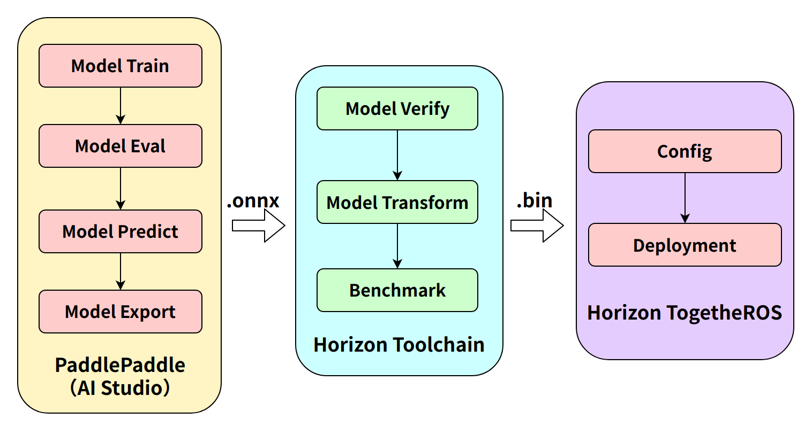
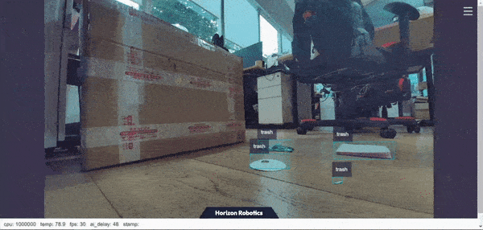
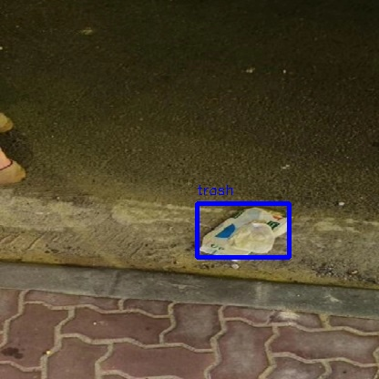

# 5.5 垃圾检测

```mdx-code-block
import Tabs from '@theme/Tabs';
import TabItem from '@theme/TabItem';
```

## 功能介绍

mono2d_trash_detection package 是基于 hobot_dnn package 开发的2D垃圾目标检测算法示例。与以往功能展示不同，本示例将以2D垃圾检测任务为例，展示如何基于开源框架训练模型、地平线工具链转换模型、地平线机器人操作系统完成算法全流程部署工作。

本package支持直接订阅sensors/msg/Image类型的话题，并且支持读取本地图片的形式进行推理，将算法信息通过话题发布的同时会将结果在Web页面渲染可视化，本地图片回灌时将渲染图片保存在当前目录。

代码仓库：<https://github.com/HorizonRDK/mono2d_trash_detection.git>

应用场景：室内外垃圾检测，识别出场景中的垃圾，可配合机器人用于垃圾寻找、垃圾捡取（配合机械臂）的APP设计。

## 算法介绍

本package采用[PaddlePaddle](https://github.com/PaddlePaddle/PaddleDetection.git)开源框架， 利用[PPYOLO](https://github.com/PaddlePaddle/PaddleDetection/tree/release/2.5)模型进行垃圾检测任务设计和训练，具体的模型配置为[ppyolo_r18vd_coco.yml](https://github.com/PaddlePaddle/PaddleDetection/blob/release/2.5/configs/ppyolo/ppyolo_r18vd_coco.yml)。

算法支持的目标检测类别如下：

| 类别                | 说明 | 数据类型 |
| ---------------------- | ----------- | --- | 
| trash           | 垃圾框         | Roi |

## 支持平台

| 平台    | 运行方式      | 示例功能                       |
| ------- | ------------ | ------------------------------ |
| RDK X3, RDK X3 Module| Ubuntu 20.04 (Foxy), Ubuntu 22.04 (Humble) | · 启动MIPI/USB摄像头/本地回灌，推理渲染结果在Web显示/保存在本地 |
| X86     | Ubuntu 20.04 (Foxy) | · 启动本地回灌，推理渲染结果在Web显示/保存在本地 |

## 准备工作

由于部署阶段我们不考虑算法模型内部的结构信息，只关注算法前后处理环节，前处理部分如图像读取、图像Resize等，后处理部分如检测头解码器、非极大值抑制（NMS）等。这些前后处理的方法在多数同类模型中是一致的，通用性较强，因此可以利用基础部署包进行快速部署。

地平线机器人操作系统提供了[dnn_node_example](https://github.com/HorizonRDK/hobot_dnn/tree/develop/dnn_node_example)部署包用于快速部署基础算法。目前支持的常见算法有图像分类、2D目标检测、语义分割。其中2D目标检测集成了Fasterrcnn、Fcos、yolov2、yolov3、yolov5、SSD、efficientnet供用户选择。

本示例利用[dnn_node_example](https://github.com/HorizonRDK/hobot_dnn/tree/develop/dnn_node_example)，通过替换地平线交叉编译模型、后处理配置文件、检测类别配置文件用以适配自定义检测模型。

如果前后处理环节与上述模型不同无法快速适配，自定义部署方法可参考[dnn_node_sample](https://github.com/HorizonRDK/hobot_dnn/tree/develop/dnn_node_example)示例。

### 地平线RDK平台

1. 地平线RDK已烧录好地平线提供的Ubuntu 20.04/Ubuntu 22.04系统镜像。

2. 地平线RDK已成功安装TogetheROS.Bot。

3. 获得地平线交叉编译模型（如本例中[ppyolo_trashdet_416x416_nv12.bin](https://github.com/HorizonRDK/mono2d_trash_detection/blob/develop/config/ppyolo_trashdet_416x416_nv12.bin)

4. 后处理配置文件 (如本例中[ppyoloworkconfig.json](https://github.com/HorizonRDK/mono2d_trash_detection/blob/develop/config/ppyoloworkconfig.json))

5. 检测类别配置文件 (如本例中[trash_coco.list](https://github.com/HorizonRDK/mono2d_trash_detection/blob/develop/config/trash_coco.list))

### X86平台

1. X86环境已配置Ubuntu 20.04系统镜像。

2. X86环境已成功安装tros.b。

3. 获得地平线交叉编译模型（如本例中[ppyolo_trashdet_416x416_nv12.bin](https://github.com/HorizonRDK/mono2d_trash_detection/blob/develop/config/ppyolo_trashdet_416x416_nv12.bin)

4. 后处理配置文件 (如本例中[ppyoloworkconfig.json](https://github.com/HorizonRDK/mono2d_trash_detection/blob/develop/config/ppyoloworkconfig.json))

5. 检测类别配置文件 (如本例中[trash_coco.list](https://github.com/HorizonRDK/mono2d_trash_detection/blob/develop/config/trash_coco.list))


## 后处理配置文件说明

config_file配置文件格式为json格式，本示例[ppyoloworkconfig.json](https://github.com/HorizonRDK/mono2d_trash_detection/blob/develop/config/ppyoloworkconfig.json)，具体配置如下：

```bash
  {
    "model_file"：模型文件的路径

    "model_name"：模型名称

    "dnn_Parser"：设置选择内置的后处理算法，示例采用的解析方法同yolov3，采用"yolov3"

    "model_output_count"：模型输出branch个数

    "class_num": 检测类别数

    "cls_names_list": 检测类别具体标签

    "strides": 每个输出branch步长

    "anchors_table": 预设anchors比例

    "score_threshold": 置信度阈值

    "nms_threshold": NMS后处理IOU阈值

    "nms_top_k": NMS后处理选取的框个数
  }
```

说明：实际每个预设anchors大小为 anchors_table x strides

## 使用介绍

完整算法开发部署流程图：



其中第一步Paddle模型训练、第二部工具链模型转换，将在下方链接中介绍，这里将主要介绍上板部署相关流程。

模型训练：[PPYOLO垃圾检测+地平线地平线RDK部署（上）](https://aistudio.baidu.com/aistudio/projectdetail/4606468?contributionType=1)

模型转换：[PPYOLO垃圾检测+地平线地平线RDK部署（下）](https://aistudio.baidu.com/aistudio/projectdetail/4754526?contributionType=1)

package对外发布包含语义分割和目标检测信息的算法msg，用户可以订阅发布的msg用于应用开发。

### 地平线RDK平台

**使用MIPI摄像头发布图片**

<Tabs groupId="tros-distro">
<TabItem value="foxy" label="Foxy">

```bash
# 配置tros.b环境
source /opt/tros/setup.bash
```

</TabItem>

<TabItem value="humble" label="Humble">

```bash
# 配置tros.b环境
source /opt/tros/humble/setup.bash
```

</TabItem>

</Tabs>

```shell
# 从tros的安装路径中拷贝出运行示例需要的配置文件。
cp -r /opt/tros/${TROS_DISTRO}/lib/mono2d_trash_detection/config/ .

# 配置MIPI摄像头
export CAM_TYPE=mipi

# 启动launch文件
ros2 launch dnn_node_example dnn_node_example.launch.py dnn_example_config_file:=config/ppyoloworkconfig.json dnn_example_msg_pub_topic_name:=ai_msg_mono2d_trash_detection dnn_example_image_width:=1920 dnn_example_image_height:=1080
```

**使用usb摄像头发布图片**

<Tabs groupId="tros-distro">
<TabItem value="foxy" label="Foxy">

```bash
# 配置tros.b环境
source /opt/tros/setup.bash
```

</TabItem>

<TabItem value="humble" label="Humble">

```bash
# 配置tros.b环境
source /opt/tros/humble/setup.bash
```

</TabItem>

</Tabs>

```shell
# 从tros的安装路径中拷贝出运行示例需要的配置文件。
cp -r /opt/tros/${TROS_DISTRO}/lib/mono2d_trash_detection/config/ .

# 配置USB摄像头
export CAM_TYPE=usb

# 启动launch文件
ros2 launch dnn_node_example dnn_node_example.launch.py dnn_example_config_file:=config/ppyoloworkconfig.json dnn_example_msg_pub_topic_name:=ai_msg_mono2d_trash_detection dnn_example_image_width:=1920 dnn_example_image_height:=1080
```

**使用单张回灌图片**

<Tabs groupId="tros-distro">
<TabItem value="foxy" label="Foxy">

```bash
# 配置tros.b环境
source /opt/tros/setup.bash
```

</TabItem>

<TabItem value="humble" label="Humble">

```bash
# 配置tros.b环境
source /opt/tros/humble/setup.bash
```

</TabItem>

</Tabs>

```shell
# 从tros的安装路径中拷贝出运行示例需要的配置文件。
cp -r /opt/tros/${TROS_DISTRO}/lib/mono2d_trash_detection/config/ .

# 启动launch文件
ros2 launch dnn_node_example dnn_node_example_feedback.launch.py dnn_example_config_file:=config/ppyoloworkconfig.json dnn_example_image:=config/trashDet0028.jpg
```

### X86平台

**使用单张回灌图片**

<Tabs groupId="tros-distro">
<TabItem value="foxy" label="Foxy">

```bash
# 配置tros.b环境
source /opt/tros/setup.bash
```

</TabItem>

<TabItem value="humble" label="Humble">

```bash
# 配置tros.b环境
source /opt/tros/humble/setup.bash
```

</TabItem>

</Tabs>

```shell
# 从tros的安装路径中拷贝出运行示例需要的配置文件。
cp -r /opt/tros/${TROS_DISTRO}/lib/mono2d_trash_detection/config/ .

# 启动垃圾检测pkg，将渲染图片保存到本地
ros2 run dnn_node_example example --ros-args -p feed_type:=0 -p image:=config/trashDet0028.jpg -p image_type:=0 -p dump_render_img:=1 -p dnn_example_config_file:=config/ppyoloworkconfig.json
```

## 结果分析

**使用mipi摄像头发布图片**

package初始化后，在运行终端输出如下信息：

```shell
[example-3] [WARN] [1665644838.299475772] [example]: This is dnn node example!
[example-3] [WARN] [1665644838.439577121] [example]: Parameter:
[example-3]  feed_type(0:local, 1:sub): 1
[example-3]  image: config/test.jpg
[example-3]  image_type: 0
[example-3]  dump_render_img: 0
[example-3]  is_shared_mem_sub: 1
[example-3]  config_file: config/ppyoloworkconfig.json
[example-3]  msg_pub_topic_name_: ai_msg_mono2d_trash_detection
[example-3] [WARN] [1665644838.441379412] [example]: Parameter:
[example-3]  model_file_name: config/ppyolo_trashdet_416x416_nv12.bin
[example-3]  model_name: ppyolo_trashdet_416x416_nv12
[example-3] [WARN] [1665644838.441523485] [example]: model_file_name_: config/ppyolo_trashdet_416x416_nv12.bin, task_num: 4
[example-3] [C][34177][10-13][15:07:18:448][configuration.cpp:49][EasyDNN]EasyDNN version: 0.4.11
[example-3] [BPU_PLAT]BPU Platform Version(1.3.1)!
[example-3] [HBRT] set log level as 0. version = 3.14.5
[example-3] [DNN] Runtime version = 1.9.7_(3.14.5 HBRT)
[example-3] [WARN] [1665644838.688580704] [dnn]: Run default SetOutputParser.
[example-3] [WARN] [1665644838.688758775] [dnn]: Set output parser with default dnn node parser, you will get all output tensors and should parse output_tensors in PostProcess.
[example-3] [WARN] [1665644838.691224728] [example]: Create ai msg publisher with topic_name: ai_msg_mono2d_trash_detection
[example-3] [WARN] [1665644838.698936232] [example]: Create img hbmem_subscription with topic_name: /hbmem_img
[example-3] [WARN] [1665644839.926634917] [example]: Sub img fps: 32.45, Smart fps: 33.07, infer time ms: 36, post process time ms: 5
[example-3] [WARN] [1665644840.950361855] [example]: Sub img fps: 30.30, Smart fps: 30.21, infer time ms: 40, post process time ms: 3
[example-3] [WARN] [1665644841.971040371] [example]: Sub img fps: 30.39, Smart fps: 30.48, infer time ms: 36, post process time ms: 7
[example-3] [WARN] [1665644842.972618649] [example]: Sub img fps: 29.94, Smart fps: 29.88, infer time ms: 36, post process time ms: 3
[example-3] [WARN] [1665644843.982243911] [example]: Sub img fps: 29.62, Smart fps: 29.70, infer time ms: 36, post process time ms: 3
[example-3] [WARN] [1665644844.995728928] [example]: Sub img fps: 29.79, Smart fps: 29.73, infer time ms: 36, post process time ms: 6
```

实时运行效果：



**使用单张回灌图片**

package初始化后，在终端输出如下信息：

```shell
[example-1] [INFO] [1665646256.967568866] [dnn]: The model input 0 width is 416 and height is 416
[example-1] [WARN] [1665646256.967698807] [dnn]: Run default SetOutputParser.
[example-1] [WARN] [1665646256.967754550] [dnn]: Set output parser with default dnn node parser, you will get all output tensors and should parse output_tensors in PostProcess.
[example-1] [INFO] [1665646256.967794962] [dnn impl]: Set default output parser
[example-1] [INFO] [1665646256.967972439] [dnn]: Task init.
[example-1] [INFO] [1665646256.970036756] [dnn]: Set task_num [4]
[example-1] [INFO] [1665646256.970176988] [example]: The model input width is 416 and height is 416
[example-1] [WARN] [1665646256.970260061] [example]: Create ai msg publisher with topic_name: hobot_dnn_detection
[example-1] [INFO] [1665646256.977452592] [example]: Dnn node feed with local image: config/trashDet0028.jpg
[example-1] [INFO] [1665646257.027170005] [dnn]: task id: 3 set bpu core: 2
[example-1] [INFO] [1665646257.057492754] [example]: Output from frame_id: feedback, stamp: 0.0
[example-1] [INFO] [1665646257.063816821] [PostProcessBase]: out box size: 1
[example-1] [INFO] [1665646257.064070497] [PostProcessBase]: det rect: 216.061 223.173 317.97 282.748, det type: trash, score:0.80733
[example-1] [INFO] [1665646257.064206479] [ClassificationPostProcess]: out cls size: 0
[example-1] [INFO] [1665646257.068688365] [ImageUtils]: target size: 1
[example-1] [INFO] [1665646257.068836554] [ImageUtils]: target type: trash, rois.size: 1
[example-1] [INFO] [1665646257.068884048] [ImageUtils]: roi.type: , x_offset: 216 y_offset: 223 width: 101 height: 59
[example-1] [WARN] [1665646257.071375688] [ImageUtils]: Draw result to file: render_feedback_0_0.jpeg
```

本地渲染效果：


